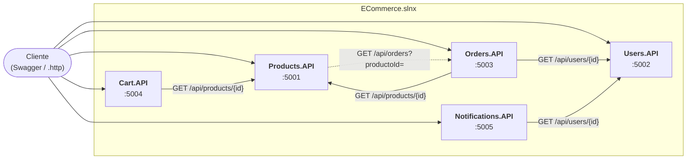

# E-Commerce con microservicios — Grupo 15

Trabajo práctico de **Construcción de Aplicaciones Informáticas**: un sistema de E-Commerce basado en una arquitectura de microservicios. Cada funcionalidad expone una REST API independiente en C# con **.NET 10**.

Integrantes: **Thomas** y **Juan Pablo**.

Cada servicio cumple los requisitos transversales del enunciado:

- un contrato de errores único con `errorCode` y `errorMessage`;
- manejo global de errores con `IExceptionHandler`;
- documentación con Swagger, con ejemplos de éxito y de error;
- logs estructurados con Serilog y Correlation ID;
- health checks.

---

## Servicios

| Servicio | Puerto | Responsabilidad | Consume a | Estado |
|---|---|---|---|---|
| **Products.API** | [5001](http://localhost:5001/swagger) | Catálogo de productos | Orders.API | ✅ Completo |
| **Users.API** | [5002](http://localhost:5002/swagger) | Registro, login y bloqueo de usuarios | — | ✅ Completo |
| **Orders.API** | [5003](http://localhost:5003/swagger) | Órdenes y su ciclo de estados | Users.API, Products.API | ✅ Completo |
| **Cart.API** | [5004](http://localhost:5004/swagger) | Carrito de compras | Products.API | ✅ Completo |
| **Notifications.API** | [5005](http://localhost:5005/swagger) | Notificaciones (envío simulado) | Users.API | ✅ Completo |

Los links abren Swagger UI con el servicio levantado. El detalle del avance está en el [plan de desarrollo](docs/planificacion/plan-de-desarrollo.md#estado-actual-10102026).

## Arquitectura



Cada servicio es un proyecto independiente, es dueño de sus datos y se comunica con los demás solo por HTTP (`IHttpClientFactory`), propagando el header `X-Correlation-Id`. Dentro de cada API, las capas dependen de interfaces:

```
Controller → Service → Repository (persistencia) / Clients (otros servicios)
                 └─ lanza excepciones con código del catálogo → IExceptionHandler → JSON de error
```

Diagramas de clases y de secuencia: [docs/arquitectura/arquitectura.md](docs/arquitectura/arquitectura.md).

> **Persistencia:** la librería de la cátedra todavía no fue entregada. Mientras tanto, cada servicio usa un repositorio en memoria detrás de una interfaz, con datos semilla para la demo. Cuando llegue la librería, solo cambia esa implementación.

---

## Cómo ejecutarlo

### Requisitos

- [SDK de .NET 10](https://dotnet.microsoft.com/download/dotnet/10.0). Verificar con `dotnet --version` (tiene que mostrar 10.x).

Los comandos son los mismos en macOS, Linux y Windows, y se ejecutan desde la raíz del repositorio.

### Compilar y correr los tests

```bash
dotnet build ECommerce.slnx
```

```bash
dotnet test ECommerce.slnx
```

Los tests no necesitan ningún servicio levantado: cada API se levanta en memoria y las llamadas a otros servicios se reemplazan por dobles de prueba. GitHub Actions corre lo mismo en cada push ([`.github/workflows/ci.yml`](.github/workflows/ci.yml)).

### Levantar un servicio

Cada servicio se levanta en su propia terminal:

```bash
dotnet run --project src/Products.API --launch-profile http
```

```bash
dotnet run --project src/Cart.API --launch-profile http
```

Con `src/Users.API`, `src/Orders.API` y `src/Notifications.API` es igual. Cart.API necesita a Products.API levantado para agregar o actualizar productos; para ver un carrito, no. Orders.API necesita a Users.API y Products.API levantados para crear órdenes; para consultarlas o cambiar su estado, no.

### Probar un servicio

| Qué | Dónde |
|---|---|
| Swagger UI (documentación y pruebas) | `http://localhost:<puerto>/swagger` |
| Requests de ejemplo, de éxito y de cada error | `src/<Servicio>.API/<Servicio>.API.http` (VS Code con REST Client, Rider o Visual Studio) |
| Estado del servicio | `http://localhost:<puerto>/health`, `/health/ready` y `/health/live` |
| Logs | En la consola y en `src/<Servicio>.API/logs/*.json` (un archivo por día) |

Para seguir un request en los logs, mandar el header `X-Correlation-Id`: el mismo valor aparece en todos los logs del request, en el header de la respuesta y en el body de los errores.

---

## Estructura del repositorio

```
├── .github/workflows/ci.yml   # integración continua: build + tests en cada push
├── ECommerce.slnx             # solución con los 10 proyectos
├── src/                       # las 5 APIs
│   └── <Servicio>.API/
│       ├── Controllers/       # traducen HTTP ↔ DTO
│       ├── Services/          # reglas de negocio
│       ├── Repositories/      # persistencia (en memoria por ahora)
│       ├── Clients/           # llamadas a otros servicios
│       ├── Models/ · DTOs/
│       ├── Exceptions/        # ErrorCodes y excepciones de dominio
│       ├── ExceptionHandlers/ # IExceptionHandler por tipo de excepción
│       └── Infrastructure/    # logging, Correlation ID, Swagger, health checks, DI
├── tests/                     # un proyecto de tests por API (Unit/ e Integration/)
└── docs/                      # documentación (índice en docs/README.md)
    ├── consignas/             # enunciado de la cátedra
    ├── planificacion/         # plan de desarrollo
    ├── arquitectura/          # diagramas
    └── repasos/               # repaso general + uno por API
```

## Documentación

| Documento | Contenido |
|---|---|
| [Consignas](docs/consignas/TP_Microservicios_ECommerce_v7.md) | El enunciado de la cátedra en Markdown ([`.docx` original](docs/consignas/TP_Microservicios_ECommerce_v7.docx)) |
| [Plan de desarrollo](docs/planificacion/plan-de-desarrollo.md) | Estado, decisiones de diseño (D-01 a D-38), convenciones de código, reparto de tareas y etapas |
| [Arquitectura](docs/arquitectura/arquitectura.md) | Diagramas del sistema, de clases y de secuencia |
| [Repaso general](docs/repasos/repaso-general.md) | Vista de conjunto: planificación, trabajo en equipo, arquitectura, revisiones y próximos pasos |
| [Repaso de Products.API](docs/repasos/repaso-products-api.md) | Cómo se construyó la plantilla de cada API, decisión por decisión |
| [Repaso de Cart.API](docs/repasos/repaso-cart-api.md) | Cómo se construyó el primer servicio que consume a otro |
| [Repaso de Users.API](docs/repasos/repaso-users-api.md) | Contraseñas, regla de bloqueo y el contrato del que dependen Orders y Notifications |
| [Repaso de Notifications.API](docs/repasos/repaso-notifications-api.md) | Envío simulado y el cliente HTTP de Users |
| [Repaso de Orders.API](docs/repasos/repaso-orders-api.md) | Máquina de estados de la orden y los clientes HTTP de Users y Products |

El índice completo, con los repasos pendientes de cada API, está en [docs/README.md](docs/README.md).

## Códigos de error

Todas las respuestas 4xx y 5xx siguen el contrato de la sección 3.1 del enunciado, más el campo `correlationId`:

```json
{
  "type": "https://tools.ietf.org/html/rfc7231#section-6.5.4",
  "title": "Not Found",
  "status": 404,
  "detail": "El recurso solicitado no fue encontrado.",
  "instance": "/api/products/99",
  "errorCode": "PRD-001",
  "errorMessage": "Producto no encontrado.",
  "correlationId": "0f8fad5b-d9cb-469f-a165-70867728950e"
}
```

Los catálogos de cada servicio (PRD, USR, ORD, CRT y NTF) están en la [sección 4 de las consignas](docs/consignas/TP_Microservicios_ECommerce_v7.md#4-requerimientos-funcionales-y-contratos-de-api). El código agregado por el grupo, USR-007, está en la sección 5.1 del plan. La tabla completa y las capturas de Swagger se agregan en la Etapa 10.

## Forma de trabajo

- **TDD:** cada funcionalidad empieza por un test que falla. Hay tests unitarios (servicios, reglas y clientes HTTP con dobles de prueba) y tests de integración (la API en memoria con `WebApplicationFactory`).
- **Git:** se trabaja en `develop`, con commits de Commitizen (Conventional Commits), y en cada hito se abre un PR a `main`.
- **Integración continua:** GitHub Actions compila y corre todos los tests en cada push.
