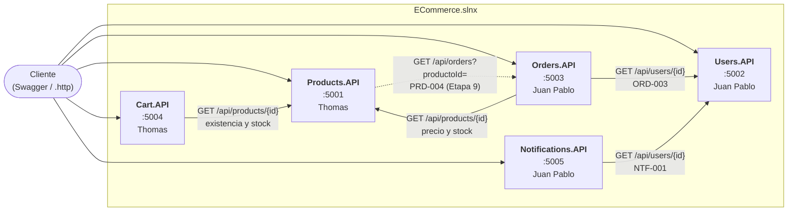
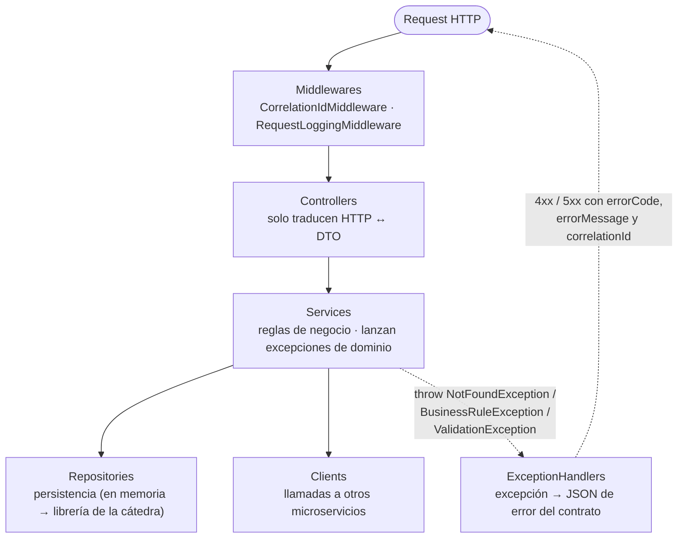
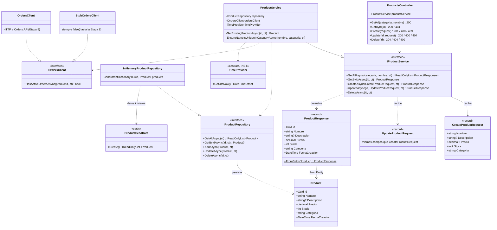
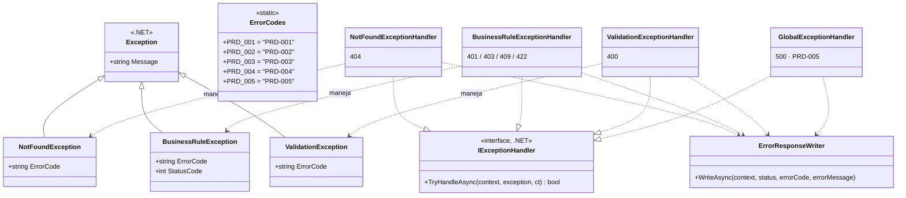
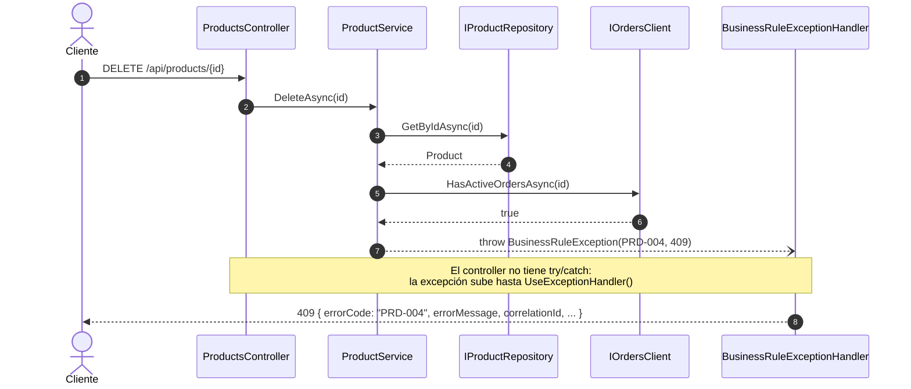

# Arquitectura — E-Commerce con microservicios

Diagramas de apoyo para el [plan de desarrollo](plan-de-desarrollo.md). GitHub los dibuja automáticamente (Mermaid); en VS Code o Rider se ven con una extensión de Mermaid.

---

## 1. Vista general: servicios y comunicación

Cada caja es un microservicio independiente, con su propio puerto y su propia persistencia. Las flechas son llamadas HTTP (`IHttpClientFactory`) y todas llevan el header `X-Correlation-Id`.

La flecha punteada es la única dependencia en sentido inverso (Products ↔ Orders). Hasta la Etapa 9, Products usa `StubOrdersClient` y no llama a Orders.

---

## 2. Capas dentro de cada API

Todas las APIs tienen las mismas capas. Cada capa depende solo de **interfaces** de la capa siguiente; `ServiceCollectionExtensions` es el único que conoce las implementaciones.

---

## 3. Diagrama de clases — Products.API (plantilla)

Products.API es la plantilla que se replica en el resto de los servicios. Las clases marcadas `«interface»` son las abstracciones; las flechas punteadas con triángulo (`..|>`) indican "implementa" y las flechas punteadas simples (`..>`) indican "depende de / usa".

### Excepciones y manejo de errores

Cada servicio lanza excepciones de dominio con un `ErrorCode` del catálogo; un `IExceptionHandler` por tipo las convierte en la respuesta de error del contrato. Se registran del más específico al más genérico: el `GlobalExceptionHandler` atrapa todo lo no previsto y devuelve PRD-005.

> Los handlers y `ErrorResponseWriter` se implementan en la Etapa 2.

---

## 4. Recorrido de un request con error

Ejemplo: `DELETE /api/products/{id}` sobre un producto que tiene órdenes activas (PRD-004).

Si el producto no existiera, el paso 4 devolvería `null`, el servicio lanzaría `NotFoundException(PRD-001)` y **nunca** se consultaría a Orders.

---

## 5. Cómo se replica en el resto de los servicios

| Pieza | Products | Users | Cart | Orders | Notifications |
|---|---|---|---|---|---|
| Service | `IProductService` → `ProductService` | `IUserService` → `UserService` | `ICartService` → `CartService` | `IOrderService` → `OrderService` | `INotificationService` → `NotificationService` |
| Repository | `IProductRepository` → `InMemoryProductRepository` | `IUserRepository` → `InMemoryUserRepository` | `ICartRepository` → `InMemoryCartRepository` | `IOrderRepository` → `InMemoryOrderRepository` | `INotificationRepository` → `InMemoryNotificationRepository` |
| Clients | `IOrdersClient` | — | `IProductsClient` | `IUsersClient`, `IProductsClient` | `IUsersClient` |
| Regla propia | — | `AccountLockoutPolicy` | — | `OrderStatusTransitions` | `INotificationSender` → `SimulatedNotificationSender` |
| Códigos | PRD-001…005 | USR-001…007 | CRT-001…005 | ORD-001…007 | NTF-001…004 |

El detalle completo (carpetas, ciclos de vida y etapa de cada pieza) está en la sección 2.3 del plan.
