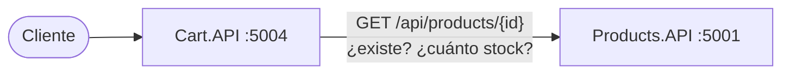
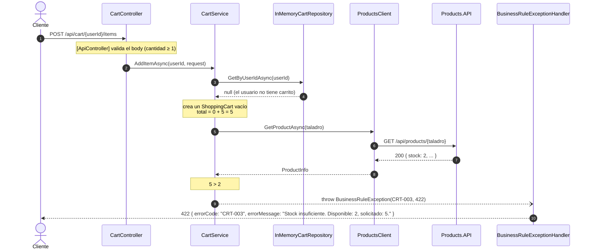

# Repaso: cómo construimos Cart.API

Guía de estudio de la Etapa 6 del [plan de desarrollo](../planificacion/plan-de-desarrollo.md). Explica **qué** hace cada pieza de Cart.API y **por qué** se decidió así.

Cart.API reutiliza la plantilla de Products.API (manejo de errores, logs, Correlation ID, Swagger y health checks). Esa parte **no se repite acá**: está explicada en el [repaso de Products.API](repaso-products-api.md). Este documento se concentra en lo nuevo de Cart:

- los huecos del enunciado que hubo que resolver;
- un modelo que tiene comportamiento propio;
- **el primer cliente HTTP entre servicios** (`ProductsClient`);
- cómo se testea un servicio que depende de otro.

Los diagramas de clases y de secuencia de Cart están en [arquitectura.md](../arquitectura/arquitectura.md#5-cartapi-un-servicio-que-consume-a-otro).

---

## Índice

1. [Visión general](#1-visión-general)
2. [Antes de programar: los huecos del enunciado](#2-antes-de-programar-los-huecos-del-enunciado)
3. [Parte 1 — El dominio y las reglas del carrito](#3-parte-1--el-dominio-y-las-reglas-del-carrito)
4. [`ProductsClient`: hablar con otro servicio](#4-productsclient-hablar-con-otro-servicio)
5. [Parte 2 — La capa HTTP y la plantilla](#5-parte-2--la-capa-http-y-la-plantilla)
6. [Cómo se testea un servicio que depende de otro](#6-cómo-se-testea-un-servicio-que-depende-de-otro)
7. [La prueba con los dos servicios levantados](#7-la-prueba-con-los-dos-servicios-levantados)
8. [Recorrido completo de un request](#8-recorrido-completo-de-un-request)
9. [Mapa de archivos](#9-mapa-de-archivos)
10. [Lo que falta: Etapa 9](#10-lo-que-falta-etapa-9)
11. [Preguntas probables de la defensa](#11-preguntas-probables-de-la-defensa)

---

## 1. Visión general

### 1.1 Qué es Cart.API

El carrito de compras de cada usuario, en el puerto 5004:

| Método | Ruta | Qué hace | Éxito | Errores |
|---|---|---|---|---|
| GET | `/api/cart/{userId}` | Obtiene el carrito | 200 | 404 |
| POST | `/api/cart/{userId}/items` | Agrega un producto; crea el carrito si no existe | 200 | 400, 404, 422 |
| PUT | `/api/cart/{userId}/items/{productId}` | Cambia la cantidad de un producto | 200 | 400, 404, 422 |
| DELETE | `/api/cart/{userId}/items/{productId}` | Quita un producto | 204 | 404 |
| DELETE | `/api/cart/{userId}` | Vacía el carrito | 204 | 404 |

Todos pueden responder 500. Su catálogo de errores tiene cinco códigos:

| Código | HTTP | Cuándo |
|---|---|---|
| CRT-001 | 404 | El usuario no tiene carrito |
| CRT-002 | 404 | El producto no existe en Products.API o no está en el carrito (D-26) |
| CRT-003 | 422 | La cantidad supera el stock disponible |
| CRT-004 | 400 | Datos inválidos: cantidad ≤ 0, campos faltantes o JSON mal formado (D-25) |
| CRT-005 | 500 | Error inesperado o Products.API no responde (D-28) |

### 1.2 Lo que lo hace distinto: depende de otro servicio

Para agregar o actualizar un producto, Cart necesita saber **si existe y cuánto stock tiene**, y ese dato es de Products.API. Cada servicio es dueño de sus datos (sección 5.1 del repaso general), así que Cart no lee la base de Products: **le pregunta por HTTP**.



### 1.3 Cómo se construyó

En dos partes con TDD, cada una con su commit:

| Parte | Qué | Tests nuevos | Fallaron en rojo | Total al terminar |
|---|---|---|---|---|
| 1 (`0405e34`) | Dominio, reglas, repositorio y `ProductsClient` | 30 | 30 | 31 |
| 2 (`e4a56ea`) | Controller, plantilla replicada y tests de integración | 59 | 58 | **90** |

En la parte 2, uno de los tests nuevos pasó en rojo por casualidad: verificaba que *no* apareciera el mensaje de una excepción interna, y en un 404 vacío tampoco aparece. Con el endpoint ya armado, prueba algo real.

---

## 2. Antes de programar: los huecos del enunciado

Igual que al principio del proyecto, antes de escribir tests se buscaron los casos que el enunciado no define para Cart. Cada uno quedó registrado como decisión en el plan:

| # | Pregunta sin respuesta en el enunciado | Decisión | Por qué |
|---|---|---|---|
| D-13 | Si el producto ya está en el carrito, ¿se reemplaza o se suma? | Se suma, y el stock se valida contra el total | Es lo que espera un usuario de un carrito. Se decidió al armar el plan. |
| D-25 | El catálogo tiene un solo código 400 (CRT-004, "Cantidad inválida"). ¿Qué código usa un producto faltante o un JSON mal formado? | Todo 400 usa CRT-004, y el `errorMessage` lista los problemas concretos | No hay otro código 400; inventar uno rompería el catálogo |
| D-26 | El producto existe, pero no está en el carrito (PUT o DELETE de un item). ¿Qué responder? | 404 con CRT-002 y el mensaje "El producto no se encuentra en el carrito." | CRT-002 es el "producto no encontrado" de Cart; el mensaje distingue el caso |
| D-27 | ¿"Vaciar" deja un carrito vacío o lo elimina? | Lo elimina: después, `GET` responde CRT-001 | "Vaciar el carrito completo" deja al usuario sin carrito activo. Quitar el último item con su `DELETE` sí deja un carrito vacío. |
| D-28 | ¿Qué pasa si Products.API no responde? | 500 con CRT-005 | Es una falla de infraestructura, no un dato del negocio, y el catálogo no tiene un código "servicio no disponible" |

---

## 3. Parte 1 — El dominio y las reglas del carrito

### 3.1 `ShoppingCart` y no `Cart`

El modelo se iba a llamar `Cart`, como dice el plan, pero esa clase choca con el namespace raíz del proyecto, `Cart.API`. Dentro de cualquier archivo con `namespace Cart.API.Services;`, cuando C# ve `Cart` busca primero en los namespaces que lo contienen y encuentra el **namespace** `Cart` antes que la clase, lo que produce el error CS0118 ("'Cart' es un espacio de nombres pero se usa como un tipo").

Se renombró a `ShoppingCart` antes de compilar, y quedó como convención del plan: ninguna clase se llama igual que el namespace raíz de su proyecto.

### 3.2 Un modelo con comportamiento

En Products, el modelo `Product` es solo datos. `ShoppingCart`, en cambio, **sabe operar sobre sus items**:

```csharp
public CartItem? FindItem(Guid productoId) => Items.FirstOrDefault(item => item.ProductoId == productoId);

public int QuantityAfterAdding(Guid productoId, int cantidad) => (FindItem(productoId)?.Cantidad ?? 0) + cantidad;

public void AddItem(Guid productoId, int cantidad)      // si ya estaba, suma (D-13)
public void RemoveItem(Guid productoId)
```

**¿Por qué acá y no en el servicio?** Por cohesión. `CartService` decide **cuándo** agregar (después de validar el stock) y `ShoppingCart` sabe **cómo** se agrega (si el producto ya está, suma). Si la regla de "sumar" estuviera en el servicio, cualquier otro código que agregara items tendría que acordarse de repetirla.

### 3.3 Los DTOs

- **`AddCartItemRequest`:** `Guid? ProductoId` y `int? Cantidad`, ambos con `[Required]`. La cantidad además lleva `[Range(1, int.MaxValue)]`. Son *nullable* por el mismo motivo que `Precio` en Products: si el JSON no trae el campo, la API responde 400 en lugar de usar un `Guid.Empty` o un `0` sin avisar.
- **`UpdateCartItemRequest`:** solo `int? Cantidad`, porque el producto viene en la ruta.
- **`CartResponse` y `CartItemResponse`:** la forma exacta de los ejemplos del enunciado. `CartResponse.FromEntity` convierte el modelo.

### 3.4 Las reglas de `CartService`

| Operación | Reglas, en orden |
|---|---|
| `GetAsync` | El carrito existe → si no, **CRT-001** |
| `AddItemAsync` | Busca el carrito (si no existe, crea uno vacío) → calcula la cantidad **total** → el producto existe en Products → si no, **CRT-002** → alcanza el stock → si no, **CRT-003** → agrega y guarda |
| `UpdateItemAsync` | El carrito existe → **CRT-001** · el producto está en el carrito → **CRT-002** (D-26) · existe en Products → **CRT-002** · alcanza el stock con la cantidad **nueva** → **CRT-003** · reemplaza y guarda |
| `RemoveItemAsync` | El carrito existe → **CRT-001** · el producto está en el carrito → **CRT-002** · quita y guarda |
| `ClearAsync` | El carrito existe → **CRT-001** · lo elimina (D-27) |

**El orden importa:** las validaciones baratas (en memoria) van antes que la llamada HTTP a Products. Si el usuario no tiene carrito, no tiene sentido consultar el stock.

**`POST` y `PUT` validan el stock distinto,** y es el detalle más fácil de equivocar:

| Situación | `POST` (suma) | `PUT` (reemplaza) |
|---|---|---|
| Carrito con 2 auriculares, stock 3, pide 2 | Total 2 + 2 = **4** > 3 → CRT-003 "solicitado: 4" | — |
| Carrito con 2 auriculares, stock 3, pide 4 | — | Nueva **4** > 3 → CRT-003 "solicitado: 4" |
| Carrito con 2 auriculares, stock 3, pide 1 | Total 3 ≤ 3 → OK, quedan 3 | Nueva 1 ≤ 3 → OK, queda 1 |

Hay un test para cada caso.

**Métodos privados con nombre:** `GetExistingCartAsync` (CRT-001), `GetExistingItem` (CRT-002 de D-26) y `EnsureStockAsync` (CRT-002 y CRT-003 contra Products) concentran cada regla en un solo lugar. Un mensaje de error se escribe una sola vez aunque lo usen varias operaciones.

### 3.5 El repositorio

`InMemoryCartRepository` guarda los carritos en un `ConcurrentDictionary<Guid, ShoppingCart>`, con el id del usuario como clave, siguiendo las convenciones: Singleton, thread-safe y con `SaveAsync` que guarda de verdad. Su interfaz tiene solo lo que el servicio necesita: buscar por usuario, guardar (crea o reemplaza) y eliminar.

### 3.6 Los tests del servicio usan el repositorio real

En Products, los tests de `ProductService` reemplazan el repositorio por un doble de NSubstitute. En Cart se usa el **`InMemoryCartRepository` real**. ¿Por qué el cambio?

Los casos del carrito encadenan operaciones: "el carrito tiene 2, agrego 3, espero 5". Con un doble habría que configurar qué devuelve en cada paso y verificar con qué se llamó a `SaveAsync`; el test describiría el *cómo* en lugar del *qué*. El repositorio en memoria funciona como un **fake**: guarda de verdad, pero sin red ni disco, y el test se lee como la regla de negocio.

Products.API **sí** se reemplaza por un doble (`Substitute.For<IProductsClient>()`), porque es un servicio externo.

---

## 4. `ProductsClient`: hablar con otro servicio

### 4.1 La interfaz

```csharp
public interface IProductsClient
{
    /// Devuelve el producto, o null si Products.API responde 404.
    /// Si Products.API falla o no responde, lanza una excepción (termina en CRT-005).
    Task<ProductInfo?> GetProductAsync(Guid productId, CancellationToken cancellationToken = default);
}
```

`CartService` solo conoce esta interfaz. No sabe que del otro lado hay HTTP, una URL ni JSON.

### 4.2 La implementación

```csharp
public async Task<ProductInfo?> GetProductAsync(Guid productId, CancellationToken cancellationToken = default)
{
    using var response = await httpClient.GetAsync($"api/products/{productId}", cancellationToken);

    if (response.StatusCode == HttpStatusCode.NotFound)
    {
        return null;
    }

    response.EnsureSuccessStatusCode();

    return await response.Content.ReadFromJsonAsync<ProductInfo>(cancellationToken);
}
```

Tres decisiones en pocas líneas:

1. **Se revisa el status antes de leer el body** (sección 10 del enunciado). Un 404 de Products no trae un producto: trae su JSON de error con `PRD-001`. Leerlo como `ProductInfo` daría un objeto con campos vacíos o fallaría.
2. **Un 404 es un dato; un 500 es una falla.** "El producto no existe" es una respuesta válida del negocio y se devuelve como `null`, que el servicio convierte en CRT-002. "Products no funciona" (500, 503, conexión rechazada) es un problema de infraestructura: `EnsureSuccessStatusCode()` lanza `HttpRequestException`, la excepción sube sin que nadie la atrape y el `GlobalExceptionHandler` responde CRT-005 (D-28).
3. **`using var response`** libera la conexión al terminar el método, aunque haya una excepción.

### 4.3 `ProductInfo`: un DTO propio

`ProductInfo` tiene solo lo que Cart necesita de un producto: `Id`, `Nombre`, `Precio` y `Stock`. No es `ProductResponse` de Products, porque los servicios no comparten código (D-05). Si mañana Products agrega un campo, Cart no se entera ni se rompe: el deserializador ignora lo que no conoce.

### 4.4 `IHttpClientFactory` y la configuración

```csharp
var productsUrl = configuration["Services:ProductsApi:BaseUrl"]
                  ?? throw new InvalidOperationException("Falta la configuración 'Services:ProductsApi:BaseUrl'.");
services.AddHttpClient<IProductsClient, ProductsClient>(client => client.BaseAddress = new Uri(productsUrl));
```

- **Typed client:** `AddHttpClient<IProductsClient, ProductsClient>` registra `ProductsClient` y hace que reciba en el constructor un `HttpClient` ya configurado con la URL base.
- **¿Por qué no `new HttpClient()`?** Cada `HttpClient` abre conexiones. Crear uno por request agota los puertos del sistema bajo carga (*socket exhaustion*). Reutilizar uno solo para siempre ignora los cambios de DNS. `IHttpClientFactory` resuelve ambos problemas reciclando las conexiones. Es lo que pide la sección 7 del enunciado.
- **La URL en `appsettings.json`** (`http://localhost:5001/`), no en el código. Si la configuración falta, la API **no arranca** y dice qué falta. Es mejor que arrancar y fallar en el primer request.

---

## 5. Parte 2 — La capa HTTP y la plantilla

### 5.1 `CartController`

Igual que en Products: cada acción tiene una o dos líneas, sin lógica ni `try/catch`. Las particularidades de Cart:

- **La ruta base incluye al usuario:** `[Route("api/cart/{userId}")]`. Todas las acciones operan sobre el carrito de un usuario.
- **Los ids llegan como texto** (D-17), con dos conversiones distintas: un `userId` mal formado responde CRT-001 (no hay carrito para algo que no es un usuario), y un `productId` mal formado, CRT-002.
- **`POST` responde 200, no 201.** La tabla del enunciado dice 200 para agregar items: el recurso que se devuelve es el carrito completo, que puede haber existido antes. D-12: se respetan exactamente los status del contrato.

### 5.2 Replicar la plantilla

La parte transversal se copió de Products y se adaptó en cuatro puntos:

| Pieza | Cambio | Por qué |
|---|---|---|
| Handlers de error | CRT-004 para validaciones (D-25) y CRT-005 para errores inesperados | Otro catálogo |
| `ErrorResponseWriter` | Sin la excepción de `detail` de PRD-004 | Los ejemplos de Cart en el enunciado usan el `detail` genérico de cada status |
| `ErrorExamplesOperationFilter` | Reemplaza cualquier `{parámetro}` de la ruta por un valor de ejemplo, no solo `{id}` | Cart tiene `{userId}` y `{productId}` |
| Health check | `CartRepositoryHealthCheck` | Verifica la persistencia de carritos |

Que alcance con eso confirma que la plantilla está bien diseñada: cada pieza transversal funciona sin conocer el dominio. Logs, Correlation ID, Swagger y health checks se copiaron cambiando solo el namespace.

### 5.3 Datos semilla

`CartSeedData` carga el carrito del ejemplo del enunciado: el usuario `a1b2c3d4-…` (María González, el usuario de los ejemplos de Users) con una notebook y tres auriculares. Los IDs de los productos son los de `ProductSeedData` de Products, así que en la demo todo es coherente entre los dos servicios.

### 5.4 `Cart.API.http`

Tiene variables con los IDs de la demo y un request para cada caso: los cinco endpoints exitosos y un error por cada código CRT. CRT-005 se provoca deteniendo Products.

---

## 6. Cómo se testea un servicio que depende de otro

El problema nuevo: si los tests de Cart llamaran a Products de verdad, solo pasarían con Products levantado en el puerto 5001. El CI fallaría, y un bug de Products rompería los tests de Cart. La solución son **tres niveles de prueba**, cada uno con una responsabilidad:

| Nivel | Qué prueba | Cómo | Tests |
|---|---|---|---|
| **1. El cliente HTTP** | Que `ProductsClient` arme bien la URL e interprete cada status | Un `HttpMessageHandler` falso reemplaza la red | 7 |
| **2. Cart completo** | La lógica de Cart a través de HTTP | La API en memoria con `FakeProductsClient` en lugar del cliente real | 59 |
| **3. Los dos servicios juntos** | Que la integración real funcione | Prueba manual con Products y Cart levantados (sección 7) | — |

### 6.1 Nivel 1: el handler falso

`HttpClient` no envía los requests por su cuenta: delega en un `HttpMessageHandler`. Si se le pasa uno falso, se controla la "red" por completo:

```csharp
var handler = new FakeHttpHandler(HttpStatusCode.NotFound, """{ "errorCode": "PRD-001" }""");
var client = new ProductsClient(new HttpClient(handler) { BaseAddress = new Uri("http://products.test/") });

var producto = await client.GetProductAsync(ProductoId);

Assert.Null(producto);   // el 404 se interpreta como "no existe", sin intentar leer el body como producto
```

El handler falso también guarda el request que recibió, así un test verifica que la URL sea exactamente `http://products.test/api/products/{id}`. Hay casos para 200, 404, 400, 500, 503 y "no responde".

### 6.2 Nivel 2: `CartApiFactory` y `FakeProductsClient`

```csharp
builder.ConfigureTestServices(services => services.AddSingleton<IProductsClient, FakeProductsClient>());
```

`FakeProductsClient` tiene un catálogo fijo con los mismos productos semilla de Products: la notebook con stock 10, los auriculares con 25 y el taladro con 2. Los tests de integración usan esos IDs y esos stocks, por ejemplo: "agregar 5 taladros → 422, Disponible: 2".

Para CRT-005, un test reemplaza el cliente por un doble que **lanza** `HttpRequestException`, como si Products estuviera caído.

### 6.3 La excepción: `DependencyInjectionTests`

Este test **no** usa `CartApiFactory`, sino la configuración real, sin reemplazos. Si usara el fake, nunca verificaría lo que importa: que `ProductsClient` esté registrado como typed client y que tenga la URL de `appsettings.json`. Es exactamente el tipo de error (dependencia mal registrada) que encontramos en la revisión de Users.

```csharp
var httpClient = scope.ServiceProvider.GetRequiredService<IHttpClientFactory>().CreateClient(nameof(IProductsClient));
Assert.Equal(new Uri("http://localhost:5001/"), httpClient.BaseAddress);
```

Un typed client se registra con el nombre de su interfaz, así que se puede pedir a la fábrica y verificar su configuración sin acceder a campos privados.

---

## 7. La prueba con los dos servicios levantados

Con Products (5001) y Cart (5004) corriendo a la vez:

| Prueba | Resultado | Qué demuestra |
|---|---|---|
| Agregar 2 notebooks | 200 con el carrito | Cart consultó a Products y el stock alcanzaba |
| Agregar 5 taladros | 422, CRT-003, "Disponible: 2, solicitado: 5" | Cart usa el stock **real** de Products |
| Agregar un producto inexistente | 404, CRT-002 | El 404 de Products se traduce bien |
| Borrar la pelota en Products y agregarla al carrito | 404, CRT-002 | Cart ve los cambios de Products en el momento: no guarda copias |
| Agregar con Products detenido | 500, CRT-005, con "Connection refused" en el log | D-28 funciona |
| Ver un carrito con Products detenido | 200 | Lo que no depende de Products sigue funcionando |

La última fila es importante: **una caída de Products no tira abajo a Cart**. Solo fallan las operaciones que necesitan consultar el stock.

**Lo que mostró que falta:** el primer request llegó a Cart con `X-Correlation-Id: demo-cart`, pero en los logs de Products apareció con **otro** ID. El Correlation ID todavía no viaja en las llamadas salientes (sección 10).

---

## 8. Recorrido completo de un request

`POST /api/cart/{userId}/items` con `{ "productoId": "<taladro>", "cantidad": 5 }`, cuando el taladro tiene stock 2:



Paso a paso:

1. **Los middlewares** (no dibujados) asignan el Correlation ID y loguean el inicio, igual que en Products.
2. **`[ApiController]` valida el body.** Si la cantidad fuera 0, acá se cortaría con CRT-004 sin llegar al servicio.
3. **`ParseUserId`** convierte el id de la ruta. Si no fuera un GUID, respondería CRT-001.
4. **El servicio busca el carrito.** No existe, así que crea uno vacío en memoria, **todavía sin guardar**.
5. **Calcula el total** con `QuantityAfterAdding`: 0 que había + 5 pedidos = 5.
6. **Consulta a Products** a través de `IProductsClient`. `ProductsClient` hace el GET real, recibe 200 y devuelve el `ProductInfo` con stock 2.
7. **5 > 2,** así que lanza `BusinessRuleException(CRT-003, 422)`. Como el carrito nuevo nunca se guardó, **no queda un carrito vacío creado por error**.
8. **El `BusinessRuleExceptionHandler`** loguea un `Warning` con `ErrorCode = CRT-003` y escribe la respuesta 422 del contrato.

Si el stock alcanzara, en el paso 7 el servicio agregaría el item, pondría la fecha con `TimeProvider`, guardaría el carrito y el controller respondería 200 con el carrito.

---

## 9. Mapa de archivos

### `src/Cart.API/` (lo propio de Cart)

| Archivo | Qué hace |
|---|---|
| `Models/ShoppingCart.cs`, `CartItem.cs` | El carrito, con sus operaciones sobre items |
| `DTOs/AddCartItemRequest`, `UpdateCartItemRequest` | Lo que entra, con validaciones y ejemplos para Swagger |
| `DTOs/CartResponse`, `CartItemResponse` | Lo que sale |
| `Services/ICartService` → `CartService` | Las reglas: CRT-001 a CRT-003, suma de cantidades y vaciado |
| `Repositories/ICartRepository` → `InMemoryCartRepository` | Persistencia en memoria |
| `Repositories/CartSeedData` | El carrito del ejemplo del enunciado |
| `Clients/IProductsClient` → `ProductsClient` | Consulta a Products.API |
| `Clients/ProductInfo` | Los datos de un producto que le importan a Cart |
| `Controllers/CartController` | Los 5 endpoints |
| `Exceptions/ErrorCodes` | CRT-001 a CRT-005 |
| `Infrastructure/ServiceCollectionExtensions` | Registra todo, incluido el typed client con la URL de Products |
| `Infrastructure/CartRepositoryHealthCheck` | El check `persistencia` de `/health/ready` |
| `Infrastructure/ErrorExamplesOperationFilter` | Ejemplos de Swagger, generalizado para cualquier parámetro de ruta |
| `appsettings.json` | Incluye `Services:ProductsApi:BaseUrl` |

El resto (`ExceptionHandlers/`, middlewares, logging, Swagger y health checks) es la plantilla de Products: ver su [mapa de archivos](repaso-products-api.md#9-mapa-de-archivos).

### `tests/Cart.API.Tests/`

| Archivo | Qué prueba | Tests |
|---|---|---|
| `Unit/Services/CartServiceTests` | Todas las reglas del carrito, con el repositorio real y Products como doble | 18 |
| `Unit/Clients/ProductsClientTests` | URL, interpretación de 200/404/4xx/5xx y falta de respuesta | 7 |
| `Unit/Repositories/InMemoryCartRepositoryTests` | Buscar, guardar, reemplazar y eliminar | 5 |
| `Integration/CartEndpointsTests` | Los 5 endpoints y CRT-001 a CRT-005 por HTTP | 22 |
| `Integration/SwaggerTests` | Status de cada endpoint, resúmenes, tags y ejemplos por código | 19 |
| `Integration/CorrelationIdTests` | Header recibido, generado, inválido y en errores | 5 |
| `Integration/LoggingTests` | Inicio y fin, Warning y Error con `ErrorCode` | 4 |
| `Integration/HealthCheckTests` | Los 3 endpoints y la persistencia caída | 4 |
| `Integration/UnexpectedErrorTests` | CRT-005 y el detalle por entorno | 3 |
| `Integration/DependencyInjectionTests` | Configuración real: servicio y typed client con su URL | 2 |
| `Integration/SmokeTests` | Que la API arranque | 1 |
| Auxiliares: `CartApiFactory` (con `FakeProductsClient`), `ErrorContractAssert`, `CollectingSink` | — | — |

---

## 10. Lo que falta: Etapa 9

| Pendiente | Por qué | Cómo |
|---|---|---|
| Propagar el Correlation ID a Products | La prueba de la sección 7 mostró dos IDs distintos para el mismo request | Un `CorrelationIdDelegatingHandler` que agrega el header a cada llamada de `ProductsClient` |
| Products en `/health/ready` | Hoy `ready` solo verifica la persistencia; Cart no está "listo" si Products no responde | Un `DownstreamServiceHealthCheck` que consulta `/health/live` de Products |
| Timeout en `ProductsClient` | Hoy, si Products tarda, Cart espera el timeout por defecto de .NET (100 segundos) | Configurar `HttpClient.Timeout` en el registro del typed client |

---

## 11. Preguntas probables de la defensa

**¿Cómo sabe Cart si un producto existe y cuánto stock tiene?**
Se lo pregunta a Products.API por HTTP (`GET /api/products/{id}`) a través de `IProductsClient`. Cart no tiene acceso a los datos de Products: cada servicio es dueño de los suyos.

**¿Qué pasa si Products.API está caído?**
`ProductsClient` lanza una excepción, el handler global responde 500 con CRT-005 y el error queda en el log con su Correlation ID. Solo fallan las operaciones que consultan el stock: ver un carrito, quitar un producto o vaciarlo siguen funcionando.

**¿Por qué un 404 de Products no es un error 500 en Cart?**
Porque "el producto no existe" es una respuesta válida del negocio, no una falla. Se traduce a CRT-002. En cambio, un 500 o una conexión rechazada indican que Products no funciona: eso sí es un error de infraestructura (CRT-005).

**¿Por qué usan `IHttpClientFactory` y no `new HttpClient()`?**
Porque crear un `HttpClient` por request agota los puertos del sistema bajo carga, y reutilizar uno para siempre ignora cambios de DNS. La fábrica recicla las conexiones y le da a `ProductsClient` un cliente ya configurado con la URL de `appsettings.json`.

**¿Cómo testean Cart sin levantar Products?**
En tres niveles: `ProductsClient` con un handler HTTP falso, Cart completo con un `FakeProductsClient` de catálogo fijo y, por último, una prueba manual con los dos servicios levantados. Así los tests de Cart no dependen de Products ni se rompen por sus bugs.

**Si agrego un producto que ya está en el carrito, ¿qué pasa?**
Se suma la cantidad (D-13), y el stock se valida contra el **total**. Si tengo 2 y agrego 2 con stock 3, responde CRT-003 con "solicitado: 4". En cambio, `PUT` reemplaza la cantidad y valida solo la nueva.

**¿Por qué la clase se llama `ShoppingCart`?**
Porque `Cart` choca con el namespace raíz del proyecto (`Cart.API`) y C# confundiría el tipo con el namespace (error CS0118).

**¿Qué diferencia hay entre vaciar el carrito y quitar el último producto?**
Vaciar (`DELETE /api/cart/{userId}`) elimina el carrito: después, `GET` responde CRT-001. Quitar el último producto con su `DELETE` deja un carrito vacío que sigue existiendo (D-27).

**¿Por qué `POST /items` responde 200 y no 201?**
Porque así lo define la tabla del enunciado. Se devuelve el carrito completo, que puede haber existido antes, y no un recurso nuevo. Respetamos exactamente los status del contrato (D-12).
