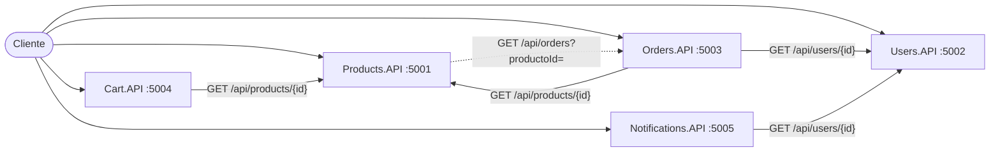

# Repaso general del proyecto

Explicación de todo lo hecho en el repositorio hasta el cierre de Cart.API (01/10/2026): de dónde partimos, cómo planificamos, cómo nos organizamos, qué arquitectura elegimos y por qué, qué aprendimos de las revisiones de código y en qué estado está cada servicio.

Este documento da la **vista de conjunto**. El detalle técnico de cómo se construyó la plantilla (controllers, manejo de errores, logs, Swagger y health checks) está en [repaso-products-api.md](repaso-products-api.md); lo propio de cada API, en su repaso: [Products](repaso-products-api.md) y [Cart](repaso-cart-api.md).

| Documento | Para qué sirve |
|---|---|
| [TP_Microservicios_ECommerce_v7.md](../consignas/TP_Microservicios_ECommerce_v7.md) | Las consignas de la cátedra (versión Markdown del `.docx`) |
| [plan-de-desarrollo.md](../planificacion/plan-de-desarrollo.md) | La guía de trabajo: decisiones, reparto, convenciones y etapas con sus tareas |
| [arquitectura.md](../arquitectura/arquitectura.md) | Diagramas del sistema y de clases |
| [repaso-products-api.md](repaso-products-api.md) | Cómo se construyó Products.API, decisión por decisión |
| **Este documento** | La vista de conjunto del proyecto |

---

## Índice

1. [Línea de tiempo](#1-línea-de-tiempo)
2. [El punto de partida](#2-el-punto-de-partida)
3. [La planificación](#3-la-planificación)
4. [Cómo trabajamos en equipo](#4-cómo-trabajamos-en-equipo)
5. [La arquitectura del sistema](#5-la-arquitectura-del-sistema)
6. [La estructura del repositorio](#6-la-estructura-del-repositorio)
7. [La plantilla común de cada API](#7-la-plantilla-común-de-cada-api)
8. [Cart.API: el primer servicio que consume a otro](#8-cartapi-el-primer-servicio-que-consume-a-otro)
9. [La documentación del repositorio](#9-la-documentación-del-repositorio)
10. [Revisiones de código: qué aprendimos](#10-revisiones-de-código-qué-aprendimos)
11. [Estado actual de cada servicio](#11-estado-actual-de-cada-servicio)
12. [Las decisiones, agrupadas por tema](#12-las-decisiones-agrupadas-por-tema)
13. [Próximos pasos](#13-próximos-pasos)
14. [Preguntas generales de la defensa](#14-preguntas-generales-de-la-defensa)

---

## 1. Línea de tiempo

| Fecha | Quién | Qué pasó | Commit |
|---|---|---|---|
| 16/09 | Thomas | Creación del repositorio | `61b6761` |
| 18/09 | Thomas | Se sube la plantilla `MiniApi` de la cátedra a `develop` | `39d99cf` |
| 27/09 | Thomas | Plan de desarrollo con reparto de tareas | `1e19b88` |
| 27/09 | Thomas | **Etapa 0:** solución con las 5 APIs y sus 5 proyectos de tests | `7863d65` |
| 27/09 | Thomas | GitHub Actions: compila y corre los tests en cada push | `6d8c7b1` |
| 27/09 | Thomas | Contratos entre servicios acordados con Juan Pablo | `cfac238` |
| 27/09 | — | **Hito H1:** PR #1 de `develop` a `main` | merge `4618329` |
| 27/09 | Thomas | **Etapa 1:** dominio y lógica de negocio de Products | `8220c39` |
| 27–29/09 | Juan Pablo | Users.API: lógica, repositorio, refactor a `async` y tests | `1dfb312` … `a31c5d6` |
| 29/09 | Juan Pablo | Notifications.API: dominio, servicio, tests y controller | `f7451f0`, `f62dd6f` |
| 30/09 | Thomas | Convenciones de código y diagramas de arquitectura | `d4f5b45` |
| 30/09 | Thomas | Consignas en `.docx` y Markdown | `7891229` |
| 30/09 | Thomas | **Etapa 2:** endpoints y contrato de errores | `01236c2` |
| 30/09 | Thomas | **Etapa 3:** Serilog y Correlation ID | `6906025` |
| 30/09 | Thomas | **Etapa 4:** Swagger y health checks. Products.API completo | `f2b4118` |
| 30/09 | Thomas | Repasos general y de Products.API | `482fd1c` |
| 01/10 | Thomas | **Etapa 6 (parte 1):** lógica del carrito y `ProductsClient`, el primer cliente HTTP entre servicios | `0405e34` |
| 01/10 | Thomas | **Etapa 6 (parte 2):** endpoints de Cart y plantilla replicada. Cart.API completo | `e4a56ea` |

En dos semanas se pasó de una plantilla vacía a dos servicios completos (Products y Cart, 161 tests entre los dos) que se comunican entre sí, y la base de los otros tres.

---

## 2. El punto de partida

### 2.1 Lo que recibimos

- **Las consignas:** cinco microservicios (Products, Users, Orders, Cart y Notifications) en .NET 10, con requisitos funcionales (endpoints y catálogos de errores) y transversales (Swagger, manejo de errores, logs, Correlation ID y health checks).
- **La plantilla `MiniApi`:** un proyecto mínimo de ASP.NET con el ejemplo del clima y un `.gitignore`.
- **Una promesa:** la persistencia la va a proveer la cátedra como librería. **Todavía no llegó.**

### 2.2 Lo primero: leer las consignas buscando huecos

Antes de escribir código, leímos el enunciado buscando qué **no** estaba definido. Aparecieron varios huecos, y cada uno se resolvió con una decisión propia documentada:

| Hueco en el enunciado | Problema | Decisión |
|---|---|---|
| Orders y Notifications tienen que verificar que el usuario exista (ORD-003, NTF-001)… | …pero Users.API solo expone `register` y `login` | **D-06:** agregar `GET /api/users/{id}`, con el código nuevo USR-007 |
| Products no puede borrar un producto con órdenes activas (PRD-004)… | …pero Orders solo filtra por `?usuarioId=` | **D-07:** agregar el filtro `?productoId=` |
| USR-004 (bloqueo por intentos) y USR-005 (bloqueo manual) son distintos… | …pero el modelo `User` no guarda el motivo del bloqueo | **D-08:** se deduce de `IntentosFallidos` |
| ¿El tercer intento fallido responde 401 o 403? | No está definido | **D-09:** 401 y bloquea; los siguientes, 403 |
| `BusinessRuleException` del Apéndice B no tiene status… | …pero el catálogo usa reglas de negocio con 401, 403, 409 y 422 | **D-10:** la excepción lleva el status |
| La persistencia es de la cátedra… | …y todavía no existe | **D-03:** repositorios en memoria detrás de interfaces |

**Por qué importa:** si estos huecos se descubrían en medio del desarrollo, cada uno habría significado rehacer trabajo de los dos. Resolverlos al principio permitió fijar los **contratos entre servicios** antes de dividir el trabajo (sección 4.3).

---

## 3. La planificación

### 3.1 Un plan escrito y versionado

Todo el trabajo sigue [plan-de-desarrollo.md](../planificacion/plan-de-desarrollo.md), que está en el repo y se actualiza a medida que avanzamos (las casillas se marcan al terminar cada tarea). Tiene seis partes:

1. **Resumen del sistema:** servicios, responsables y puertos.
2. **Estructura:** carpetas, y qué clases llevan interfaz y cuáles no.
3. **Forma de trabajo:** git, hitos, TDD, principios de diseño y convenciones de código.
4. **Reparto de tareas:** quién hace qué y en qué orden.
5. **Registro de decisiones:** D-01 a D-24, cada una con su motivo.
6. **Etapas:** la 0 a la 11, con tareas y criterio de "lista cuando".

**¿Por qué tanto detalle?** Por tres razones:

- Somos dos personas trabajando en paralelo sobre la misma rama; sin un plan compartido, cada uno resolvería lo mismo de forma distinta.
- El enunciado exige que cada integrante pueda explicar cualquier parte del código.
- Las decisiones escritas evitan volver a discutir lo mismo.

### 3.2 Etapas pequeñas e iterativas

En lugar de construir todo de una vez, el trabajo se dividió en 12 etapas. Cada una termina con algo que compila, pasa sus tests y se puede subir:

| Etapas | Qué cubren | Responsable |
|---|---|---|
| 0 | Esqueleto de la solución | Thomas |
| 1 – 4 | Products.API completo: es la **plantilla** de las demás | Thomas |
| 5 | Users.API | Juan Pablo |
| 6 | Cart.API | Thomas |
| 7 | Orders.API | Juan Pablo |
| 8 | Notifications.API | Juan Pablo |
| 9 | Integración entre servicios | Ambos |
| 10 – 11 | Documentación, prueba integral y defensa | Ambos |

**¿Por qué Products primero y completo?** Así lo sugiere la sección 10 del enunciado: "Products.API es la plantilla: una vez que funciona, la estructura se replica en el resto". Resolver una sola vez los aspectos transversales (errores, logs, Swagger y health checks) y después copiarlos evita resolverlos cinco veces de cinco formas distintas.

### 3.3 Hitos

Al cerrar cada hito se abre un PR de `develop` a `main`:

| Hito | Contenido | Estado |
|---|---|---|
| H1 | Solución compilando | ✅ PR #1 mergeado (27/09) |
| H2 | Products completo y Users con su contrato de errores | 🟡 Products listo; falta la parte de Users |
| H3 | Los cinco servicios funcionando | 🟡 Products y Cart listos |
| H4 | Integración, documentación y entrega | Pendiente |

### 3.4 TDD como método

Todo el código de Products se escribió con TDD: primero el test, verlo fallar y después el código. Además de dar confianza para cambiar el código, **encontró tres bugs que una prueba manual difícilmente habría encontrado** (detalle en el [repaso de Products](repaso-products-api.md#13-cómo-trabajamos-tdd)). La meta es que los otros servicios sigan el mismo método.

---

## 4. Cómo trabajamos en equipo

### 4.1 Reparto por servicios

| | Thomas | Juan Pablo |
|---|---|---|
| Servicios | Products, Cart | Users, Notifications, Orders |
| Transversales | La plantilla (errores, logs, Swagger y health checks) | Replicarla en sus servicios |

**La lógica del reparto:** cada uno es dueño de los servicios que consumen a otro servicio suyo. Cart consume a Products (Thomas); Orders y Notifications consumen a Users (Juan Pablo). Así cada uno conoce bien los contratos que usa. Thomas tiene la parte más pesada (la plantilla) y Juan Pablo más servicios, que arma replicándola.

### 4.2 Trabajo en paralelo en bloques

El trabajo se ordenó en 7 bloques. En cada bloque los dos avanzan en paralelo y al final se sincronizan (sección 4.2 del plan). El truco que lo hace posible es separar cada servicio en partes que **no dependen de la plantilla**. Por ejemplo, Juan Pablo puede escribir la lógica de negocio de Users con sus tests unitarios mientras Thomas termina la capa HTTP de Products.

### 4.3 Contratos acordados antes de empezar

Para que nadie tenga que esperar al otro, en el Bloque 1 se fijaron (sección 4.4 del plan):

- **La forma de las excepciones:** `NotFoundException(errorCode, message)`, `BusinessRuleException(errorCode, message, statusCode)` y `ValidationException(errorCode, message)`.
- **El formato de error:** el de la sección 3.1 del enunciado, más `correlationId`.
- **Los endpoints que se consumen entre servicios:** `GET /api/products/{id}`, `GET /api/users/{id}` y `GET /api/orders?productoId=`.
- **Los nombres de los clientes HTTP:** `IProductsClient`, `IUsersClient` e `IOrdersClient`.

Con esto, Thomas puede programar el cliente de Orders y Juan Pablo los clientes de Users **antes** de que existan los servicios del otro: testean contra el contrato acordado con dobles de prueba.

### 4.4 Git y commits

- **Una sola rama de trabajo: `develop`.** No usamos feature branches; es un TP y alcanza con una rama compartida y PRs a `main` en cada hito.
- **Commits con Commitizen** (`cz commit`), con el formato Conventional Commits: `tipo(alcance): descripción`. Por ejemplo: `feat(products): agregar endpoints…`. El historial se lee como una lista de cambios.
- **Cada uno toca solo sus carpetas,** y hace `git pull --rebase` antes de cada push. Por eso no hubo conflictos.
- **Merge commit, no squash, al pasar a `main`.** Con squash o rebase, GitHub crea en `main` commits que `develop` no tiene, y el siguiente PR mostraría conflictos o commits repetidos.

### 4.5 Integración continua

GitHub Actions ([`.github/workflows/ci.yml`](../../.github/workflows/ci.yml)) compila la solución y corre **todos** los tests en cada push a `develop` o `main` y en cada PR a `main`. La regla "nunca se mergea código que no compile" no depende de que alguien se acuerde de verificarlo.

**Una limitación importante:** el CI solo ve lo que se compila. Un archivo sin extensión `.cs` no entra en la compilación, así que el CI sigue en verde aunque el código tenga errores. Esto pasó de verdad (sección 10.1).

---

## 5. La arquitectura del sistema

### 5.1 Microservicios



Cada servicio:

- **Es un proyecto independiente** con su propio puerto. Se puede levantar, testear y desplegar solo.
- **Es dueño de sus datos.** Ningún servicio lee los datos de otro directamente: si Orders necesita saber si un usuario existe, se lo pregunta a Users por HTTP.
- **Tiene su propia copia de la plantilla** (D-05: sin librería compartida).

### 5.2 ¿Por qué no hay una librería compartida (D-05)?

Los cinco servicios tienen las mismas excepciones, handlers y middlewares. Parecería lógico moverlos a una librería común. No lo hicimos por dos razones:

1. **Autonomía:** en una arquitectura de microservicios, cada servicio debería poder cambiar sin coordinar con los demás. Una librería compartida obliga a actualizar los cinco cada vez que cambia.
2. **El enunciado:** la sección 6 muestra `Exceptions/` y `ExceptionHandlers/` dentro de cada API.

El costo es duplicar código. Lo aceptamos a cambio de que cada servicio sea independiente.

### 5.3 La dependencia circular Products ↔ Orders

Orders llama a Products (precio y stock) y Products llama a Orders (PRD-004). Es la única dependencia en los dos sentidos. Es aceptable porque:

- son llamadas puntuales, no un flujo continuo entre los dos;
- Products la tiene detrás de `IOrdersClient`, y hoy usa `StubOrdersClient`, que responde siempre "sin órdenes activas";
- si Orders se cae, solo falla la eliminación de productos, no todo Products.

Conviene tenerla clara para la defensa, porque es una pregunta típica.

### 5.4 Comunicación entre servicios

Las llamadas HTTP se hacen con `IHttpClientFactory`, siempre detrás de una interfaz (`IProductsClient`, `IUsersClient`, `IOrdersClient`), con la URL de cada servicio en `appsettings.json`. Cart → Products ya funciona así (sección 8).

Falta, para la Etapa 9, que cada llamada lleve el `X-Correlation-Id` del request original. Así, un request que pasa por Orders, Users y Products dejaría en los logs de los tres el mismo ID.

---

## 6. La estructura del repositorio

```
tp_arquitectura_microservicios_cai_grupo_15/
├── .github/workflows/ci.yml      # integración continua
├── ECommerce.slnx                 # la solución con los 10 proyectos
├── src/                           # las 5 APIs (puertos 5001–5005)
├── tests/                         # 5 proyectos de tests, cada uno con Unit/ e Integration/
├── docs/                          # consignas, plan, arquitectura y repasos
├── .gitignore
└── README.md                      # se completa en la Etapa 10
```

Decisiones de estructura (detalle en el [repaso de Products](repaso-products-api.md#2-etapa-0--esqueleto-de-la-solución)):

| Decisión | Por qué |
|---|---|
| `ECommerce.slnx` reemplaza a `MiniApi.slnx` | Estructura de la sección 6 del enunciado (D-01) |
| Controllers, no Minimal API | El enunciado pide `Controllers/` y XML comments (D-02) |
| Solo HTTP, puertos fijos 5001–5005 | Llamadas internas simples, sin certificados (D-16) |
| `appsettings.Development.json` versionado | Define el detalle de errores por entorno (D-04) |
| Un proyecto de tests por API | Los tests no forman parte del producto y cada uno trabaja en sus carpetas |
| Paquetes de tests | xUnit, `Microsoft.AspNetCore.Mvc.Testing` (`WebApplicationFactory`), NSubstitute (dobles de prueba) y `Microsoft.Extensions.TimeProvider.Testing` (`FakeTimeProvider`) |

---

## 7. La plantilla común de cada API

Todas las APIs tienen las mismas capas. El detalle de cada una, con su porqué, está en el [repaso de Products](repaso-products-api.md):

| Capa / pieza | Responsabilidad | Requisito del enunciado |
|---|---|---|
| Controller | Traduce HTTP ↔ DTO, sin lógica ni `try/catch` | Endpoints (sección 4) |
| Service | Reglas de negocio; lanza excepciones con código del catálogo | Catálogos de errores |
| Repository | Persistencia (en memoria hasta tener la librería) | Persistencia de la cátedra |
| Clients | Llamadas a otros servicios | Comunicación HTTP |
| Excepciones + 4 `IExceptionHandler` + `ErrorResponseWriter` | Excepción → JSON de error del contrato | 5.2 Manejo de errores |
| Serilog + `CorrelationIdMiddleware` + `RequestLoggingMiddleware` | Logs estructurados con Servicio, Endpoint, CorrelationId y ErrorCode | 5.3 Logging y 5.5 Correlation ID |
| Swashbuckle + `[ProducesError]` | Documentación con ejemplos de éxito y de error | 5.1 Swagger |
| `/health`, `/health/ready`, `/health/live` | Estado del servicio | 5.4 Health Checks |

**La plantilla ya se replicó una vez, en Cart.API**, y sirvió: la parte transversal (manejo de errores, logs, Correlation ID, Swagger y health checks) se copió de Products y solo hubo que adaptar los códigos de error y dos detalles ([repaso de Cart, sección 5.2](repaso-cart-api.md#52-replicar-la-plantilla)).

**El criterio para usar interfaces** (D-15, sección 2.3 del plan): llevan interfaz los servicios, la persistencia, los clientes de otros servicios y lo que depende del entorno. No llevan interfaz los modelos, los DTOs, las excepciones, los controllers ni las reglas puras. Una interfaz tiene que aportar algo: poder reemplazar la pieza en un test o cambiar su implementación.

---

## 8. Cart.API: el primer servicio que consume a otro

Cart.API es el segundo servicio terminado y el primero que **depende de otro**: para agregar un producto al carrito, le pregunta a Products.API por HTTP si existe y cuánto stock tiene. El detalle completo está en su repaso: **[repaso-cart-api.md](repaso-cart-api.md)**. Lo importante, a nivel proyecto:

| Tema | Qué se hizo | Más detalle |
|---|---|---|
| **Huecos del enunciado** | Cuatro decisiones nuevas antes de escribir tests: todo 400 usa CRT-004 (D-25), un producto que no está en el carrito responde CRT-002 (D-26), vaciar elimina el carrito (D-27) y Products caído responde CRT-005 (D-28) | [Repaso de Cart, sección 2](repaso-cart-api.md#2-antes-de-programar-los-huecos-del-enunciado) |
| **Primer cliente HTTP** | `ProductsClient`, registrado con `IHttpClientFactory` y con la URL en `appsettings.json`. Revisa el status antes de leer el body: un 404 es un dato ("no existe") y un 500 es una falla | [Repaso de Cart, sección 4](repaso-cart-api.md#4-productsclient-hablar-con-otro-servicio) |
| **Tests con una dependencia** | Tres niveles: el cliente con un handler HTTP falso, Cart completo con un `FakeProductsClient` y una prueba manual con los dos servicios | [Repaso de Cart, sección 6](repaso-cart-api.md#6-cómo-se-testea-un-servicio-que-depende-de-otro) |
| **La plantilla se replicó** | La parte transversal se copió de Products y solo cambiaron los códigos de error y dos detalles. Confirma que la plantilla no depende del dominio | [Repaso de Cart, sección 5.2](repaso-cart-api.md#52-replicar-la-plantilla) |
| **Resiliencia** | Con Products caído, Cart responde CRT-005 al agregar productos, pero sigue mostrando los carritos | [Repaso de Cart, sección 7](repaso-cart-api.md#7-la-prueba-con-los-dos-servicios-levantados) |
| **Lo que falta** | El Correlation ID no viaja de Cart a Products: un mismo request aparece con dos IDs distintos en los logs. Lo resuelve la Etapa 9 | [Repaso de Cart, sección 10](repaso-cart-api.md#10-lo-que-falta-etapa-9) |

> **Para la defensa:** "Cart consulta a Products por HTTP detrás de una interfaz. Un 404 de Products es un dato del negocio (CRT-002) y un 500 es una falla de infraestructura (CRT-005). Si Products se cae, solo fallan las operaciones que lo necesitan."

---

## 9. La documentación del repositorio

| Documento | Cómo se armó | Por qué |
|---|---|---|
| **Consignas** (`.docx` + `.md`) | El `.md` se generó con un conversor propio en Python que lee el XML interno del `.docx`. Toma la fuente Courier New como señal de código para separar los bloques JSON y C#, y convierte las 47 tablas según su tipo. Se verificó palabra por palabra contra el original. | GitHub no muestra los `.docx`. En Markdown se lee, se busca y se puede enlazar a una sección. Si la cátedra publica una v8, `git diff` muestra qué cambió. |
| **Plan de desarrollo** | Se fue completando etapa por etapa. | Es la guía del equipo; las decisiones quedan escritas. |
| **Arquitectura** | Diagramas en Mermaid: GitHub los dibuja solos y se editan como texto. | Una imagen se desactualiza; el texto se versiona junto al código. |
| **Repasos** (`docs/repasos/`) | Uno general y uno por API, escrito al terminarla (convención del plan). | Para entender el código en profundidad y preparar la defensa. |
| **README** | La puerta de entrada del repo: qué es, cómo ejecutarlo, puertos, estado y enlaces a los demás documentos. La tabla de códigos de error y las decisiones se completan en la Etapa 10. | Es lo primero que ve cualquiera que abre el repositorio, incluidos los docentes. |

Todos los diagramas Mermaid se verificaron dibujándolos en un navegador antes de subirlos. Así se encontraron dos problemas que en GitHub se habrían visto como errores: diagramas de clases enredados y un `;` que rompía un diagrama de secuencia.

---

## 10. Revisiones de código: qué aprendimos

Revisamos el código de Juan Pablo dos veces. No fue para señalar errores, sino porque el enunciado exige que los dos entiendan todo el código, y porque los problemas que se encuentran temprano se corrigen fácil.

### 10.1 Primera revisión: archivos que no compilaban

**Lo que se encontró:** casi todos los archivos de Users estaban **sin extensión `.cs`** y muchos estaban vacíos. Como .NET solo compila los `.cs`, el compilador los ignoraba, y el build y el CI daban verde aunque el código tuviera errores.

**Causa probable:** en Windows, el Explorador oculta las extensiones; un archivo creado como "UserService" queda sin `.cs`.

**Lo que aprendimos:** "el CI está verde" no significa "el código funciona", si el código no entra en la compilación. Por eso se sumó la convención "revisar `git status` antes de cada commit" y crear las clases desde el editor.

### 10.2 Segunda revisión: mejoró mucho, con tres bloqueantes

Juan Pablo corrigió la primera revisión: archivos con extensión, métodos `async` con `CancellationToken`, DTOs como `record`, validaciones y tests unitarios. Aparecieron tres problemas nuevos que **los tests unitarios no podían detectar**:

| Bloqueante | Por qué los tests no lo vieron |
|---|---|
| Se eliminó `GET /api/users/{id}` y USR-007, que son un contrato acordado (D-06) | Users compila y pasa sus tests; el que se rompe es **otro** servicio (Orders y Notifications), y recién cuando se integran |
| Users.API no registra sus dependencias: la API real responde 500 en `register` y `login` | Los tests unitarios crean el servicio a mano (`new UserService(...)`) y nunca pasan por el contenedor |
| El repositorio de Notifications es Scoped: las notificaciones se pierden entre requests | Mismo motivo: el test no usa el contenedor de dependencias |

También hubo observaciones importantes, no bloqueantes: el tercer intento fallido de login no coincide con D-09, la `BusinessRuleException` de Notifications no tiene `statusCode`, los repositorios usan `List<T>` (no es thread-safe), y faltan tests, datos semilla y `TimeProvider`.

### 10.3 Lo que se agregó al plan a partir de las revisiones

Las dos revisiones dieron origen a la sección **"Convenciones de código"** del plan: 12 reglas concretas, cada una con su porqué. Las más importantes:

- archivos siempre con `.cs`, creados desde el editor;
- repositorios en memoria **Singleton** y con `ConcurrentDictionary`;
- un **`DependencyInjectionTests` en cada API**, que levanta la app real y verifica que el contenedor resuelva el servicio. Es el test que habría detectado los bloqueantes 2 y 3;
- los contratos entre servicios no se cambian sin acordarlo.

**La lección general:** cada tipo de test detecta un tipo de error distinto. Los unitarios prueban la lógica; los de integración, que las piezas estén bien conectadas; los contratos entre servicios se rompen en el otro servicio. Por eso Products tiene los tres tipos de verificación.

---

## 11. Estado actual de cada servicio

| Servicio | Responsable | Estado | Tests |
|---|---|---|---|
| **Products.API** | Thomas | ✅ **Completo** (Etapas 1–4). Es la plantilla. Falta la integración real con Orders (Etapa 9). | 71 |
| **Users.API** | Juan Pablo | 🟡 Lógica de negocio y controller hechos. **Bloqueantes abiertos:** falta `GET /api/users/{id}` y USR-007, y falta registrar las dependencias. Falta replicar errores, logs, Swagger y health checks. | 5 |
| **Notifications.API** | Juan Pablo | 🟡 Dominio, servicio y controller hechos. **Bloqueante abierto:** repositorio Scoped. Falta replicar la plantilla. | 2 |
| **Cart.API** | Thomas | ✅ **Completo** (Etapa 6). Primer servicio que consume a otro. Falta propagar el Correlation ID y sumar Products a `/health/ready` (Etapa 9). | 90 |
| **Orders.API** | Juan Pablo | ⬜ Solo el esqueleto (Bloque 5). | 1 (humo) |

**Pendientes externos:**

- La librería de persistencia de la cátedra (D-03).
- Consultar con los docentes los endpoints adicionales (D-06, D-07) y el código USR-007.

---

## 12. Las decisiones, agrupadas por tema

Las 28 decisiones del plan, agrupadas para entender **qué problema resuelve cada grupo**. El texto completo está en la sección 5 del plan.

**Estructura y entorno**

| # | Decisión | En una línea |
|---|---|---|
| D-01 | `ECommerce.slnx` con `src/` y `tests/` | Estructura de la sección 6 del enunciado más TDD |
| D-02 | Controllers | El enunciado pide la carpeta `Controllers/` |
| D-04 | `appsettings.Development.json` versionado | Define el detalle de errores por entorno |
| D-16 | Solo HTTP | Llamadas internas sin certificados |

**Diseño**

| # | Decisión | En una línea |
|---|---|---|
| D-03 | Persistencia en memoria detrás de interfaces | Avanzar sin esperar la librería de la cátedra |
| D-05 | Sin librería compartida | Autonomía de cada microservicio |
| D-15 | Interfaces solo donde aportan | Bajo acoplamiento sin interfaces innecesarias |

**Huecos del enunciado (contratos entre servicios y reglas)**

| # | Decisión | En una línea |
|---|---|---|
| D-06 | `GET /api/users/{id}` + USR-007 | Orders y Notifications verifican usuarios |
| D-07 | `?productoId=` en Orders | Products verifica órdenes activas |
| D-08 | USR-004 vs. USR-005 por `IntentosFallidos` | El modelo no guarda el motivo del bloqueo |
| D-09 | Tercer intento: 401 y bloqueo | La respuesta refleja el motivo de ese intento |
| D-13 | Cart suma cantidades | Comportamiento esperable de un carrito |
| D-14 | Crear una orden no descuenta stock | El enunciado no lo exige |

**Contrato de errores**

| # | Decisión | En una línea |
|---|---|---|
| D-10 | `BusinessRuleException` con status | El catálogo usa 401, 403, 409 y 422 |
| D-11 | `correlationId` en los errores | Requisito 5.5 |
| D-12 | Solo los status del contrato | `PUT` de productos no devuelve 409 |
| D-17 | Ids de ruta como texto | `/api/products/99` → 404 con PRD-001 |
| D-18 | Detalle de los 500 según entorno | Requisito 5.2, sin stack trace |
| D-19 | JSON inválido → un mensaje en español | Los mensajes de .NET están en inglés |

**Cart.API**

| # | Decisión | En una línea |
|---|---|---|
| D-25 | Todo 400 de Cart usa CRT-004 | Es el único código 400 del catálogo de Cart |
| D-26 | Producto que no está en el carrito → CRT-002 | El catálogo no tiene un código para ese caso |
| D-27 | Vaciar elimina el carrito | Deja al usuario sin carrito activo |
| D-28 | Products caído → 500 con CRT-005 | Es una falla de infraestructura, no del negocio |

**Observabilidad y documentación**

| # | Decisión | En una línea |
|---|---|---|
| D-20 | Validar el `X-Correlation-Id` recibido | Evitar texto arbitrario en logs y en otros servicios |
| D-21 | Serilog sin logger estático | Evitar que los logs se pierdan entre APIs |
| D-22 | Swagger en todos los entornos | El enunciado lo pide y la demo se hace ahí |
| D-23 | `[ProducesError]` propio | No hay paquete de ejemplos compatible con Swashbuckle 10 |
| D-24 | `live` vs. `ready` | Separar "vivo" de "listo para atender" |

---

## 13. Próximos pasos

**Juan Pablo (cerrar el hito H2):**

1. Restaurar `GET /api/users/{id}` y USR-007.
2. Registrar las dependencias de Users y agregar `DependencyInjectionTests`.
3. Cambiar el repositorio de Notifications a Singleton.
4. Definir D-09: alinear el código o actualizar el plan.
5. Replicar en Users la capa de errores de la Etapa 2 de Products, usando las carpetas `ExceptionHandlers/` e `Infrastructure/` como referencia.

**Thomas (Bloque 5, Etapa 9 en Products y Cart):**

1. `CorrelationIdDelegatingHandler`: que el `X-Correlation-Id` viaje en las llamadas de Cart a Products (el problema de la [sección 7 del repaso de Cart](repaso-cart-api.md#7-la-prueba-con-los-dos-servicios-levantados)).
2. `DownstreamServiceHealthCheck`: Products en el `/health/ready` de Cart, y Orders en el de Products.
3. Timeouts en los clientes HTTP.
4. `OrdersClient` real para PRD-004, que reemplaza a `StubOrdersClient`. **Depende de que Juan Pablo implemente `GET /api/orders?productoId=`:** conviene coordinar con él antes de arrancar.

**Después:** Orders (Juan Pablo), las capturas de Swagger y la parte del README que falta (Etapa 10), y el ensayo de la defensa (Etapa 11).

---

## 14. Preguntas generales de la defensa

Las preguntas específicas de Products están en su [repaso](repaso-products-api.md#9-preguntas-probables-de-la-defensa). Estas son las del proyecto en general.

**¿Por qué microservicios y no una sola API?**
Lo pide el enunciado, y además permite que cada servicio se desarrolle, pruebe y despliegue por separado. El costo es la comunicación por HTTP entre servicios, con sus fallas posibles. Para eso están los health checks, los timeouts y el Correlation ID.

**¿Cómo se comunican los servicios?**
Por HTTP, con `IHttpClientFactory`, siempre detrás de una interfaz y llevando el `X-Correlation-Id`. Ningún servicio lee los datos de otro directamente.

**¿Qué pasa si se cae un servicio del que dependen?**
Fallan solo las operaciones que lo necesitan, con el 500 del servicio y el error en el log. Por ejemplo, si Products se cae, Cart no puede agregar productos (CRT-005), pero sigue mostrando los carritos. Lo verificamos con los dos servicios levantados ([repaso de Cart, sección 7](repaso-cart-api.md#7-la-prueba-con-los-dos-servicios-levantados)).

**¿Por qué cada servicio tiene su propia copia de las excepciones y los handlers?**
Para que sean independientes (D-05). Una librería compartida obligaría a coordinar los cinco servicios ante cada cambio.

**¿Qué hacen si la librería de persistencia no llega a tiempo?**
El sistema funciona igual con los repositorios en memoria. Cuando llegue, se implementa la interfaz del repositorio con la librería y se cambia una línea de registro en cada servicio.

**¿Cómo se organizaron como equipo?**
Por servicios: cada uno es dueño de los suyos y los contratos entre servicios se acordaron antes de empezar. Trabajamos en paralelo sobre `develop` con commits pequeños, un CI que corre todos los tests y revisiones cruzadas del código del otro.

**¿Qué aprendieron de las revisiones de código?**
Que cada tipo de test detecta un tipo de error distinto. Los tests unitarios no detectaron dependencias sin registrar ni un repositorio con el ciclo de vida equivocado. Por eso cada API tiene un test que levanta la app real y verifica el contenedor.

**¿Cómo resolvieron lo que el enunciado no define?**
Con decisiones explícitas y documentadas: 24 en el registro del plan, cada una con su motivo. Las que agregan endpoints (D-06, D-07) quedaron marcadas para consultarlas con los docentes.
