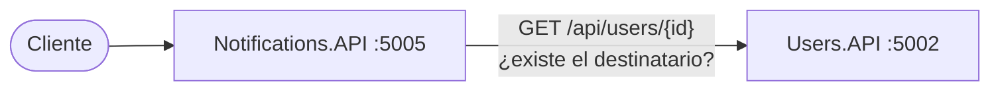
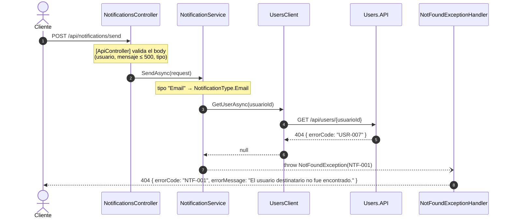

# Repaso: cómo construimos Notifications.API

Guía de estudio de la Etapa 8 del [plan de desarrollo](../planificacion/plan-de-desarrollo.md). Explica **qué** hace cada pieza de Notifications.API y **por qué** se decidió así.

Notifications.API reutiliza la plantilla de Products.API (manejo de errores, logs, Correlation ID, Swagger y health checks), explicada en el [repaso de Products.API](repaso-products-api.md). Su cliente HTTP sigue el mismo diseño que el de Cart, explicado en el [repaso de Cart.API](repaso-cart-api.md#4-productsclient-hablar-con-otro-servicio). Este documento se concentra en lo propio de Notifications:

- el **envío simulado** detrás de una interfaz;
- los **enums** de tipo y estado, y por qué la API los expone como texto;
- `UsersClient`, el segundo cliente HTTP entre servicios del proyecto;
- los huecos del enunciado que hubo que resolver.

---

## Índice

1. [Visión general](#1-visión-general)
2. [Antes de programar: los huecos del enunciado](#2-antes-de-programar-los-huecos-del-enunciado)
3. [El dominio y las reglas](#3-el-dominio-y-las-reglas)
4. [`UsersClient`: hablar con Users.API](#4-usersclient-hablar-con-usersapi)
5. [La capa HTTP y la plantilla](#5-la-capa-http-y-la-plantilla)
6. [Cómo se testea](#6-cómo-se-testea)
7. [Recorrido completo de un request](#7-recorrido-completo-de-un-request)
8. [Mapa de archivos](#8-mapa-de-archivos)
9. [La historia: lo que corrigieron las revisiones](#9-la-historia-lo-que-corrigieron-las-revisiones)
10. [Lo que falta: Etapa 9](#10-lo-que-falta-etapa-9)
11. [Preguntas probables de la defensa](#11-preguntas-probables-de-la-defensa)

---

## 1. Visión general

### 1.1 Qué es Notifications.API

El servicio de soporte que registra notificaciones y simula su envío, en el puerto 5005:

| Método | Ruta | Qué hace | Éxito | Errores |
|---|---|---|---|---|
| POST | `/api/notifications/send` | Registra una notificación y simula el envío | 201 | 400, 404 |
| GET | `/api/notifications/{userId}` | Lista las notificaciones de un usuario | 200 | 404 |

Los dos pueden responder 500. Su catálogo de errores:

| Código | HTTP | Cuándo |
|---|---|---|
| NTF-001 | 404 | El destinatario no existe en Users.API |
| NTF-002 | 400 | Datos faltantes, mensaje de más de 500 caracteres, tipo distinto de Email, Push o SMS, o JSON mal formado |
| NTF-003 | 404 | El usuario no tiene notificaciones, o el id no es un GUID (D-17, D-30) |
| NTF-004 | 500 | Error inesperado o Users.API no responde (D-29) |

### 1.2 Lo que lo hace distinto: depende de Users

Antes de registrar una notificación, Notifications verifica que el destinatario exista. Ese dato es de Users.API, así que **se lo pregunta por HTTP**, igual que Cart con Products:



### 1.3 Cómo se construyó

| Fecha | Commits | Qué | Tests |
|---|---|---|---|
| 29/09 | `f7451f0`, `f62dd6f` | Dominio, servicio, controller y primeros tests | 3 |
| 04/10 | `5d673a4` | Repositorio Singleton thread-safe, contrato de errores y envío simulado detrás de una interfaz | 3 |
| 07/10 | `54a8efa` | Correcciones de la tercera revisión: `UsersClient` real, `Guid?` obligatorio, ruta D-17 y tests | 26 |
| 07/10 | `76b4cee` | Enums de tipo y estado, nombres en inglés y tests de repositorio | 31 |
| 07/10 | `348fb38` | Plantilla transversal: Serilog, Swagger y health checks | **57** |

---

## 2. Antes de programar: los huecos del enunciado

| # | Pregunta sin respuesta en el enunciado | Decisión | Por qué |
|---|---|---|---|
| D-06 | ¿Cómo se verifica que el destinatario exista? | Con `GET /api/users/{id}`, el endpoint agregado a Users | Users no tenía otra forma de responder esa pregunta |
| D-29 | ¿Qué pasa si Users.API no responde? | 500 con NTF-004 | Es una falla de infraestructura, no un dato del negocio. Es la misma decisión que D-28 en Cart |
| D-30 | `GET /api/notifications/{userId}` de un usuario que no existe en Users: ¿NTF-001 o NTF-003? | NTF-003, sin consultar a Users. Un id que no es GUID también responde NTF-003 (D-17) | El catálogo define NTF-001 solo para el POST. Para el GET la respuesta correcta es "no hay notificaciones", y se evita una llamada HTTP que no cambia el resultado |
| D-31 | ¿Se le puede enviar una notificación a un usuario bloqueado? | Sí: solo se verifica que exista | El bloqueo impide iniciar sesión, no recibir avisos (por ejemplo, el aviso de que la cuenta fue bloqueada) |

Además, el **tipo** distingue mayúsculas: `Email`, `Push` y `SMS` son los únicos valores aceptados, tal como los escribe el Apéndice A.

---

## 3. El dominio y las reglas

### 3.1 `Notification` y sus enums

```csharp
public class Notification
{
    public Guid Id { get; set; }
    public Guid UsuarioId { get; set; }
    public string Mensaje { get; set; } = string.Empty;
    public NotificationType Tipo { get; set; }        // Email, Push, SMS
    public NotificationStatus Estado { get; set; }    // Pendiente, Enviada, Fallida
    public DateTime FechaEnvio { get; set; }
}
```

**¿Por qué enums y no texto?** Porque el Apéndice A define una lista cerrada de valores. Con un enum, el compilador impide guardar un tipo inexistente como `"Fax"` o un estado mal escrito como `"enviada"`.

**Pero la API habla en texto:** el request trae `"tipo": "Email"` y la respuesta devuelve `"estado": "Enviada"`, como en los ejemplos del enunciado. La conversión se hace en un solo lugar: `NotificationService` convierte el texto del request al enum (`Enum.Parse`) y `ToResponse` convierte el enum a texto (`ToString()`).

### 3.2 El envío, detrás de una interfaz

```csharp
public interface INotificationSender
{
    Task<NotificationSendResult> SendAsync(Notification notification, CancellationToken cancellationToken = default);
}

public record NotificationSendResult(NotificationStatus Estado, DateTime FechaEnvio);
```

`SimulatedNotificationSender` siempre responde `Enviada` con la fecha actual de `TimeProvider`. **¿Por qué una interfaz para algo que no hace nada?** Porque el envío **depende del entorno**: hoy es simulado, pero mañana podría ser un servidor de mail o un servicio de push. Con la interfaz, ese cambio es una clase nueva y una línea en `ServiceCollectionExtensions`, sin tocar `NotificationService` (criterio de la sección 2.3 del plan).

El estado y la fecha los decide **el sender**, no el servicio: un envío real podría responder `Fallida`, y el servicio registraría lo que pasó.

### 3.3 Las reglas de `NotificationService`

| Operación | Reglas, en orden |
|---|---|
| `SendAsync` | Hay `UsuarioId` → si no, **NTF-002** · el tipo es Email, Push o SMS → si no, **NTF-002** · el usuario existe en Users → si no, **NTF-001** · crea la notificación como `Pendiente` · la envía · guarda el estado y la fecha que informó el sender |
| `GetByUserIdAsync` | Hay notificaciones del usuario → si no, **NTF-003** · las devuelve de la más vieja a la más nueva |

**El orden importa:** las validaciones baratas van antes que la llamada HTTP a Users. Un request con un tipo inválido no consulta a nadie.

Las dos primeras validaciones también las hacen las Data Annotations del request, así que por HTTP nunca llegan al servicio. Están repetidas en el servicio a propósito: lo protegen si lo llama otro código, y los tests unitarios las verifican.

### 3.4 Los DTOs

- **`SendNotificationRequest`:** `UsuarioId` es **`Guid?`** con `[Required]`. Con `Guid` a secas, un body sin `usuarioId` llegaba como `Guid.Empty`, que `[Required]` no detecta, y terminaba en un 404 (NTF-001) en lugar de un 400 (NTF-002). Es el mismo motivo que `ProductoId` en Cart. `Mensaje` tiene un máximo de 500 caracteres y `Tipo` se valida con `[RegularExpression("^(Email|Push|SMS)$")]`. Todos los mensajes están en español.
- **`NotificationResponse`:** la forma exacta del ejemplo del enunciado, con `tipo` y `estado` como texto.

### 3.5 El repositorio

`InMemoryNotificationRepository` guarda las notificaciones en un `ConcurrentDictionary<Guid, Notification>` con el id de la notificación como clave. Es Singleton y thread-safe, y `GetByUserIdAsync` devuelve una lista ya materializada (`ToList()`) y ordenada por fecha de envío.

En la segunda revisión este repositorio estaba registrado como **Scoped**: se creaba uno nuevo en cada request, así que una notificación enviada no aparecía en el GET siguiente. Lo corrigió `5d673a4`.

---

## 4. `UsersClient`: hablar con Users.API

Es el segundo cliente HTTP del proyecto y sigue el diseño de `ProductsClient` de Cart:

```csharp
public async Task<UserInfo?> GetUserAsync(Guid userId, CancellationToken cancellationToken = default)
{
    using var response = await httpClient.GetAsync($"api/users/{userId}", cancellationToken);

    if (response.StatusCode == HttpStatusCode.NotFound)
    {
        return null;                          // USR-007 de Users → NTF-001 en Notifications
    }

    response.EnsureSuccessStatusCode();       // 500, 503, sin respuesta → excepción → NTF-004 (D-29)

    return await response.Content.ReadFromJsonAsync<UserInfo>(cancellationToken);
}
```

- **Se revisa el status antes de leer el body.** Un 404 de Users trae su JSON de error (USR-007), no un usuario.
- **Un 404 es un dato y un 500 es una falla,** igual que en Cart.
- **`UserInfo`** es un DTO propio con `Id`, `Nombre`, `Apellido`, `Email` y `Activo`, los campos del contrato de la sección 4.4 del plan (D-05).
- **Typed client con `IHttpClientFactory`,** con la URL en `Services:UsersApi:BaseUrl` del `appsettings.json`. Si falta, la API no arranca y dice qué falta.
- **Timeout de 5 segundos.** Es una tarea de la Etapa 9 que quedó hecha antes. Sin ella, si Users se cuelga, Notifications espera el timeout por defecto de .NET: 100 segundos.

**Historia:** al principio Notifications usaba un `StubUsersClient` que daba por existente a cualquier GUID que no fuera vacío. NTF-001 nunca se disparaba de verdad, y `UsersClient.cs` había quedado commiteado como un archivo de 0 bytes. Fue el primer punto de la tercera revisión.

---

## 5. La capa HTTP y la plantilla

### 5.1 `NotificationsController`

- **`POST /send` responde 201 sin header `Location`.** No hay un endpoint para obtener **una** notificación por su id, así que no hay a dónde apuntar. El status es el que pide el contrato (D-12).
- **`GET /{userId}` recibe el id como texto** (D-17). Antes la ruta era `{userId:guid}`, y `/api/notifications/99` respondía un 404 **vacío**, sin `errorCode`. Ahora responde NTF-003 con el contrato completo.
- **Las acciones se llaman como en la plantilla** (`Send`, `GetByUserId`) y devuelven `ActionResult<T>`.

### 5.2 Replicar la plantilla

Se copió de Cart cambiando el namespace, con estas adaptaciones:

| Pieza | Cambio |
|---|---|
| Validaciones | NTF-002 |
| `GlobalExceptionHandler` | NTF-004, "Error interno al procesar la notificación." |
| `ErrorExamplesOperationFilter` | El parámetro `{userId}` se reemplaza por el ID de María |
| Health check | `NotificationRepositoryHealthCheck` verifica la persistencia de notificaciones |

### 5.3 `Notifications.API.http`

Tiene un request para cada caso de éxito y uno por cada código NTF, más los de Correlation ID y health checks. Para enviar notificaciones hace falta Users.API levantado en el puerto 5002.

---

## 6. Cómo se testea

Los mismos tres niveles que Cart:

| Nivel | Qué prueba | Cómo | Tests |
|---|---|---|---|
| **1. El cliente HTTP** | Que `UsersClient` arme la URL e interprete 200, 404, 4xx, 5xx y la falta de respuesta | Un `HttpMessageHandler` falso reemplaza la red | 7 |
| **Unitario** | Reglas del servicio, sender simulado y repositorio | Users y el sender como dobles de NSubstitute; `FakeTimeProvider` para la fecha | 10 |
| **2. Notifications completo** | Los 2 endpoints, NTF-001 a NTF-004 y la plantilla | `NotificationsApiFactory` con un `FakeUsersClient` en el que solo existe María | 40 |
| **3. Los dos servicios juntos** | La integración real | Prueba manual con Users y Notifications levantados (pendiente, sección 10) | — |

**Total: 57.**

- **`FakeUsersClient`** conoce solo a María (`a1b2c3d4-…`), la misma usuaria semilla de Users. Cualquier otro id es "no existe" → NTF-001.
- **`DependencyInjectionTests`** usa la configuración **real**, sin el fake: verifica que `UsersClient` sea un typed client con la URL `http://localhost:5002/` y el timeout de 5 segundos.
- **Los tests del servicio usan dobles** para Users y para el sender, y verifican que, si el usuario no existe, **no se envíe ni se guarde nada** (`DidNotReceive()`).

---

## 7. Recorrido completo de un request

`POST /api/notifications/send` para un usuario que no existe en Users:



Paso a paso:

1. **Los middlewares** asignan el Correlation ID y loguean el inicio.
2. **`[ApiController]` valida el body.** Un tipo `"Fax"` cortaría acá con NTF-002, sin consultar a Users.
3. **El servicio repite las validaciones baratas** y convierte el tipo al enum.
4. **Consulta a Users** a través de `IUsersClient`. Users responde 404 con su propio error (USR-007), y `UsersClient` lo traduce a `null` **sin leer el body**.
5. **El servicio lanza NTF-001.** El sender y el repositorio nunca se llaman: no queda una notificación registrada por error.
6. **El `NotFoundExceptionHandler`** loguea un `Warning` con `ErrorCode = NTF-001` y escribe el 404 del contrato.

Si el usuario existiera, el servicio crearía la notificación como `Pendiente`, el sender la marcaría `Enviada` con la fecha actual, se guardaría y el controller respondería 201.

---

## 8. Mapa de archivos

### `src/Notifications.API/` (lo propio de Notifications)

| Archivo | Qué hace |
|---|---|
| `Models/Notification.cs` | La notificación del Apéndice A |
| `Models/NotificationType`, `NotificationStatus` | Los enums: Email/Push/SMS y Pendiente/Enviada/Fallida |
| `DTOs/SendNotificationRequest` | Lo que entra, con validaciones en español |
| `DTOs/NotificationResponse` | Lo que sale, con tipo y estado como texto |
| `Services/INotificationService` → `NotificationService` | Las reglas: NTF-001 a NTF-003 |
| `Services/INotificationSender` → `SimulatedNotificationSender` | El envío simulado |
| `Services/NotificationSendResult` | El resultado de un envío: estado y fecha |
| `Repositories/INotificationRepository` → `InMemoryNotificationRepository` | Persistencia en memoria |
| `Clients/IUsersClient` → `UsersClient` | Consulta a Users.API |
| `Clients/UserInfo` | Los datos de un usuario que le importan a Notifications |
| `Controllers/NotificationsController` | Los 2 endpoints |
| `Exceptions/ErrorCodes` | NTF-001 a NTF-004 |
| `Infrastructure/ServiceCollectionExtensions` | Registra todo, incluido el typed client con la URL y el timeout |
| `Infrastructure/NotificationRepositoryHealthCheck` | El check `persistencia` de `/health/ready` |
| `appsettings.json` | Incluye `Services:UsersApi:BaseUrl` |

El resto es la plantilla de Products: ver su [mapa de archivos](repaso-products-api.md#9-mapa-de-archivos).

### `tests/Notifications.API.Tests/`

| Archivo | Qué prueba | Tests |
|---|---|---|
| `Unit/Services/NotificationServiceTests` | Envío exitoso, NTF-001, NTF-002 (usuario y tipo), lista y NTF-003 | 6 |
| `Unit/Services/SimulatedNotificationSenderTests` | Siempre `Enviada`, con la fecha actual | 1 |
| `Unit/Clients/UsersClientTests` | URL, interpretación de 200/404/4xx/5xx y falta de respuesta | 7 |
| `Unit/Repositories/InMemoryNotificationRepositoryTests` | Filtra por usuario, ordena por fecha, lista vacía | 3 |
| `Integration/NotificationsEndpointsTests` | Los 2 endpoints y NTF-001 a NTF-004 por HTTP | 11 |
| `Integration/SwaggerTests` | Status, resúmenes, tags y ejemplos por código | 10 |
| `Integration/CorrelationIdTests` | Header recibido, generado, inválido y en errores | 5 |
| `Integration/LoggingTests` | Inicio y fin, Warning y Error con `ErrorCode` | 4 |
| `Integration/HealthCheckTests` | Los 3 endpoints y la persistencia caída | 4 |
| `Integration/UnexpectedErrorTests` | NTF-004 y el detalle por entorno | 3 |
| `Integration/DependencyInjectionTests` | Configuración real: servicio y typed client con URL y timeout | 2 |
| `Integration/SmokeTests` | Que la API arranque | 1 |
| Auxiliares: `NotificationsApiFactory` (con `FakeUsersClient`), `ErrorContractAssert`, `CollectingSink` | — | — |

---

## 9. La historia: lo que corrigieron las revisiones

| Revisión | Lo que se encontró | Cómo se resolvió |
|---|---|---|
| **2.ª** | Repositorio Scoped: las notificaciones se perdían entre requests | Singleton con `ConcurrentDictionary` (`5d673a4`) |
| **3.ª** | Seguía registrado el stub, con `UsersClient.cs` vacío; `Guid UsuarioId` no detectaba que faltara; la ruta `{userId:guid}` daba un 404 vacío; la clave de configuración no era la acordada | `UsersClient` real, `Guid?`, ruta como texto y `Services:UsersApi:BaseUrl` (`54a8efa`) |
| Alineación con el plan | Tipo y estado como texto suelto; métodos en español; dos tipos en un mismo archivo | Enums, nombres en inglés y `NotificationSendResult` en su propio archivo (`76b4cee`) |

---

## 10. Lo que falta: Etapa 9

| Pendiente | Por qué | Cómo |
|---|---|---|
| Propagar el Correlation ID a Users | Hoy un mismo envío aparece con dos IDs distintos en los logs de los dos servicios | `CorrelationIdDelegatingHandler` en el typed client de `UsersClient` |
| Users en `/health/ready` | Notifications no está "listo" si Users no responde | `DownstreamServiceHealthCheck` que consulta `/health/live` de Users |
| Prueba con los dos servicios levantados | Verificar NTF-001 con el Users real y NTF-004 con Users detenido | Como la [sección 7 del repaso de Cart](repaso-cart-api.md#7-la-prueba-con-los-dos-servicios-levantados) |
| (Opcional) Orders notifica los cambios de estado | Mejora sugerida en el plan | Orders llama a `POST /api/notifications/send` |

El timeout del cliente (otra tarea de la Etapa 9) ya está hecho: 5 segundos.

---

## 11. Preguntas probables de la defensa

**¿Cómo sabe Notifications si el destinatario existe?**
Se lo pregunta a Users.API con `GET /api/users/{id}` a través de `IUsersClient`. Si Users responde 404, es NTF-001. Notifications no tiene acceso a los datos de Users.

**¿Qué pasa si Users.API está caído?**
`UsersClient` lanza una excepción (o corta a los 5 segundos), el handler global responde 500 con NTF-004 y el error queda en el log. Listar notificaciones sigue funcionando, porque no consulta a Users (D-29, D-30).

**¿Por qué el envío está detrás de una interfaz si es simulado?**
Porque depende del entorno: hoy es simulado y mañana puede ser un mail real. Con `INotificationSender`, ese cambio es una clase nueva y una línea de registro, sin tocar el servicio.

**¿Por qué usan enums si la API devuelve texto?**
Para que el código no pueda guardar un tipo o un estado inválido. La API mantiene el texto del contrato del enunciado (`"Email"`, `"Enviada"`), y la conversión se hace en un solo lugar del servicio.

**¿Por qué `UsuarioId` es `Guid?` en el request?**
Porque un `Guid` nunca es null: si el JSON no traía el campo, llegaba como `Guid.Empty`, `[Required]` no lo detectaba y la respuesta era un 404 (NTF-001) en vez de un 400 (NTF-002).

**¿Por qué el POST no devuelve un header `Location`?**
Porque no existe un endpoint para obtener una sola notificación por id: no hay a dónde apuntar. El status 201 es el del contrato.

**¿Se le puede mandar una notificación a un usuario bloqueado?**
Sí (D-31). El bloqueo impide iniciar sesión, no recibir avisos.

**¿Cómo testean Notifications sin levantar Users?**
Igual que Cart: `UsersClient` con un handler HTTP falso, Notifications completo con un `FakeUsersClient` donde solo existe María, y una prueba manual con los dos servicios.
