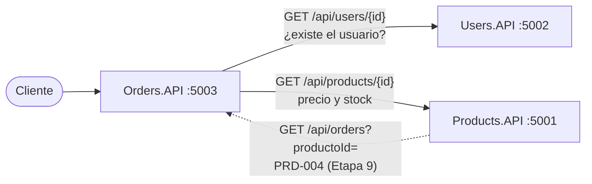
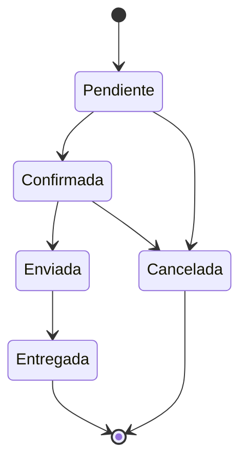
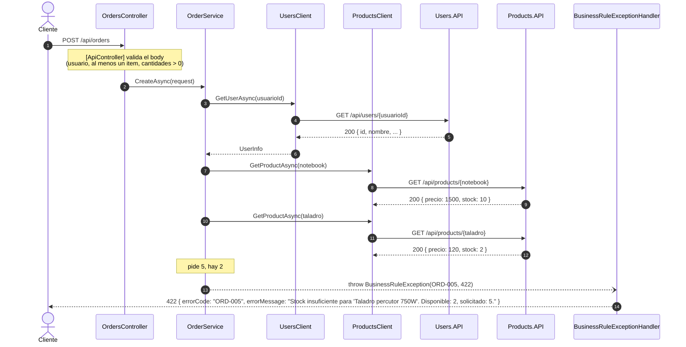

# Repaso: cómo construimos Orders.API

Guía de estudio de la Etapa 7 del [plan de desarrollo](../planificacion/plan-de-desarrollo.md). Explica **qué** hace cada pieza de Orders.API y **por qué** se decidió así.

Orders.API reutiliza la plantilla de Products.API (manejo de errores, logs, Correlation ID, Swagger y health checks), explicada en el [repaso de Products.API](repaso-products-api.md). Sus dos clientes HTTP son copias de los de Cart y Notifications, explicados en el [repaso de Cart.API](repaso-cart-api.md#4-productsclient-hablar-con-otro-servicio) y en el [de Notifications.API](repaso-notifications-api.md#4-usersclient-hablar-con-usersapi). Este documento se concentra en lo propio de Orders:

- la **máquina de estados** de la orden;
- la **creación de una orden**, que consulta a **dos** servicios antes de guardar nada;
- el filtro `?productoId=` (D-07), que es el contrato del que depende Products;
- los huecos del enunciado que hubo que resolver.

---

## Índice

1. [Visión general](#1-visión-general)
2. [Antes de programar: los huecos del enunciado](#2-antes-de-programar-los-huecos-del-enunciado)
3. [El dominio y las reglas](#3-el-dominio-y-las-reglas)
4. [Los clientes HTTP: hablar con Users y Products](#4-los-clientes-http-hablar-con-users-y-products)
5. [La capa HTTP y la plantilla](#5-la-capa-http-y-la-plantilla)
6. [Cómo se testea](#6-cómo-se-testea)
7. [Recorrido completo de un request](#7-recorrido-completo-de-un-request)
8. [Mapa de archivos](#8-mapa-de-archivos)
9. [La historia: cómo se construyó](#9-la-historia-cómo-se-construyó)
10. [Lo que falta: Etapa 9](#10-lo-que-falta-etapa-9)
11. [Preguntas probables de la defensa](#11-preguntas-probables-de-la-defensa)

---

## 1. Visión general

### 1.1 Qué es Orders.API

El servicio de órdenes de compra y su ciclo de estados, en el puerto 5003:

| Método | Ruta | Qué hace | Éxito | Errores |
|---|---|---|---|---|
| GET | `/api/orders` | Lista las órdenes, con filtros `?usuarioId=` y `?productoId=` (D-07) | 200 | — |
| GET | `/api/orders/{id}` | Detalle de una orden | 200 | 404 |
| POST | `/api/orders` | Crea una orden en estado Pendiente | 201 | 400, 404, 422 |
| PUT | `/api/orders/{id}/status` | Cambia el estado | 200 | 400, 404, 409 |

Todos pueden responder 500. Su catálogo de errores:

| Código | HTTP | Cuándo |
|---|---|---|
| ORD-001 | 404 | La orden no existe, o el id no es un GUID (D-17) |
| ORD-002 | 400 | Datos faltantes, orden sin items, cantidad ≤ 0, estado desconocido o JSON mal formado |
| ORD-003 | 404 | El usuario no existe en Users.API |
| ORD-004 | 404 | Algún producto no existe en Products.API |
| ORD-005 | 422 | La cantidad pedida supera el stock |
| ORD-006 | 409 | La transición de estado no está permitida |
| ORD-007 | 500 | Error inesperado, o Users o Products no responden (D-36) |

### 1.2 Lo que lo hace distinto: depende de dos servicios, y uno depende de él

Orders es el servicio más conectado del sistema. Para crear una orden **le pregunta a Users** si el usuario existe y **a Products** el precio y el stock de cada producto. Y Products, a su vez, le va a preguntar a Orders si un producto tiene órdenes activas antes de borrarlo (PRD-004, Etapa 9):



### 1.3 Cómo se construyó

En cuatro tandas, cada una con su commit y sus tests, todas el 10/10:

| Commit | Qué | Tests |
|---|---|---|
| `f34b388` | Dominio, DTOs, códigos de error y máquina de estados | 26 |
| `a73ef13` | Repositorio en memoria y servicio de órdenes | 59 |
| `8b16ffc` | Clientes HTTP de Users y Products | 73 |
| `52d05e1` | Controller, plantilla transversal y tests de integración | **136** |

---

## 2. Antes de programar: los huecos del enunciado

| # | Pregunta sin respuesta en el enunciado | Decisión | Por qué |
|---|---|---|---|
| D-07 | ¿Cómo sabe Products si un producto tiene órdenes activas? | Filtro adicional `?productoId=` en `GET /api/orders`, con el mismo formato de respuesta que el resto del listado | Products no puede leer los datos de Orders: se lo pregunta por HTTP |
| D-14 | ¿Crear una orden descuenta stock? | No | El enunciado no lo exige. Queda como mejora opcional |
| D-33 | El Apéndice A no tiene `FechaActualizacion`, pero la respuesta de `PUT /status` la incluye | Se agrega al modelo `Order`. Al crear la orden vale lo mismo que `FechaCreacion` | Sin ese campo no se puede armar la respuesta del enunciado |
| D-34 | ¿Qué pasa si el mismo producto viene en dos items? | Se unen en uno y el stock se valida contra la suma | Si no, se podría pedir 3 + 3 de un producto con stock 5. Es el mismo criterio que D-13 en Cart |
| D-35 | ¿Un usuario bloqueado puede comprar? | Sí: Orders solo verifica que exista | El catálogo no tiene un código para ese caso, y el bloqueo es para el login. Es el mismo criterio que D-31 en Notifications |
| D-36 | ¿Qué pasa si Users o Products no responden? | 500 con ORD-007, con un timeout de 5 segundos | Es una falla de infraestructura, no un dato del negocio. Mismo criterio que D-28 y D-29 |
| D-37 | `GET /api/orders?productoId=abc`: el filtro no es un GUID | 200 con `[]` | El endpoint solo admite 200 y 500 (D-12): un filtro inválido no coincide con ninguna orden |
| D-38 | El enunciado lista un 409 en `POST /api/orders`, pero el catálogo no tiene ningún error 409 al crear | No se devuelve ni se documenta | ORD-006 es del `PUT /status`. Documentar un 409 que nunca ocurre confundiría a quien use la API |

Además, el **estado** distingue mayúsculas: `"pendiente"` es un estado desconocido (ORD-002), igual que el tipo en Notifications.

---

## 3. El dominio y las reglas

### 3.1 `Order`, `OrderItem` y `OrderStatus`

```csharp
public class Order
{
    public Guid Id { get; set; }
    public Guid UsuarioId { get; set; }
    public List<OrderItem> Items { get; set; } = [];
    public decimal Total { get; set; }
    public OrderStatus Estado { get; set; }          // Pendiente, Confirmada, Enviada, Entregada, Cancelada
    public DateTime FechaCreacion { get; set; }
    public DateTime FechaActualizacion { get; set; } // D-33
}

public class OrderItem
{
    public Guid ProductoId { get; set; }
    public int Cantidad { get; set; }
    public decimal PrecioUnitario { get; set; }      // copiado del producto al crear la orden
}
```

- **`PrecioUnitario` se copia en el item.** Si Products cambia el precio mañana, la orden de hoy no cambia. Es lo que dice el Apéndice A: "capturado del producto al momento de crear la orden".
- **`Total` se guarda**, no se recalcula en cada lectura, por el mismo motivo: refleja los precios del momento de la compra.
- **`OrderStatus` es un enum,** como en Notifications: el compilador impide guardar un estado inventado. La API lo muestra como texto (`"Pendiente"`), igual que el enunciado.

### 3.2 La máquina de estados: `OrderStatusTransitions`

Es la regla central de Orders. Una tabla dice a qué estados se puede pasar desde cada uno:

```csharp
private static readonly Dictionary<OrderStatus, OrderStatus[]> AllowedTransitions = new()
{
    [OrderStatus.Pendiente] = [OrderStatus.Confirmada, OrderStatus.Cancelada],
    [OrderStatus.Confirmada] = [OrderStatus.Enviada, OrderStatus.Cancelada],
    [OrderStatus.Enviada] = [OrderStatus.Entregada],
    [OrderStatus.Entregada] = [],
    [OrderStatus.Cancelada] = []
};

public static bool CanTransition(OrderStatus from, OrderStatus to) => AllowedTransitions[from].Contains(to);
```



- **¿Por qué una tabla y no un `if` por caso?** Porque las reglas se leen de un vistazo, y agregar un estado nuevo es agregar una fila. Con `if` anidados, cada transición nueva obliga a revisar todas las demás.
- **¿Por qué una clase estática?** Porque no depende de nada: no lee datos ni llama a otros servicios. No necesita una interfaz (D-15) ni registrarse en el contenedor.
- **Quedar en el mismo estado es inválido.** "Confirmar" una orden ya confirmada da ORD-006: no hay cambio que hacer.
- **Una orden enviada ya no se puede cancelar.** Solo Pendiente y Confirmada pasan a Cancelada, como pide el plan.

### 3.3 Las reglas de `OrderService`

| Operación | Reglas, en orden |
|---|---|
| `CreateAsync` | Hay `UsuarioId` → si no, **ORD-002** · hay items → si no, **ORD-002** · cada item tiene producto y cantidad > 0 → si no, **ORD-002** · el usuario existe en Users → si no, **ORD-003** · se unen los items repetidos (D-34) · por cada producto: existe en Products → si no, **ORD-004**; alcanza el stock → si no, **ORD-005** · crea la orden `Pendiente` con el precio de Products y el total calculado · la guarda |
| `GetByIdAsync` | La orden existe → si no, **ORD-001** |
| `GetAllAsync` | Filtra por usuario y/o producto; de la más vieja a la más nueva |
| `UpdateStatusAsync` | El estado es uno de los 5 → si no, **ORD-002** · la orden existe → si no, **ORD-001** · la transición está permitida → si no, **ORD-006** · cambia el estado y `FechaActualizacion` |

**El orden importa:**

- **Las validaciones baratas van primero.** Una orden sin items no consulta a nadie.
- **Usuario antes que productos.** Si el usuario no existe, no tiene sentido preguntar por los productos (el test lo verifica con `DidNotReceive()`).
- **Todos los chequeos antes de guardar.** Si el segundo producto falla, la orden no se guarda a medias.
- **El precio nunca viene del request.** El cliente manda solo producto y cantidad; el precio lo da Products. Así nadie puede comprar una notebook a $1.

El mensaje de ORD-005 es el del ejemplo del enunciado: *"Stock insuficiente para 'Notebook Dell XPS 15'. Disponible: 2, solicitado: 5."*. El de ORD-006 sigue la misma idea: *"Una orden en estado 'Entregada' no puede pasar a 'Pendiente'."*.

Como en Notifications, las validaciones de datos también las hacen las Data Annotations, así que por HTTP nunca llegan al servicio. Están repetidas a propósito: protegen al servicio si lo llama otro código, y los tests unitarios las verifican.

### 3.4 Los DTOs

- **`CreateOrderRequest`:** `UsuarioId` es `Guid?` con `[Required]` (mismo motivo que en Notifications y Cart: un `Guid` a secas llega como `Guid.Empty` y `[Required]` no lo detecta). `Items` lleva `[MinLength(1)]` con el mensaje "La orden debe tener al menos un item.".
- **`CreateOrderItemRequest`:** `ProductoId` (`Guid?`) y `Cantidad` (`int?`, mayor a cero), igual que el request de Cart. No tiene precio.
- **`UpdateOrderStatusRequest`:** `Estado` con `[Required]` y `[RegularExpression]` con los 5 estados.
- **`OrderResponse`, `OrderItemResponse` y `OrderStatusResponse`:** la forma exacta de los ejemplos del enunciado, con `estado` como texto. Cada uno tiene su `FromEntity`, como `CartResponse`.

### 3.5 El repositorio

`InMemoryOrderRepository` guarda las órdenes en un `ConcurrentDictionary<Guid, Order>` con el id de la orden como clave. Es Singleton y thread-safe, y `GetAllAsync` devuelve una lista ya materializada y ordenada por fecha de creación.

Los filtros se aplican **en el repositorio**, no en el servicio: cuando llegue la librería de la cátedra, filtrar en la base es mucho más barato que traer todas las órdenes y filtrarlas en memoria.

El constructor acepta órdenes iniciales, como el de Cart. Por ahora no hay datos semilla: está pendiente de acordar con Thomas si conviene una orden Pendiente con la Notebook para mostrar PRD-004 en la demo (sección 10).

---

## 4. Los clientes HTTP: hablar con Users y Products

Orders es el único servicio con **dos** clientes HTTP. Ninguno es nuevo:

| Cliente | Copia de | Llama a | `null` (404) se traduce en |
|---|---|---|---|
| `UsersClient` | Notifications | `GET api/users/{id}` | ORD-003 |
| `ProductsClient` | Cart | `GET api/products/{id}` | ORD-004 |

Se copiaron con `sed`, cambiando solo el namespace y los comentarios. Tienen el diseño de la convención del plan:

- **Se revisa el status antes de leer el body.** Un 404 trae el JSON de error del otro servicio, no un usuario o un producto.
- **Un 404 es un dato y un 500 es una falla:** el 404 se traduce a `null`; cualquier otro error (o que el servicio no responda) lanza una excepción que termina en **ORD-007** (D-36).
- **`UserInfo` y `ProductInfo` son DTOs propios** de Orders, con solo los campos que usa (D-05).
- **Typed clients con `IHttpClientFactory`,** con las URLs en `Services:UsersApi:BaseUrl` y `Services:ProductsApi:BaseUrl` de `appsettings.json`. Si falta alguna, la API no arranca y dice cuál falta.
- **Timeout de 5 segundos en los dos** (`ServiceCollectionExtensions`). Sin él, si Users o Products se cuelgan, Orders esperaría los 100 segundos por defecto de .NET.

---

## 5. La capa HTTP y la plantilla

### 5.1 `OrdersController`

- **Cuatro acciones delgadas** (`GetAll`, `GetById`, `Create`, `UpdateStatus`) con `ActionResult<T>`, como en Products.
- **`POST` responde 201 con header `Location`**, que apunta a `GET /api/orders/{id}` (`CreatedAtRoute`, igual que Products). A diferencia de Notifications, acá sí existe un endpoint para obtener una orden por id.
- **Los ids de ruta llegan como texto** (D-17): `/api/orders/99` responde 404 con ORD-001, con el contrato completo.
- **Los filtros del listado también llegan como texto.** Un filtro vacío no filtra; uno que no es GUID devuelve `[]` (D-37), porque el contrato del endpoint no admite 400.
- **El POST no documenta el 409** que lista el enunciado, porque ningún error del catálogo lo produce al crear (D-38).

### 5.2 Replicar la plantilla

Se copió de Cart cambiando el namespace, con estas adaptaciones:

| Pieza | Cambio |
|---|---|
| Validaciones | ORD-002 |
| `GlobalExceptionHandler` | ORD-007, "Error interno al procesar la orden." |
| `ErrorExamplesOperationFilter` | El parámetro `{id}` se reemplaza por el id de la orden del enunciado (`f1e2d3c4-…`) |
| Health check | `OrderRepositoryHealthCheck` verifica la persistencia de órdenes |
| `ServiceCollectionExtensions` | Dos typed clients con URL y timeout |

### 5.3 `Orders.API.http`

Tiene los requests de éxito (crear, listar con y sin filtros, ver el detalle, confirmar) y uno por cada código de ORD-001 a ORD-007. Para crear órdenes hace falta Users.API levantado en el puerto 5002 y Products.API en el 5001. El id de la orden creada se pega en la variable `@OrdenId`.

---

## 6. Cómo se testea

Los mismos niveles que Cart y Notifications:

| Nivel | Qué prueba | Cómo | Tests |
|---|---|---|---|
| **1. Los clientes HTTP** | Que `UsersClient` y `ProductsClient` armen la URL e interpreten 200, 404, 4xx, 5xx y la falta de respuesta | Un `HttpMessageHandler` falso reemplaza la red | 14 |
| **Unitario** | La máquina de estados, las reglas del servicio y el repositorio | Users y Products como dobles de NSubstitute; `FakeTimeProvider` para las fechas | 58 |
| **2. Orders completo** | Los 4 endpoints, ORD-001 a ORD-007 y la plantilla | `OrdersApiFactory` con `FakeUsersClient` y `FakeProductsClient` | 64 |
| **3. Los tres servicios juntos** | La integración real | Prueba manual con Users, Products y Orders levantados (pendiente, sección 10) | — |

**Total: 136.**

- **La máquina de estados se prueba entera:** las 25 combinaciones posibles (5 estados × 5), 5 válidas y 20 inválidas, agrupadas en el test por motivo (mismo estado, saltearse pasos, volver atrás, estados finales).
- **`FakeUsersClient`** conoce solo a María; **`FakeProductsClient`**, la Notebook (stock 10), los Auriculares (stock 25) y el Taladro (stock 2), con los mismos IDs que los datos semilla de Users y Products.
- **Los tests del servicio verifican que no se guarde nada** cuando falla un producto o el stock, y que no se consulte a Products si el usuario no existe.
- **Los tests de endpoints comparten la misma API en memoria,** así que cada uno crea sus propias órdenes y no asume que la lista arranca vacía.
- **`DependencyInjectionTests`** usa la configuración **real**: verifica los dos typed clients con su URL y su timeout de 5 segundos.
- **Un test de endpoints simula que Users no responde** y verifica el 500 con ORD-007 (D-36).

---

## 7. Recorrido completo de un request

`POST /api/orders` con stock insuficiente para el segundo producto:



Paso a paso:

1. **Los middlewares** asignan el Correlation ID y loguean el inicio.
2. **`[ApiController]` valida el body.** Una orden sin items cortaría acá con ORD-002, sin consultar a nadie.
3. **El servicio repite las validaciones baratas** y consulta a Users. María existe.
4. **Consulta cada producto en Products.** La Notebook alcanza; el Taladro no.
5. **El servicio lanza ORD-005** con el nombre del producto, el stock y lo pedido. Como nada se guarda antes de terminar los chequeos, **no queda una orden a medias**.
6. **El `BusinessRuleExceptionHandler`** loguea un `Warning` con `ErrorCode = ORD-005` y escribe el 422 del contrato.

Si todo alcanzara, el servicio armaría la orden `Pendiente` con los precios de Products (1500 y 120), calcularía el total, la guardaría y el controller respondería 201 con el header `Location`.

---

## 8. Mapa de archivos

### `src/Orders.API/` (lo propio de Orders)

| Archivo | Qué hace |
|---|---|
| `Models/Order.cs`, `OrderItem.cs` | La orden y sus items del Apéndice A, más `FechaActualizacion` (D-33) |
| `Models/OrderStatus.cs` | El enum de los 5 estados |
| `DTOs/CreateOrderRequest`, `CreateOrderItemRequest` | Lo que entra al crear, con validaciones en español |
| `DTOs/UpdateOrderStatusRequest` | El estado nuevo |
| `DTOs/OrderResponse`, `OrderItemResponse`, `OrderStatusResponse` | Lo que sale, con el estado como texto |
| `Services/OrderStatusTransitions` | La máquina de estados |
| `Services/IOrderService` → `OrderService` | Las reglas: ORD-001 a ORD-006 |
| `Repositories/IOrderRepository` → `InMemoryOrderRepository` | Persistencia en memoria con los filtros |
| `Clients/IUsersClient` → `UsersClient`, `UserInfo` | Consulta a Users.API |
| `Clients/IProductsClient` → `ProductsClient`, `ProductInfo` | Consulta a Products.API |
| `Controllers/OrdersController` | Los 4 endpoints |
| `Exceptions/ErrorCodes` | ORD-001 a ORD-007 |
| `Infrastructure/ServiceCollectionExtensions` | Registra todo, incluidos los dos typed clients con URL y timeout |
| `Infrastructure/OrderRepositoryHealthCheck` | El check `persistencia` de `/health/ready` |
| `appsettings.json` | Incluye `Services:UsersApi:BaseUrl` y `Services:ProductsApi:BaseUrl` |

El resto es la plantilla de Products: ver su [mapa de archivos](repaso-products-api.md#9-mapa-de-archivos).

### `tests/Orders.API.Tests/`

| Archivo | Qué prueba | Tests |
|---|---|---|
| `Unit/Services/OrderStatusTransitionsTests` | Las 25 combinaciones de estados | 25 |
| `Unit/Services/OrderServiceTests` | Creación (precio, total, repetidos, bloqueado), ORD-001 a ORD-006, cambio de estado y listado | 24 |
| `Unit/Repositories/InMemoryOrderRepositoryTests` | Guardar, buscar, actualizar y cada combinación de filtros | 9 |
| `Unit/Clients/UsersClientTests`, `ProductsClientTests` | URL, interpretación de 200/404/4xx/5xx y falta de respuesta | 14 |
| `Integration/OrdersEndpointsTests` | Los 4 endpoints, ORD-001 a ORD-007 por HTTP y el ciclo completo de estados | 25 |
| `Integration/SwaggerTests` | Status, resúmenes, tags y ejemplos por código | 19 |
| `Integration/CorrelationIdTests` | Header recibido, generado, inválido y en errores | 5 |
| `Integration/LoggingTests` | Inicio y fin, Warning y Error con `ErrorCode` | 4 |
| `Integration/HealthCheckTests` | Los 3 endpoints y la persistencia caída | 4 |
| `Integration/UnexpectedErrorTests` | ORD-007 y el detalle por entorno | 3 |
| `Integration/DependencyInjectionTests` | Configuración real: servicio y los dos typed clients | 3 |
| `Integration/SmokeTests` | Que la API arranque | 1 |
| Auxiliares: `OrdersApiFactory` (con `FakeUsersClient` y `FakeProductsClient`), `ErrorContractAssert`, `CollectingSink` | — | — |

---

## 9. La historia: cómo se construyó

A diferencia de Users y Notifications, Orders no pasó por varias revisiones: se construyó de una vez, aplicando desde el principio todo lo que esas revisiones enseñaron.

| Lección de revisiones anteriores | Cómo se aplicó en Orders |
|---|---|
| Un stub que dice "sí" a todo hace pasar cualquier test | Los clientes son reales desde el primer día; los tests usan dobles que también dicen "no" |
| Un repositorio Scoped pierde los datos entre requests | Singleton con `ConcurrentDictionary`, verificado en `DependencyInjectionTests` |
| `Guid` a secas no detecta un campo faltante | `Guid?` e `int?` con `[Required]` en todos los requests |
| `{id:guid}` da un 404 vacío | Ids de ruta como texto (D-17) |
| Archivos vacíos o con CRLF/LF mezclados | Cada tanda verificó tamaño, finales de línea y referencias a otros servicios antes del commit |

Cada tanda se compiló y testeó entera (los cinco proyectos) antes de su commit.

---

## 10. Lo que falta: Etapa 9

| Pendiente | Por qué | Cómo |
|---|---|---|
| Confirmar D-07 con Thomas | Su `OrdersClient` real (PRD-004) va a leer `GET /api/orders?productoId=` | Formato propuesto: el mismo listado de siempre; `HasActiveOrdersAsync` da true si alguna orden está Pendiente o Confirmada |
| Orden semilla (a definir con Thomas) | Mostrar PRD-004 en la demo | Una orden Pendiente con la Notebook, la del ejemplo del enunciado (`f1e2d3c4-…`) |
| Propagar el Correlation ID | Hoy una orden aparece con IDs distintos en los logs de Orders, Users y Products | `CorrelationIdDelegatingHandler` en los dos typed clients |
| Users y Products en `/health/ready` | Orders no está "listo" si no responden | `DownstreamServiceHealthCheck` que consulta `/health/live` de cada uno |
| Prueba con los tres servicios levantados | Verificar ORD-003/004/005 con los servicios reales y ORD-007 con uno detenido | Como la [sección 7 del repaso de Cart](repaso-cart-api.md#7-la-prueba-con-los-dos-servicios-levantados) |
| (Opcional) Notificar los cambios de estado | Mejora sugerida en el plan | Orders llama a `POST /api/notifications/send` |
| (Opcional) Descontar stock (D-14) | Mejora sugerida en el plan | Requiere un endpoint nuevo en Products |

El timeout de los clientes (otra tarea de la Etapa 9) ya está hecho: 5 segundos.

---

## 11. Preguntas probables de la defensa

**¿Cómo funciona la máquina de estados?**
Es una tabla (`OrderStatusTransitions`) que dice a qué estados se puede pasar desde cada uno: Pendiente → Confirmada → Enviada → Entregada, y Pendiente o Confirmada → Cancelada. Cualquier otro cambio, incluido quedarse en el mismo estado, es ORD-006 (409). Está testeada con las 25 combinaciones posibles.

**¿Por qué el precio no viene en el request?**
Porque lo decide Products, no el cliente. Si viniera en el request, cualquiera podría comprar a cualquier precio. Además se copia en la orden, así un cambio de precio posterior no altera las órdenes ya hechas.

**¿Qué pasa si el segundo producto no tiene stock?**
ORD-005 (422), y la orden no se guarda: todos los chequeos se hacen antes de guardar, así que no puede quedar una orden a medias.

**¿Qué pasa si Users o Products están caídos?**
El cliente lanza una excepción (o corta a los 5 segundos), el handler global responde 500 con ORD-007 y el error queda en el log (D-36). Consultar y cambiar el estado de órdenes sigue funcionando, porque no consulta a nadie.

**¿Por qué existe el filtro `?productoId=` si el enunciado no lo pide?**
Porque Products necesita saber si un producto tiene órdenes activas antes de borrarlo (PRD-004), y no puede leer los datos de Orders: se lo tiene que preguntar por HTTP (D-07).

**¿Por qué `GET /api/orders?productoId=abc` devuelve 200 y no 400?**
Porque el contrato de ese endpoint solo admite 200 y 500 (D-12). Un filtro que no es un GUID no coincide con ninguna orden, así que la respuesta correcta es una lista vacía (D-37).

**El enunciado dice que el POST puede devolver 409. ¿Cuándo pasa?**
Nunca: el catálogo no tiene ningún error 409 al crear una orden. ORD-006 es el 409 del cambio de estado. Por eso no lo documentamos en Swagger (D-38).

**¿Un usuario bloqueado puede comprar?**
Sí (D-35). Orders solo verifica que el usuario exista. El bloqueo impide iniciar sesión, y el catálogo no tiene un código para ese caso.

**¿Por qué crear una orden no descuenta stock?**
Porque el enunciado no lo exige (D-14), y hacerlo bien requiere un endpoint nuevo en Products y manejar qué pasa si falla a mitad de camino. Quedó como mejora opcional.

**¿Cómo testean Orders sin levantar Users ni Products?**
Igual que Cart y Notifications: los clientes con un handler HTTP falso, el servicio con dobles de NSubstitute, y Orders completo con `FakeUsersClient` y `FakeProductsClient`, que tienen los mismos datos semilla que los servicios reales.
