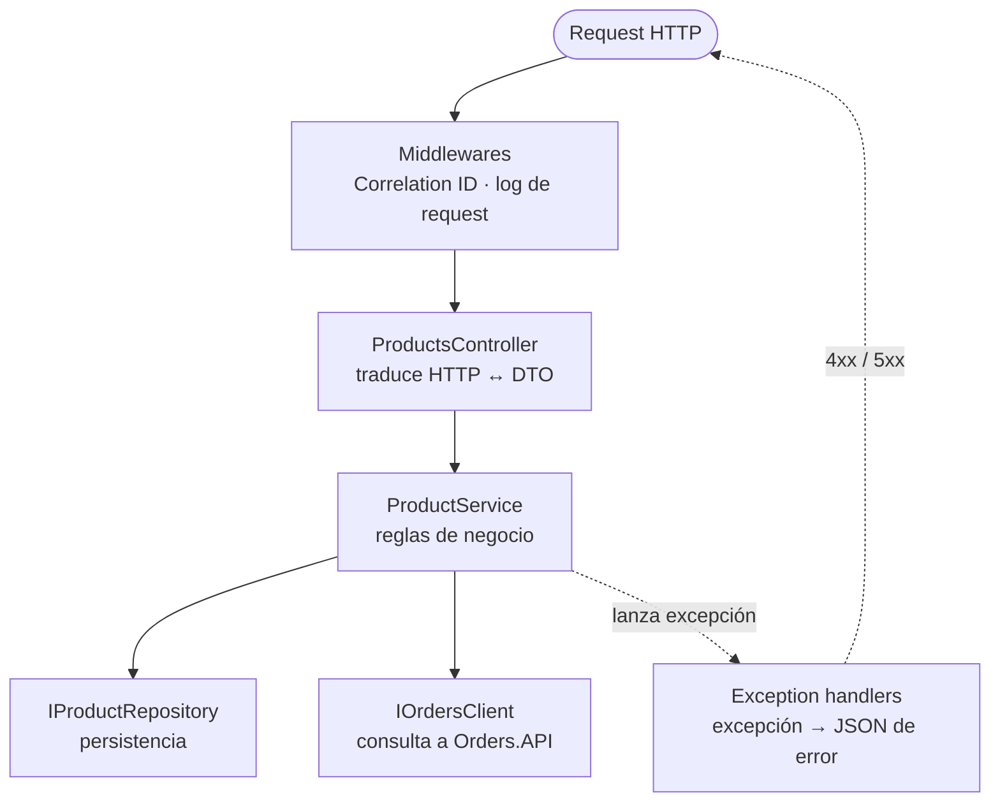
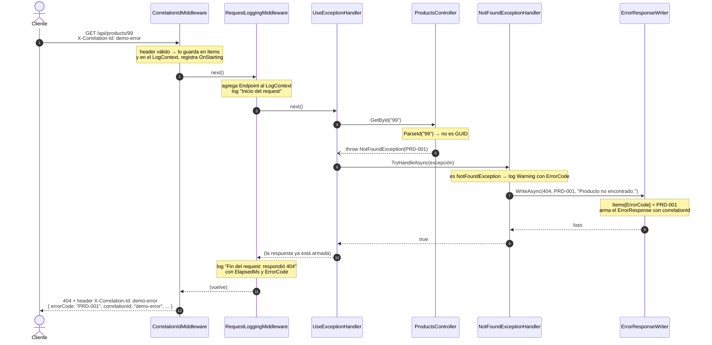

# Repaso: cómo construimos Products.API

Guía de estudio de todo lo hecho hasta el cierre de Products.API (Etapas 0 a 4 del [plan de desarrollo](../planificacion/plan-de-desarrollo.md)). Explica **qué** hace cada pieza y, sobre todo, **por qué** se decidió así. Sirve para entender el código, para replicarlo en los otros servicios y para preparar la defensa.

> **La plantilla ya se replicó en Cart.API** (Etapa 6). Todo lo que se explica acá vale también para Cart, con las diferencias explicadas en el [repaso de Cart.API](repaso-cart-api.md#52-replicar-la-plantilla): otros códigos de error, el filtro de ejemplos de Swagger generalizado y el cliente HTTP hacia Products.

Cómo leerlo:

- La **sección 1** da la visión general. Leela primero aunque sea rápido.
- Las **secciones 2 a 6** recorren cada etapa en orden. Cada una termina con un recuadro "Para la defensa" con la idea que conviene saber explicar.
- La **sección 7** sigue un request real de punta a punta por todas las clases. Es la mejor forma de comprobar que se entendió todo.
- La **sección 8** es un mapa de archivos para consultar, y la **sección 9** tiene preguntas probables de la defensa.

Los diagramas de clases están en [arquitectura.md](../arquitectura/arquitectura.md) y las consignas, en [TP_Microservicios_ECommerce_v7.md](../consignas/TP_Microservicios_ECommerce_v7.md). La vista de conjunto del proyecto (planificación, trabajo en equipo, arquitectura del sistema y estado de cada servicio) está en [repaso-general.md](repaso-general.md).

---

## Índice

1. [Visión general](#1-visión-general)
2. [Etapa 0 — Esqueleto de la solución](#2-etapa-0--esqueleto-de-la-solución)
3. [Etapa 1 — Dominio y lógica de negocio](#3-etapa-1--dominio-y-lógica-de-negocio)
4. [Etapa 2 — Endpoints y contrato de errores](#4-etapa-2--endpoints-y-contrato-de-errores)
5. [Etapa 3 — Logs y Correlation ID](#5-etapa-3--logs-y-correlation-id)
6. [Etapa 4 — Swagger y Health Checks](#6-etapa-4--swagger-y-health-checks)
7. [Etapa 9 — Integración con Orders.API](#7-etapa-9--integración-con-ordersapi)
8. [Recorrido completo de un request](#8-recorrido-completo-de-un-request)
9. [Mapa de archivos](#9-mapa-de-archivos)
10. [Preguntas probables de la defensa](#10-preguntas-probables-de-la-defensa)
11. [Glosario](#11-glosario)

---

## 1. Visión general

### 1.1 Qué es Products.API

Es uno de los cinco microservicios del E-Commerce. Administra el catálogo de productos con cinco endpoints:

| Método | Ruta | Qué hace | Éxito | Errores |
|---|---|---|---|---|
| GET | `/api/products?categoria=&nombre=` | Lista, con filtros opcionales | 200 | 500 |
| GET | `/api/products/{id}` | Obtiene uno | 200 | 404, 500 |
| POST | `/api/products` | Crea | 201 | 400, 409, 500 |
| PUT | `/api/products/{id}` | Actualiza | 200 | 400, 404, 500 |
| DELETE | `/api/products/{id}` | Elimina | 204 | 404, 409, 500 |

Además cumple los requisitos transversales del enunciado: contrato de errores con `errorCode`, manejo global con `IExceptionHandler`, logs con Serilog, Correlation ID, Swagger y Health Checks.

### 1.2 La idea central: capas que dependen de interfaces

Todo el diseño sale de un principio: **cada clase hace una sola cosa (alta cohesión) y conoce lo mínimo de las demás (bajo acoplamiento)**. En la práctica, eso se traduce en capas:



Cada flecha va hacia una **interfaz**, nunca hacia una clase concreta. `ProductService` usa un `IProductRepository`, pero no sabe que hoy es `InMemoryProductRepository`. Esto trae tres beneficios concretos:

1. **Se puede testear cada pieza por separado.** En los tests, el repositorio se reemplaza por un doble que devuelve lo que necesitamos.
2. **Se puede cambiar una implementación sin tocar el resto.** Cuando llegue la librería de persistencia de la cátedra, solo cambia el repositorio.
3. **Cada clase se entiende sola.** Para entender `ProductService` no hace falta saber nada de HTTP ni de cómo se guardan los datos.

### 1.3 Cómo trabajamos: TDD

Cada funcionalidad se desarrolló con el ciclo **rojo → verde → refactor**:

1. **Rojo:** escribir un test que describe lo que el código *debería* hacer, y verlo fallar. Si no falla, el test no está probando nada.
2. **Verde:** escribir el código mínimo para que pase.
3. **Refactor:** mejorar el código con los tests como red de seguridad.

En cada etapa los números fueron así:

| Etapa | Tests nuevos | Fallaron en rojo | Total al terminar |
|---|---|---|---|
| 0 | 1 (humo) | — | 1 |
| 1 | 20 | 20 | 21 |
| 2 | 18 | 17 | 39 |
| 3 | 9 | 20 (los 9 nuevos y 11 que pasaron a exigir `correlationId`) | 48 |
| 4 | 23 | 23 | **71** |

TDD no fue solo una formalidad: **encontró tres bugs reales** que se explican en su etapa:

- el punto antes de cada `;` en los mensajes de validación (Etapa 2);
- los logs que se perdían por el logger estático (Etapa 3);
- el content type de los errores en Swagger (Etapa 4).

---

## 2. Etapa 0 — Esqueleto de la solución

### 2.1 Qué se hizo

- Se reemplazó el proyecto `MiniApi` de la cátedra por la estructura de la sección 6 del enunciado: `ECommerce.slnx` con `src/` (5 APIs) y `tests/` (5 proyectos de tests).
- Cada API se armó tomando como guía los archivos de `MiniApi`.
- Se agregó un test de humo por API y el workflow de GitHub Actions.

### 2.2 Decisiones y por qué

**¿Por qué `.slnx` y no `.sln`?** `.slnx` es el formato nuevo de solución de .NET 10: es XML, se lee fácil y se combina sin conflictos en git. La plantilla de la cátedra ya lo usaba.

**¿Por qué un proyecto de tests separado por API?** Los tests no forman parte del producto que se ejecuta. Separados, la API no carga librerías de testing, y cada integrante trabaja en sus propios proyectos sin pisarse (sección 4.3 del plan).

**¿Por qué Controllers y no Minimal API (D-02)?** `MiniApi` usaba Minimal API (`app.MapGet(...)`), pero el enunciado pide una carpeta `Controllers/` y XML comments en los controladores. Los controllers además agrupan los endpoints de un recurso en una clase.

**¿Por qué solo HTTP, sin HTTPS (D-16)?** Los servicios se llaman entre sí en la misma máquina. HTTPS obligaría a configurar certificados de desarrollo y agregaría redirecciones en cada llamada interna, sin beneficio para el TP.

**¿Por qué se versiona `appsettings.Development.json` (D-04)?** El `.gitignore` de la cátedra lo excluía, pero el enunciado pide controlar el nivel de detalle de errores por entorno con ese archivo. No tiene secretos, así que se sube al repo.

**¿Por qué se actualizó `Microsoft.AspNetCore.OpenApi`?** La versión de la plantilla traía, como dependencia, `Microsoft.OpenApi` 2.0.0, que tiene una vulnerabilidad de severidad alta (`NU1903`). Después ese paquete se reemplazó por Swashbuckle (Etapa 4).

**¿Por qué no hizo falta `public partial class Program`?** Los tests de integración necesitan referenciar la clase `Program` de la API. Hasta .NET 9 había que agregar esa línea a mano. En .NET 10 el compilador la genera solo.

**¿Por qué GitHub Actions?** Porque la regla "nunca se mergea código que no compile" no debería depender de que alguien se acuerde de correr los tests. El workflow compila y corre todos los tests en cada push.

> **Para la defensa:** la estructura sigue la sección 6 del enunciado. Cada microservicio es un proyecto independiente con su propio puerto (5001 a 5005) y su propio proyecto de tests.

---

## 3. Etapa 1 — Dominio y lógica de negocio

### 3.1 Qué se hizo

| Pieza | Tipo | Qué hace |
|---|---|---|
| `Product` | Modelo (entidad) | El producto como lo guarda el sistema |
| `CreateProductRequest`, `UpdateProductRequest`, `ProductResponse` | DTOs | Lo que entra y sale por HTTP |
| `ErrorCodes`, `NotFoundException`, `BusinessRuleException`, `ValidationException` | Excepciones | Los errores del catálogo |
| `IProductRepository` → `InMemoryProductRepository` | Interfaz → implementación | Guarda los productos |
| `IOrdersClient` → `StubOrdersClient` | Interfaz → implementación provisoria | Pregunta a Orders si hay órdenes activas |
| `IProductService` → `ProductService` | Interfaz → implementación | Las reglas de negocio |
| `ServiceCollectionExtensions` | Configuración | Conecta cada interfaz con su implementación |

### 3.2 Modelo vs. DTO: ¿por qué dos clases para "un producto"?

`Product` (en `Models/`) es la **entidad del dominio**: lo que el sistema guarda y con lo que trabaja. Los DTOs (en `DTOs/`) son **contratos con el cliente**: lo que entra y sale por HTTP.

Parece duplicación, pero cada uno cambia por motivos distintos:

- El request **no tiene** `Id` ni `FechaCreacion`, porque los asigna el servidor. Si el cliente pudiera mandarlos, podría pisar datos.
- En Users va a ser crítico: `User` tiene `PasswordHash` y el DTO de respuesta no, así que es **imposible** que la API lo exponga por error.
- Si mañana cambia cómo se guarda un producto, el contrato con el cliente no se rompe.

`ProductResponse.FromEntity(product)` es el único lugar que convierte una entidad en DTO.

### 3.3 ¿Por qué `decimal? Precio` con `[Required]` en el request?

En el request, `Precio` y `Stock` admiten `null` (`decimal?`, `int?`), aunque son obligatorios. Si fueran `decimal` común y el JSON no trajera el campo, .NET le pondría `0` sin avisar:

- con el precio, el error sería "debe ser mayor a 0", un mensaje confuso para un campo que en realidad falta;
- con el stock, `0` es válido y **se guardaría un producto sin stock** sin que nadie lo pidiera.

Con `int?` y `[Required]`, un campo que falta da 400 con "El stock es obligatorio.". En el servicio se usa `request.Stock!.Value`, porque la validación ya garantizó que hay valor.

### 3.4 Excepciones de dominio y `ErrorCodes`

El servicio no sabe nada de HTTP. Cuando algo sale mal, **lanza una excepción con un código del catálogo**:

```csharp
throw new NotFoundException(ErrorCodes.PRD_001, "Producto no encontrado.");
```

- `ErrorCodes` agrupa los códigos como constantes (`PRD_001 = "PRD-001"`), como recomienda la sección 10 del enunciado. Escribir `"PRD-01"` por error daría un error de compilación en lugar de un bug silencioso.
- Hay tres tipos de excepción, uno por categoría de error, como en el Apéndice B:
  - `NotFoundException` → 404.
  - `ValidationException` → 400.
  - `BusinessRuleException` → **lleva el status como dato** (D-10), porque el catálogo usa reglas de negocio con 401, 403, 409 y 422. En Products, PRD-003 y PRD-004 son 409.

La traducción de excepción a respuesta HTTP se hace en la Etapa 2. Así el servicio queda libre de detalles de HTTP: lanza la excepción y el handler arma la respuesta.

### 3.5 Las reglas de negocio de `ProductService`

| Regla | Dónde | Detalle |
|---|---|---|
| PRD-001 | `GetExistingProductAsync` | Un solo método busca el producto y lanza PRD-001. Lo usan obtener, actualizar y eliminar, sin repetir el mensaje en tres lugares. |
| PRD-003 | `EnsureNameIsUniqueInCategoryAsync` | Solo al **crear**. Compara nombre y categoría sin distinguir mayúsculas (`OrdinalIgnoreCase`). |
| PRD-004 | `DeleteAsync` | **Primero** verifica que exista (PRD-001) y **después** consulta a Orders. Así no se hace una llamada HTTP por un producto que no existe. |
| Filtros | `GetAllAsync` | `categoria` busca el valor exacto; `nombre`, una parte del texto; ninguno distingue mayúsculas. |

**¿Por qué `PUT` no valida nombres duplicados (D-12)?** Porque la tabla del enunciado dice que `PUT` responde 200, 400, 404 o 500, sin 409. Respetamos el contrato tal cual está escrito.

**¿Por qué los filtros están en el servicio y no en el repositorio?** Porque son una regla de negocio (cómo se busca) y no un detalle de almacenamiento. Si quedaran en el repositorio, habría que volver a escribirlos para la librería de la cátedra.

### 3.6 ¿Por qué todo es `async` y lleva `CancellationToken`?

Hoy el repositorio en memoria responde al instante. Pero la persistencia real y las llamadas HTTP a Orders van a ser operaciones de entrada/salida, y en .NET eso se hace con `async`. Si las interfaces fueran sincrónicas, habría que cambiarlas, y con ellas todo lo que las usa.

`CancellationToken` permite cancelar el trabajo si el cliente cierra la conexión. El controller lo recibe de ASP.NET y lo pasa hacia abajo.

### 3.7 ¿Por qué `TimeProvider` en lugar de `DateTime.UtcNow`?

`FechaCreacion` la asigna el servicio. Si usara `DateTime.UtcNow`, el test no podría saber qué fecha esperar. Con `TimeProvider`, una clase de .NET:

- en producción se registra `TimeProvider.System`, que da la hora real;
- en los tests se usa `FakeTimeProvider` con una hora fija (27/09/2026 10:30). El test verifica exactamente esa fecha.

Es el mismo principio de siempre: depender de una abstracción para poder reemplazarla.

### 3.8 El repositorio en memoria

- **¿Por qué en memoria? (D-03)** La librería de la cátedra todavía no llegó. En lugar de esperarla, usamos una implementación provisoria **detrás de la interfaz definitiva**.
- **¿Por qué `ConcurrentDictionary`?** El repositorio es uno solo para toda la API y atiende requests simultáneos. Un `Dictionary` o `List` común se puede corromper si dos requests lo modifican a la vez.
- **¿Por qué datos semilla (`ProductSeedData`)?** Para tener productos desde el arranque, para la demo. Los IDs son fijos: el primero es el del ejemplo del enunciado (`3fa85f64-…`), y el Taladro tiene stock 2 para poder mostrar errores de stock insuficiente desde Cart y Orders.

### 3.9 `StubOrdersClient`: una implementación provisoria

PRD-004 necesita preguntarle a Orders si hay órdenes activas, pero Orders todavía no existe. La solución:

- `IOrdersClient` define **qué** se necesita: `HasActiveOrdersAsync(productId)`.
- `StubOrdersClient` es una versión provisoria que responde siempre "no hay órdenes activas".
- En la Etapa 9 se reemplaza por `OrdersClient`, que hace la llamada HTTP real, y `ProductService` no cambia.

La regla PRD-004 **ya está implementada y testeada**: los tests usan un doble que responde "sí hay órdenes" y verifican el 409.

> **Cómo terminó:** en la Etapa 9 `StubOrdersClient` se eliminó y lo reemplazó `OrdersClient` (sección 7). `ProductService` no cambió ni una línea: es la prueba de que la interfaz cumplió su función.

### 3.10 Inyección de dependencias y ciclos de vida

`ServiceCollectionExtensions.AddProductServices()` es el **único lugar** que sabe qué implementación corresponde a cada interfaz:

```csharp
services.AddSingleton(TimeProvider.System);
services.AddSingleton<IProductRepository>(_ => new InMemoryProductRepository(ProductSeedData.Create()));
services.AddSingleton<IOrdersClient, StubOrdersClient>(); // reemplazado por OrdersClient en la Etapa 9
services.AddScoped<IProductService, ProductService>();
```

El **ciclo de vida** define cuánto dura cada instancia:

| Ciclo de vida | Cuánto vive | Por qué acá |
|---|---|---|
| **Singleton** | Una sola instancia para toda la vida de la API | El repositorio en memoria **tiene que** ser Singleton: si se creara uno por request, los datos se perderían. Fue uno de los bloqueantes que encontramos en Notifications. |
| **Scoped** | Una instancia por request | `ProductService` no guarda estado; Scoped es lo habitual para servicios de negocio. |

### 3.11 Cómo se lee un test unitario

```csharp
[Fact]
public async Task DeleteAsync_ProductoConOrdenesActivas_LanzaBusinessRuleConPRD004YNoLoElimina()
{
    // Arrange: preparar la situación
    var existente = CrearProducto("Notebook Dell XPS 15", "Electrónica");
    DadoElProducto(existente);                                    // el repositorio "tiene" este producto
    _ordersClient.HasActiveOrdersAsync(existente.Id, Arg.Any<CancellationToken>()).Returns(true);

    // Act: ejecutar lo que se prueba
    var excepcion = await Assert.ThrowsAsync<BusinessRuleException>(() => _service.DeleteAsync(existente.Id));

    // Assert: verificar el resultado
    Assert.Equal(ErrorCodes.PRD_004, excepcion.ErrorCode);
    Assert.Equal(StatusCodes.Status409Conflict, excepcion.StatusCode);
    await _repository.DidNotReceive().DeleteAsync(Arg.Any<Guid>(), Arg.Any<CancellationToken>());
}
```

- **El nombre** sigue la convención `Metodo_Escenario_ResultadoEsperado`. Si falla, el nombre ya dice qué se rompió.
- **NSubstitute** crea dobles de las interfaces (`Substitute.For<IOrdersClient>()`). Con `.Returns(true)` se define qué responden, y con `DidNotReceive()` se verifica que algo **no** se haya llamado. La última línea asegura que, ante PRD-004, el producto no se borra.
- El test **no necesita** ni HTTP, ni base de datos, ni Orders funcionando. Esa es la ventaja de depender de interfaces.

> **Para la defensa:** "El servicio tiene las reglas de negocio y depende solo de interfaces. Por eso PRD-004 está testeado aunque Orders todavía no exista: en el test reemplazamos `IOrdersClient` por un doble que dice que hay órdenes activas."

---

## 4. Etapa 2 — Endpoints y contrato de errores

### 4.1 Qué se hizo

| Pieza | Qué hace |
|---|---|
| `ProductsController` | Los 5 endpoints |
| `ErrorResponseWriter` | Arma el JSON de error del contrato (un solo lugar) |
| `NotFoundExceptionHandler`, `BusinessRuleExceptionHandler`, `ValidationExceptionHandler`, `GlobalExceptionHandler` | Cada uno traduce un tipo de excepción a una respuesta |
| `ModelStateErrorMessage` | Convierte los errores de validación en el mensaje de PRD-002 |
| `ErrorHandlingOptions` | Nivel de detalle de los 500 según el entorno |

### 4.2 Controller delgado

Cada acción tiene una o dos líneas:

```csharp
[HttpGet("{id}", Name = GetByIdRoute)]
public async Task<ActionResult<ProductResponse>> GetById(string id, CancellationToken cancellationToken) =>
    Ok(await productService.GetByIdAsync(ParseId(id), cancellationToken));
```

No hay lógica de negocio ni `try/catch`. Si el producto no existe, el servicio lanza `NotFoundException`, la excepción **sube sola** hasta `UseExceptionHandler()` y un handler arma la respuesta 404. El controller solo traduce: recibe HTTP, llama al servicio y devuelve el status.

**¿Por qué el id llega como `string` y no como `Guid` (D-17)?** El enunciado muestra este ejemplo literal: `GET /api/products/99` → 404 con PRD-001. Pero "99" no es un GUID. Con la ruta `{id:guid}`, ASP.NET ni siquiera llega al controller y devuelve un 404 **vacío**, sin `errorCode`, lo que viola el contrato. Por eso la ruta acepta texto y `ParseId` lo convierte: si no es un GUID válido, lanza PRD-001 igual que si el producto no existiera.

**¿Por qué las acciones no terminan en `Async`?** ASP.NET recorta ese sufijo del nombre de las acciones, y `CreatedAtAction(nameof(GetByIdAsync))` fallaría en tiempo de ejecución. Por eso se usa `CreatedAtRoute` con un nombre de ruta fijo (`GetProductById`), que arma el header `Location` del 201. La convención `…Async` sigue valiendo para servicios, repositorios y clientes.

### 4.3 `IExceptionHandler`: cómo funciona el manejo global de errores

El enunciado pide `app.UseExceptionHandler()` con `IExceptionHandler` y **prohíbe** un middleware propio para esto (sección 5.2). El mecanismo:

1. Se registran los handlers **en orden**, del más específico al más genérico:
   ```csharp
   services.AddExceptionHandler<NotFoundExceptionHandler>();
   services.AddExceptionHandler<BusinessRuleExceptionHandler>();
   services.AddExceptionHandler<ValidationExceptionHandler>();
   services.AddExceptionHandler<GlobalExceptionHandler>();   // último: atrapa todo lo demás
   ```
2. Cuando una excepción llega a `UseExceptionHandler()`, ASP.NET llama a cada handler en ese orden.
3. Cada handler pregunta "¿es mi tipo?". Si no lo es, devuelve `false` y ASP.NET prueba el siguiente. Si lo es, escribe la respuesta y devuelve `true`.

```csharp
if (exception is not NotFoundException ex)
{
    return false;                       // no es mío, que pruebe el siguiente
}
await writer.WriteAsync(context, StatusCodes.Status404NotFound, ex.ErrorCode, ex.Message, ...);
return true;                            // listo, la respuesta ya está escrita
```

`GlobalExceptionHandler` va último y **siempre** devuelve `true`: es la red de seguridad. Cualquier error no previsto (un null, una falla de la base de datos) termina en un 500 con PRD-005 y **nunca** muestra el stack trace al cliente.

### 4.4 `ErrorResponseWriter`: un solo lugar para el formato

Los cuatro handlers comparten el formato del JSON de error. En lugar de repetirlo, todos llaman a `ErrorResponseWriter`. Cada handler solo decide **qué** responder (status, código y mensaje); el writer decide **cómo** se ve:

```json
{
  "type": "https://tools.ietf.org/html/rfc7231#section-6.5.4",
  "title": "Not Found",
  "status": 404,
  "detail": "El recurso solicitado no fue encontrado.",
  "instance": "/api/products/99",
  "errorCode": "PRD-001",
  "errorMessage": "Producto no encontrado.",
  "correlationId": "demo-error"
}
```

- `type`, `title` y `detail` salen de una tabla por status, con los textos de los ejemplos del enunciado.
- Hay una excepción: PRD-004 usa un `detail` distinto ("No se puede eliminar el recurso."), como muestra el enunciado.
- El content type es `application/problem+json`, el estándar para errores HTTP (RFC 7807).
- En la Etapa 3 se sumó `correlationId` (D-11), y en la Etapa 4 Swagger empezó a usar este mismo writer para sus ejemplos.

### 4.5 PRD-002: la validación automática

Con `[ApiController]`, ASP.NET valida las Data Annotations (`[Required]`, `[MaxLength]`, …) **antes** de entrar a la acción. Si algo falla, por defecto responde su propio 400 con otro formato, sin `errorCode`.

Para que también pase por nuestros handlers, se configura `InvalidModelStateResponseFactory` para que **lance** una `ValidationException`:

```csharp
options.InvalidModelStateResponseFactory = context =>
    throw new Exceptions.ValidationException(ErrorCodes.PRD_002, ModelStateErrorMessage.Build(context.ModelState));
```

Así, **todos** los errores de la API salen del mismo lugar y con el mismo formato.

`ModelStateErrorMessage.Build` arma el mensaje:

- **Errores de Data Annotations:** se unen como pide el enunciado ("separados por punto y coma"): `"El nombre es obligatorio; El precio debe ser mayor a 0; El stock es obligatorio."`.
- **JSON mal formado:** .NET genera mensajes técnicos en inglés. Se reemplazan por uno solo en español: "El cuerpo de la solicitud no es un JSON válido." (D-19).

**El bug que encontró la prueba manual:** al probar con `curl` apareció `"El stock es obligatorio.; El nombre es obligatorio."`, con un punto pegado a cada `;`, porque cada mensaje ya termina en punto. Siguiendo TDD, primero se cambió el test para exigir el formato correcto, se lo vio fallar y recién después se corrigió el código.

### 4.6 Nivel de detalle por entorno (D-18)

Para un error 500, el enunciado pide no exponer el stack trace y controlar el nivel de detalle por entorno:

| Entorno | `ErrorHandling:IncludeExceptionDetails` | `detail` del 500 |
|---|---|---|
| Development (`appsettings.Development.json`) | `true` | El mensaje de la excepción (útil para depurar) |
| Producción (`appsettings.json`) | `false` | Un texto genérico |

En ningún caso se muestra el stack trace. Ese queda solo en los logs (Etapa 3).

### 4.7 Tests de integración

A diferencia de los unitarios, estos tests **levantan la API completa en memoria** con `WebApplicationFactory` y le hacen requests HTTP reales:

```csharp
var response = await _client.GetAsync("/api/products/99");

await ErrorContractAssert.IsErrorAsync(response, HttpStatusCode.NotFound, ErrorCodes.PRD_001,
    instance: "/api/products/99", errorMessage: "Producto no encontrado.");
```

- `ErrorContractAssert` verifica **todos** los campos del contrato en un solo lugar: status, content type, `type`, `title`, `detail`, `instance`, `errorCode`, `errorMessage` y `correlationId`. También verifica que no haya stack trace.
- Para casos difíciles de provocar se reemplaza una pieza de la API real con `ConfigureTestServices`:
  - **PRD-004:** se reemplaza `IOrdersClient` por un doble que responde "hay órdenes activas".
  - **PRD-005:** se reemplaza `IProductService` por un doble que lanza una excepción.

> **Para la defensa:** "El controller no tiene try/catch. El servicio lanza excepciones de dominio con su código del catálogo, y `UseExceptionHandler` las pasa por los handlers en orden de especificidad. El último, el global, es la red de seguridad que devuelve PRD-005 sin stack trace."

---

## 5. Etapa 3 — Logs y Correlation ID

### 5.1 Qué se hizo

| Pieza | Qué hace |
|---|---|
| `LoggingExtensions` | Configura Serilog: consola legible y archivo JSON |
| `CorrelationIdMiddleware` | Toma o genera el `X-Correlation-Id` y lo agrega a los logs y a la respuesta |
| `ICorrelationIdAccessor` → `CorrelationIdAccessor` | Le da el Correlation ID actual a quien lo necesite |
| `RequestLoggingMiddleware` | Loguea el inicio y el fin de cada request con duración |
| Logs en los handlers | Errores de negocio como `Warning`, inesperados como `Error` |

### 5.2 ¿Qué es el Correlation ID y para qué sirve?

Es un identificador único por request. Cuando un request pasa por varios servicios (por ejemplo, Orders llama a Users y a Products), **todos los logs de todos los servicios llevan el mismo ID**. Ante un error, se busca ese ID y aparece la historia completa del request.

`CorrelationIdMiddleware` hace cuatro cosas:

1. Lee el header `X-Correlation-Id` del request. Si no viene, o no es válido, genera un GUID nuevo.
2. Lo guarda en `HttpContext.Items`, para que otras partes del request lo lean.
3. Lo agrega a la respuesta como header.
4. Lo agrega a **todos los logs** del request con `LogContext.PushProperty("CorrelationId", ...)`.

**¿Por qué se valida el header recibido (D-20)?** El valor lo manda el cliente y termina escrito en los logs y, desde la Etapa 9, en otros servicios. Solo se aceptan hasta 64 caracteres de `[A-Za-z0-9._-]`. Así nadie puede meter texto arbitrario, como saltos de línea que falsifiquen entradas de log.

**¿Por qué el header se agrega con `Response.OnStarting`?** Cuando hay una excepción, `UseExceptionHandler` **limpia la respuesta**, headers incluidos, antes de llamar a los handlers. Si el middleware escribiera el header directamente, las respuestas de error saldrían sin él. `OnStarting` lo agrega justo antes de enviar la respuesta, cualquiera haya sido el camino.

### 5.3 ¿Por qué un `ICorrelationIdAccessor`?

`ErrorResponseWriter` necesita el ID para el campo `correlationId`, y en la Etapa 9 lo va a necesitar el handler que lo propaga a las llamadas salientes. En vez de que cada uno lo lea de `HttpContext.Items`, lo piden a una interfaz. Es más fácil de testear y nadie más necesita saber dónde está guardado.

Es **Singleton** y lee el ID con `IHttpContextAccessor`, que siempre apunta al request en curso. Así funciona también dentro de los `DelegatingHandler`, que `IHttpClientFactory` crea por fuera del scope del request (sección 2.3 del plan).

### 5.4 El orden del pipeline importa

```csharp
app.UseMiddleware<CorrelationIdMiddleware>();    // 1. el ID existe antes del primer log
app.UseMiddleware<RequestLoggingMiddleware>();   // 2. "Inicio" ... (todo lo de abajo) ... "Fin"
app.UseExceptionHandler();                       // 3. convierte excepciones en respuestas
```

Un middleware envuelve a los que vienen después, como capas de una cebolla:

- Si `RequestLogging` fuera **antes** que `CorrelationId`, el log de "Inicio" saldría sin ID.
- Si `RequestLogging` fuera **después** que `UseExceptionHandler`, ante un error el log de "Fin" no vería el status final (404, 409 o 500) ni el `ErrorCode`, porque la respuesta se arma más afuera.

### 5.5 Qué tiene cada log (sección 5.3 del enunciado)

```
[20:52:40 WRN] Products.API demo-error GET /api/products/99 Recurso no encontrado PRD-001: Producto no encontrado.
 └Timestamp └Nivel └Servicio   └CorrelationId └Endpoint                        └errorCode
```

| Requisito | De dónde sale |
|---|---|
| Timestamp, Nivel | Serilog los agrega siempre |
| Servicio | `Enrich.WithProperty("Servicio", environment.ApplicationName)` |
| Endpoint | `RequestLoggingMiddleware` lo agrega al `LogContext` |
| Correlation ID | `CorrelationIdMiddleware` lo agrega al `LogContext` |
| errorCode | Lo agrega el handler al loguear el error; además `ErrorResponseWriter` lo deja en `HttpContext.Items` para que el log de "Fin" también lo incluya |

Se escriben dos salidas:

- **Consola:** formato legible, para mirar mientras se desarrolla o durante la demo.
- **Archivo `logs/products-AAAAMMDD.json`:** una línea JSON por log, con todas las propiedades por separado, para buscar y filtrar. Hay un archivo por día y git lo ignora.

Los niveles de log se configuran en la sección `Serilog` de `appsettings`. En Development se ve `Debug`; los logs internos de ASP.NET se silencian (`Warning`) para que no tapen los nuestros.

### 5.6 El bug del logger estático (D-21)

Este es el bug más instructivo del proyecto.

**Síntoma:** el test de los logs de inicio y fin pasaba solo, pero fallaba siempre que corría junto con el resto.

**Diagnóstico:** se hizo que el test listara los logs capturados, y la lista estaba **vacía**. No faltaba un log puntual: no llegaba ninguno.

**Causa:** `AddSerilog` por defecto guarda el logger en una **variable estática global**, `Log.Logger`. Las clases de test corren en paralelo y cada una levanta su propia API. Cada API, al arrancar, reemplazaba esa variable global, así que los logs de una API terminaban en el logger de otra.

**Solución:** `AddSerilog(preserveStaticLogger: true, ...)`, para que cada API use su propio logger y no la variable global.

**Lección:** el estado global (`static`) acopla partes que deberían ser independientes. Es el mismo principio de bajo acoplamiento del plan, ahora visto como un bug. El problema también podría aparecer en producción si un mismo proceso levantara más de una API.

### 5.7 Cómo se testean los logs

Serilog se registró con `ReadFrom.Services(...)`, que toma también los *sinks* (destinos de log) registrados en el contenedor. Los tests registran un `CollectingSink` que guarda cada log en memoria y verifican sus propiedades:

```csharp
var evento = await sink.WaitForAsync(e => e.Property("CorrelationId") == "log-warning" && ...);
Assert.Equal(LogEventLevel.Warning, evento.Level);
Assert.Equal(ErrorCodes.PRD_001, evento.Property("ErrorCode"));
```

`ProductsApiFactory` desactiva el archivo de log en los tests (`LogFile:Enabled = false`), para no llenar `src/Products.API/logs/` de archivos de prueba.

> **Para la defensa:** "Cada request tiene un Correlation ID que aparece en todos sus logs, en el header de la respuesta y en el body de error. Si un usuario reporta un error, con ese ID buscamos todo lo que pasó en el archivo JSON de logs."

---

## 6. Etapa 4 — Swagger y Health Checks

### 6.1 Swagger: qué se documentó

Swagger UI está en `/swagger` (D-22: habilitado en todos los entornos, porque el enunciado lo pide en cada servicio y la demo se hace desde ahí). Cada endpoint tiene:

- **Resumen y descripción** escritos como XML comments sobre cada acción del controller (`/// <summary>`). El `.csproj` tiene `GenerateDocumentationFile` para generar el XML, y `NoWarn CS1591` para no exigir comentarios en todas las clases.
- **Exactamente los status de la tabla del enunciado.** Un test lo compara endpoint por endpoint.
- **Ejemplos de éxito** escritos como `/// <example>` en cada propiedad de los DTOs.
- **Ejemplos de error** con su `errorCode`, `errorMessage` y `correlationId`.

### 6.2 `[ProducesError]` y el filtro de ejemplos (D-23)

El paquete habitual para ejemplos en Swagger (`Swashbuckle.AspNetCore.Filters`) no tiene versión para Swashbuckle 10. La solución propia tiene dos piezas:

**1. Un atributo que hereda de `ProducesResponseType`:**

```csharp
[ProducesError(StatusCodes.Status409Conflict, ErrorCodes.PRD_004, "El producto tiene órdenes activas y no puede eliminarse.")]
```

Al heredar, ASP.NET lo trata como un `ProducesResponseType` común: declara que el endpoint puede devolver 409 con un `ErrorResponse`. Además, guarda el código y el mensaje.

**2. Un `IOperationFilter`** (`ErrorExamplesOperationFilter`) que Swashbuckle ejecuta por cada endpoint. Busca los `[ProducesError]` y, por cada uno, agrega un ejemplo armado con `ErrorResponseWriter.Build(...)`, **el mismo método que arma las respuestas reales**. Si cambia el formato de error, Swagger se actualiza solo y no puede mostrar algo distinto de lo que devuelve la API.

### 6.3 El bug del content type

**Síntoma:** los tests de ejemplos de error fallaban porque no encontraban `application/problem+json`.

**Causa:** el controller tenía `[Produces("application/json")]`. Parecía inofensivo, pero cambia el content type de **todas** las respuestas, incluidas las de error. Swagger mostraba los errores como `application/json` sin ejemplos, aunque la API real devuelve `application/problem+json`.

**Solución:** quitar el atributo del controller y declarar el content type en cada respuesta de éxito: `[ProducesResponseType<ProductResponse>(200, "application/json")]`.

### 6.4 Health Checks: `live` vs. `ready` (D-24)

| Endpoint | Pregunta que responde | Checks |
|---|---|---|
| `/health/live` | ¿El proceso está vivo? | `self`: siempre Healthy si responde |
| `/health/ready` | ¿Puede atender requests? | `persistencia`: el repositorio responde. Desde la Etapa 9, también `Orders.API` (sección 7.4). |
| `/health` | Estado completo | Todos |

**¿Por qué separar `live` y `ready`?** Es la convención de los orquestadores como Kubernetes:

- si `live` falla, **reinician** el servicio;
- si `ready` falla, **dejan de mandarle tráfico** hasta que se recupere.

Si `live` dependiera de la base de datos, una caída de la base de datos haría reiniciar todos los servicios sin necesidad, porque reiniciarlos no arregla la base de datos. Por eso hay un test que verifica que, con la persistencia caída, `ready` responde 503 y `live` sigue en 200.

Los códigos HTTP siguen la regla de ASP.NET: Healthy y Degraded responden 200; Unhealthy, 503.

`ProductRepositoryHealthCheck` hoy consulta el repositorio en memoria. Cuando llegue la librería de la cátedra, va a verificar la conexión real **sin cambiar nada más**: otra vez, gracias a la interfaz.

> **Para la defensa:** "En Swagger cada error del catálogo tiene su ejemplo, generado por el mismo código que arma las respuestas reales. Los health checks separan 'vivo' de 'listo': si se cae la persistencia, el servicio deja de recibir tráfico, pero no se reinicia."

---

## 7. Etapa 9 — Integración con Orders.API

### 7.1 Qué se hizo

Products deja de usar el stub y le pregunta de verdad a Orders si un producto tiene órdenes activas. Además, el Correlation ID viaja en las llamadas salientes y `/health/ready` informa si Orders responde.

| Clase | Qué hace |
|---|---|
| `IOrdersClient` → `OrdersClient` (`Clients/`) | `GET /api/orders?productoId={id}` (D-07) y decide si alguna orden está activa. Reemplaza a `StubOrdersClient`, que se eliminó |
| `OrderInfo` (`Clients/`) | Lo que Products lee de una orden: `Id` y `Estado`, más la regla `EstaActiva` (Pendiente o Confirmada) |
| `CorrelationIdDelegatingHandler` (`Infrastructure/`) | Agrega el `X-Correlation-Id` del request actual a cada llamada saliente |
| `DownstreamServiceHealthCheck` (`Infrastructure/`) | Llama al `/health/live` de un servicio del que se depende |

La configuración nueva es `Services:OrdersApi:BaseUrl` (`http://localhost:5003/`) y un timeout de 5 segundos, el mismo valor que usan Orders y Notifications.

### 7.2 `OrdersClient`: un 404 ya no es un dato

En Cart, un 404 de Products significa "ese producto no existe" y se convierte en `null`. Acá no hay 404 posible: `GET /api/orders?productoId=` responde **200 con `[]`** cuando no hay órdenes (D-37). Entonces cualquier status de error es una falla de Orders:

```csharp
using var response = await httpClient.GetAsync($"api/orders?productoId={productId}", cancellationToken);
response.EnsureSuccessStatusCode();   // 500, 503, timeout... → excepción → 500 PRD-005

var orders = await response.Content.ReadFromJsonAsync<List<OrderInfo>>(cancellationToken) ?? [];
return orders.Any(order => order.EstaActiva);
```

**¿Qué pasa si Orders está caído? (D-39)** El `DELETE` responde 500 con PRD-005 y el producto **no se borra**. Es "fallar cerrado": si no se puede saber si hay órdenes activas, borrar podría dejar órdenes apuntando a un producto inexistente, y eso no se puede deshacer. Responder un error, en cambio, solo pide reintentar más tarde.

**¿Por qué `EstaActiva` está en `OrderInfo` y no en `ProductService`?** Porque es una pregunta sobre una orden ("¿esta orden está activa?"), y `OrderInfo` es la clase que conoce los estados de Orders. `ProductService` sigue preguntando solo `HasActiveOrdersAsync`: no sabe que existen estados ni HTTP.

### 7.3 `CorrelationIdDelegatingHandler`: el ID cruza servicios

Un `DelegatingHandler` es un eslabón en la cadena que recorre cada request de un `HttpClient`, antes de llegar a la red. Se engancha al registrar el cliente:

```csharp
services.AddTransient<CorrelationIdDelegatingHandler>();
services.AddHttpClient<IOrdersClient, OrdersClient>(client => { ... })
    .AddHttpMessageHandler<CorrelationIdDelegatingHandler>();
```

`OrdersClient` no sabe que el header existe: es un aspecto transversal y queda fuera del cliente. El handler lee el ID con `ICorrelationIdAccessor`, que se apoya en `IHttpContextAccessor`. Esto importa porque `IHttpClientFactory` crea los handlers en **su propio scope**, distinto del scope del request: un servicio Scoped del request no sería el mismo adentro del handler. Por eso el accessor es Singleton (sección 5.3).

Si no hay request en curso (por ejemplo, durante un health check), no hay ID que propagar y el header no se agrega.

**Resultado, probado con los dos servicios levantados:**

```
[INF] Products.API borrar-notebook DELETE /api/products/3fa85f64-… Inicio del request
[WRN] Products.API borrar-notebook DELETE /api/products/3fa85f64-… Regla de negocio violada PRD-004: …
[INF] Orders.API   borrar-notebook GET /api/orders Inicio del request
[INF] Orders.API   borrar-notebook GET /api/orders Fin del request: respondió 200 en 5.08 ms
[INF] Products.API borrar-notebook DELETE /api/products/3fa85f64-… Fin del request: respondió 409 en 9.82 ms
```

### 7.4 `DownstreamServiceHealthCheck`: Orders en `/health/ready`

```csharp
.Add(new HealthCheckRegistration(
    "Orders.API",
    provider => new DownstreamServiceHealthCheck(
        provider.GetRequiredService<IHttpClientFactory>(), nameof(IOrdersClient), "Orders.API"),
    HealthStatus.Degraded,
    [ReadyTag]));
```

Tres decisiones:

- **Usa el mismo `HttpClient` que `OrdersClient`** (`CreateClient(nameof(IOrdersClient))`), así verifica la misma URL y el mismo timeout que se usan de verdad.
- **Consulta `/health/live` de Orders, no `/health/ready`.** Si consultara `ready`, Products dependería también de Users (porque el `ready` de Orders consulta a Users), y una caída se propagaría por toda la cadena.
- **Una falla da `Degraded`, no `Unhealthy`.** Con Orders caído, Products sigue sirviendo el catálogo; lo único que falla es el `DELETE`. `Degraded` responde 200 (D-24), así que el servicio sigue recibiendo tráfico.

La misma clase sirve para Cart (que depende de Products): recibe el nombre del cliente y del servicio por constructor.

### 7.5 Cómo se testea

| Nivel | Qué reemplaza | Qué prueba |
|---|---|---|
| **Unitario** (`OrdersClientTests`, `CorrelationIdDelegatingHandlerTests`, `DownstreamServiceHealthCheckTests`) | La red, con `FakeHttpHandler` | La URL del contrato, cómo se lee cada estado, qué pasa con cada error |
| **Integración** (`OrdersIntegrationTests`, `HealthCheckTests`) | Solo la red de `OrdersClient`, con `FakeOrdersApi` | PRD-004 de punta a punta, que el ID llegue a Orders, `Degraded` con Orders caído |
| **Configuración** (`DependencyInjectionTests`) | Nada | Que esté registrado `OrdersClient` con la URL y el timeout reales |

`ProductsApiFactory` reemplaza **solo el último eslabón**, el que toca la red:

```csharp
services.AddHttpClient(nameof(IOrdersClient)).ConfigurePrimaryHttpMessageHandler(OrdersApi.CrearHandler);
```

Todo lo demás es el código real: `OrdersClient`, su `DelegatingHandler`, la deserialización de las órdenes y el health check. En Cart reemplazamos todo el `IProductsClient` por un fake; acá el test cubre más código de producción con el mismo esfuerzo.

> **Para la defensa:** "Products le pregunta a Orders con un typed client. Si Orders está caído, no borramos: respondemos 500 y el health check muestra el servicio degradado. El Correlation ID viaja en un header que agrega un DelegatingHandler, así un DELETE aparece con el mismo ID en los logs de los dos servicios."

---

## 8. Recorrido completo de un request

Seguimos `GET /api/products/99` con el header `X-Correlation-Id: demo-error` por todas las clases. Si este recorrido se entiende, se entiende todo Products.API.



Paso a paso:

1. **`CorrelationIdMiddleware`** valida el header `demo-error` (cumple el formato), lo guarda en `HttpContext.Items["CorrelationId"]`, lo agrega al `LogContext` y registra con `OnStarting` que el header vaya en la respuesta.
2. **`RequestLoggingMiddleware`** agrega `Endpoint = "GET /api/products/99"` al `LogContext`, escribe el log "Inicio del request" y arranca el cronómetro.
3. **`UseExceptionHandler`** deja pasar el request, pero queda atento a cualquier excepción que vuelva desde adentro.
4. **El ruteo** encuentra `ProductsController.GetById` porque la ruta es `{id}` (texto) y no `{id:guid}`.
5. **`ParseId("99")`** falla al convertir a GUID y lanza `NotFoundException(PRD-001)`. Nunca se llega al servicio.
6. **`UseExceptionHandler`** atrapa la excepción, limpia la respuesta y prueba los handlers en orden.
7. **`NotFoundExceptionHandler`** reconoce su tipo, loguea un `Warning` con `ErrorCode = PRD-001` (el log ya tiene `CorrelationId` y `Endpoint`, porque están en el `LogContext`) y llama al writer.
8. **`ErrorResponseWriter`** deja `PRD-001` en `Items`, pone el status 404 y escribe el JSON con `correlationId = "demo-error"`, que obtiene del `ICorrelationIdAccessor`.
9. Al empezar a enviarse la respuesta, se ejecuta el `OnStarting` del paso 1 y se agrega el header `X-Correlation-Id`.
10. **`RequestLoggingMiddleware`** retoma después del `next()`: escribe el log "Fin del request: respondió 404 en X ms" con el `ErrorCode` que dejó el writer.

Resultado: el cliente recibe el JSON del contrato, y en los logs quedan tres líneas con el mismo `demo-error` (Inicio, Warning y Fin).

**Comparación con un `GET /api/products/{id}` de un producto que existe:** en el paso 5 el id sí es un GUID, así que el controller llama a `ProductService.GetByIdAsync`. El servicio lo busca en `IProductRepository`, lo convierte con `ProductResponse.FromEntity` y lo devuelve; el controller responde `Ok(...)`. No hay excepción, así que los pasos 6 a 8 no ocurren, y el log de "Fin" muestra 200 sin `ErrorCode`.

---

## 9. Mapa de archivos

### `src/Products.API/`

| Carpeta / archivo | Qué hace | Etapa |
|---|---|---|
| `Program.cs` | Arma la API: registra servicios y define el orden del pipeline | 0–4 |
| `appsettings.json` / `appsettings.Development.json` | Niveles de log, archivo de log, detalle de errores por entorno y URL de Orders | 0, 2, 3, 9 |
| **Models/** `Product.cs` | La entidad del dominio | 1 |
| **DTOs/** `CreateProductRequest`, `UpdateProductRequest` | Lo que entra, con validaciones y ejemplos para Swagger | 1, 4 |
| **DTOs/** `ProductResponse` | Lo que sale; `FromEntity` convierte la entidad | 1, 4 |
| **DTOs/** `ErrorResponse` | El contrato de error de la sección 3.1 | 4 |
| **Services/** `IProductService` → `ProductService` | Reglas de negocio (PRD-001, 003, 004 y filtros) | 1 |
| **Repositories/** `IProductRepository` → `InMemoryProductRepository` | Persistencia en memoria, thread-safe | 1 |
| **Repositories/** `ProductSeedData` | Productos de la demo con IDs fijos | 1 |
| **Clients/** `IOrdersClient` → `OrdersClient`, `OrderInfo` | Consulta a Orders por HTTP: ¿el producto tiene órdenes activas? | 1, 9 |
| **Controllers/** `ProductsController` | Los 5 endpoints, documentados para Swagger | 2, 4 |
| **Exceptions/** `ErrorCodes` y las 3 excepciones | El catálogo y los tipos de error | 1 |
| **ExceptionHandlers/** los 4 handlers | Excepción → respuesta HTTP + log | 2, 3 |
| **ExceptionHandlers/** `ErrorResponseWriter` | Único lugar que arma el JSON de error | 2–4 |
| **ExceptionHandlers/** `ModelStateErrorMessage` | Errores de validación → mensaje de PRD-002 | 2 |
| **ExceptionHandlers/** `ErrorHandlingOptions` | Detalle de los 500 según entorno | 2 |
| **Infrastructure/** `ServiceCollectionExtensions` | Registra servicios, el cliente de Orders, Correlation ID y manejo de errores | 1–3, 9 |
| **Infrastructure/** `LoggingExtensions` | Configuración de Serilog | 3 |
| **Infrastructure/** `CorrelationIdMiddleware`, `ICorrelationIdAccessor` → `CorrelationIdAccessor` | Correlation ID | 3 |
| **Infrastructure/** `RequestLoggingMiddleware` | Logs de inicio y fin de request | 3 |
| **Infrastructure/** `HttpContextItemKeys` | Nombres de lo que se comparte en `HttpContext.Items` | 3 |
| **Infrastructure/** `SwaggerExtensions`, `ProducesErrorAttribute`, `ErrorExamplesOperationFilter` | Swagger y ejemplos de error | 4 |
| **Infrastructure/** `HealthCheckExtensions`, `ProductRepositoryHealthCheck`, `HealthCheckResponseWriter` | Health checks | 4 |
| **Infrastructure/** `CorrelationIdDelegatingHandler` | Propaga el Correlation ID a las llamadas salientes | 9 |
| **Infrastructure/** `DownstreamServiceHealthCheck` | Verifica que Orders responda (`/health/ready`) | 9 |

### `tests/Products.API.Tests/`

| Archivo | Qué prueba | Tests |
|---|---|---|
| `Unit/Services/ProductServiceTests` | Reglas de negocio con dobles de repositorio y de Orders | 14 |
| `Unit/Repositories/InMemoryProductRepositoryTests` | Guardar, buscar, actualizar y eliminar | 5 |
| `Unit/Clients/OrdersClientTests` | URL del contrato, órdenes activas por estado, errores de Orders | 9 |
| `Unit/Infrastructure/CorrelationIdDelegatingHandlerTests` | Header agregado, sin request en curso, sin duplicar | 3 |
| `Unit/Infrastructure/DownstreamServiceHealthCheckTests` | `/health/live` del servicio, Healthy y Degraded | 4 |
| `Integration/ProductsEndpointsTests` | Los 5 endpoints y el catálogo PRD-001 a PRD-003 por HTTP | 14 |
| `Integration/OrdersIntegrationTests` | PRD-004 con el `OrdersClient` real, Orders caído y Correlation ID propagado | 7 |
| `Integration/UnexpectedErrorTests` | PRD-005 y detalle por entorno | 3 |
| `Integration/CorrelationIdTests` | Header recibido, generado, inválido y en errores | 5 |
| `Integration/LoggingTests` | Inicio y fin, Warning y Error con `ErrorCode` | 4 |
| `Integration/SwaggerTests` | Status, resúmenes, tags y ejemplos | 18 |
| `Integration/HealthCheckTests` | Los 3 endpoints, la persistencia caída y Orders caído | 8 |
| `Integration/DependencyInjectionTests` | Que el contenedor resuelva `IProductService` y registre `OrdersClient` | 2 |
| `Integration/SmokeTests` | Que la API arranque | 1 |
| Auxiliares: `ProductsApiFactory`, `FakeOrdersApi`, `FakeHttpHandler`, `ErrorContractAssert`, `CollectingSink` | Fábrica sin archivo de log y con Orders falso, red falsa, verificación del contrato y sink en memoria | — |

---

## 10. Preguntas probables de la defensa

**¿Por qué el controller no tiene try/catch?**
Porque el manejo de errores está centralizado. El servicio lanza excepciones de dominio con su `errorCode`, y `UseExceptionHandler` las traduce con un `IExceptionHandler` por tipo. Así el formato de error está en un solo lugar (`ErrorResponseWriter`) y el controller solo traduce HTTP.

**¿Por qué los handlers se registran en ese orden?**
ASP.NET los prueba en el orden de registro y usa el primero que devuelve `true`. Los específicos van primero; el global va último porque acepta cualquier excepción y es la red de seguridad.

**¿Qué pasa si ocurre un error que no previeron?**
Lo atrapa `GlobalExceptionHandler`: responde 500 con PRD-005, loguea el error con el stack trace como `Error` y **no** muestra el stack trace al cliente. En Development el `detail` incluye el mensaje de la excepción; en producción, un texto genérico.

**¿Por qué tantas interfaces?**
Solo donde aportan algo: servicios, persistencia, otros microservicios y lo que depende del entorno (sección 2.3 del plan). Permiten testear con dobles y cambiar implementaciones sin tocar el resto. Las reglas puras, los DTOs y los modelos no tienen interfaz porque no lo necesitan.

**¿Cómo van a pasar a la librería de persistencia de la cátedra?**
Se crea una clase nueva que implementa `IProductRepository` usando la librería y se cambia una línea en `ServiceCollectionExtensions`. `ProductService`, el controller y los tests unitarios no cambian.

**¿Cómo prueban PRD-004 sin levantar Orders?**
Los tests unitarios de `ProductService` usan un doble de `IOrdersClient`. Los de integración usan el `OrdersClient` real y reemplazan solo la red con `FakeOrdersApi`, un Orders falso que responde con el mismo formato. Además lo probamos a mano con los servicios levantados.

**¿Qué pasa si Orders está caído cuando quieren borrar un producto?**
Responde 500 con PRD-005 y el producto no se borra (D-39): sin saber si hay órdenes activas no se puede aplicar la regla, y un borrado no se puede deshacer. `/health/ready` muestra el servicio `Degraded`, no `Unhealthy`, porque el resto de los endpoints sigue funcionando.

**¿Qué es el Correlation ID y cómo lo propagan?**
Es un ID único por request que aparece en todos sus logs, en el header `X-Correlation-Id` de la respuesta y en el body de error. `CorrelationIdDelegatingHandler` lo agrega a cada llamada HTTP saliente, y así un `DELETE` aparece con el mismo ID en los logs de Products y de Orders.

**¿Por qué `/api/products/99` da 404 y no 400?**
Porque el enunciado lo muestra así: un id que no corresponde a ningún producto es "no encontrado", sea un GUID inexistente o un texto que no es GUID. Por eso la ruta recibe el id como texto (D-17).

**¿Por qué el repositorio es Singleton?**
Porque guarda los datos en memoria dentro de su propia instancia. Si fuera Scoped, cada request tendría un repositorio nuevo y vacío, y lo guardado se perdería.

**¿Por qué Serilog no usa `Log.Logger`?**
Porque es estado global: cuando varias APIs corren en el mismo proceso, como en los tests, se pisan entre sí y los logs se pierden. Lo detectamos con un test (D-21).

**¿Cuál es la diferencia entre `/health/live` y `/health/ready`?**
`live` dice si el proceso responde; `ready`, si puede atender requests porque sus dependencias funcionan. Si se cae la persistencia, `ready` da 503 y `live` sigue en 200: el servicio deja de recibir tráfico, pero no se reinicia.

**¿Qué es TDD y les sirvió?**
Escribir el test antes que el código y verlo fallar primero. Nos sirvió para encontrar tres bugs (el formato de PRD-002, los logs perdidos y el content type de Swagger), y nos permite cambiar código con confianza: 97 tests verifican Products en un par de segundos.

---

## 11. Glosario

| Término | Significado |
|---|---|
| **Cohesión** | Cuánto se relacionan las responsabilidades de una clase. Alta cohesión = la clase hace una sola cosa. |
| **Acoplamiento** | Cuánto depende una clase de otras. Bajo acoplamiento = depende de interfaces y no de implementaciones concretas. |
| **DTO** | *Data Transfer Object*: clase que solo transporta datos entre el cliente y la API. |
| **Entidad / Modelo** | La representación de un concepto del dominio, como el sistema lo guarda. |
| **Inyección de dependencias (DI)** | Las clases reciben sus dependencias en el constructor, en vez de crearlas. El contenedor de .NET decide qué implementación entregar. |
| **Singleton / Scoped / Transient** | Ciclos de vida en DI: una instancia para toda la API, una por request o una cada vez que se pide. |
| **Middleware** | Una pieza del pipeline de ASP.NET que procesa cada request antes y después del resto. |
| **Pipeline** | La cadena de middlewares por la que pasa cada request, en el orden definido en `Program.cs`. |
| **`IExceptionHandler`** | Interfaz de .NET para convertir excepciones en respuestas HTTP dentro de `UseExceptionHandler()`. |
| **Problem Details** | Estándar (RFC 7807) para respuestas de error HTTP, con content type `application/problem+json`. |
| **Doble de prueba** | Objeto que reemplaza una dependencia real en un test (por ejemplo, un `Substitute.For<IOrdersClient>()`). |
| **Test unitario** | Prueba una clase aislada, con sus dependencias reemplazadas por dobles. |
| **Test de integración** | Prueba la API completa en memoria con requests HTTP reales (`WebApplicationFactory`). |
| **Sink (Serilog)** | Destino de los logs: consola, archivo o, en los tests, una lista en memoria. |
| **`LogContext`** | Propiedades de Serilog que se agregan automáticamente a todos los logs dentro de un bloque `using`. |
| **Correlation ID** | Identificador único de un request, compartido por todos los servicios que participan. |
| **Health check** | Endpoint que informa el estado del servicio (Healthy, Degraded o Unhealthy). |
| **Stub** | Implementación provisoria que devuelve respuestas fijas, como `StubOrdersClient` hasta la Etapa 9. |
| **DelegatingHandler** | Eslabón que procesa cada request de un `HttpClient` antes de que llegue a la red; se usa para aspectos transversales como agregar un header. |
| **Degraded** | Estado de un health check: el servicio funciona, pero con una dependencia caída. Responde 200. |
