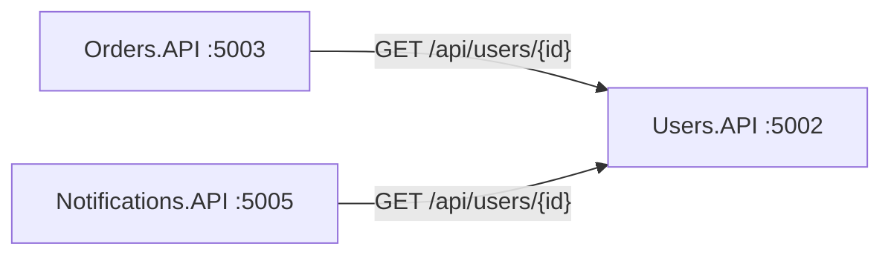
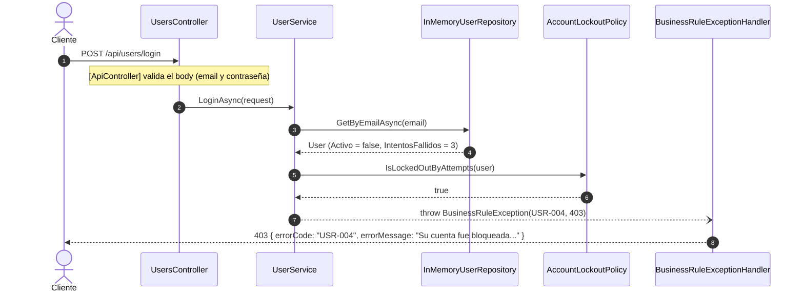

# Repaso: cómo construimos Users.API

Guía de estudio de la Etapa 5 del [plan de desarrollo](../planificacion/plan-de-desarrollo.md). Explica **qué** hace cada pieza de Users.API y **por qué** se decidió así.

Users.API reutiliza la plantilla de Products.API (manejo de errores, logs, Correlation ID, Swagger y health checks). Esa parte **no se repite acá**: está explicada en el [repaso de Products.API](repaso-products-api.md). Este documento se concentra en lo propio de Users:

- cómo se guardan y verifican las contraseñas;
- **la regla de bloqueo** y cómo se distingue USR-004 de USR-005;
- `GET /api/users/{id}`, el contrato del que dependen Orders y Notifications;
- lo que aprendimos de las tres revisiones de código.

---

## Índice

1. [Visión general](#1-visión-general)
2. [Antes de programar: los huecos del enunciado](#2-antes-de-programar-los-huecos-del-enunciado)
3. [El dominio y las reglas](#3-el-dominio-y-las-reglas)
4. [La capa HTTP y la plantilla](#4-la-capa-http-y-la-plantilla)
5. [El contrato con Orders y Notifications](#5-el-contrato-con-orders-y-notifications)
6. [Cómo se testea](#6-cómo-se-testea)
7. [Recorrido completo de un request](#7-recorrido-completo-de-un-request)
8. [Mapa de archivos](#8-mapa-de-archivos)
9. [La historia: tres revisiones de código](#9-la-historia-tres-revisiones-de-código)
10. [Lo que falta](#10-lo-que-falta)
11. [Preguntas probables de la defensa](#11-preguntas-probables-de-la-defensa)

---

## 1. Visión general

### 1.1 Qué es Users.API

Registro, login y bloqueo de usuarios, en el puerto 5002:

| Método | Ruta | Qué hace | Éxito | Errores |
|---|---|---|---|---|
| POST | `/api/users/register` | Registra un usuario | 201 | 400, 409 |
| POST | `/api/users/login` | Autentica con email y contraseña | 200 | 400, 401, 403 |
| GET | `/api/users/{id}` | Obtiene un usuario (endpoint agregado, D-06) | 200 | 404 |

Todos pueden responder 500. Su catálogo tiene los seis códigos del enunciado más uno agregado por el equipo:

| Código | HTTP | Cuándo |
|---|---|---|
| USR-001 | 409 | El email ya está registrado (sin distinguir mayúsculas) |
| USR-002 | 400 | Datos inválidos, campos faltantes o JSON mal formado |
| USR-003 | 401 | Email inexistente o contraseña incorrecta |
| USR-004 | 403 | Cuenta bloqueada por 3 intentos fallidos (D-08) |
| USR-005 | 403 | Cuenta bloqueada manualmente, por fraude (D-08) |
| USR-006 | 500 | Error inesperado |
| USR-007 | 404 | El ID no existe (D-06, sección 5.1 del plan) |

### 1.2 Lo que lo hace distinto: otros servicios dependen de él

Users no consume a nadie, pero **dos servicios lo consumen**: Orders (para ORD-003) y Notifications (para NTF-001) le preguntan si un usuario existe.



Por eso, en Users un cambio de contrato no rompe sus propios tests: rompe a **los otros**. Es la lección más importante de este servicio (sección 9).

### 1.3 Cómo se construyó

| Fecha | Commits | Qué | Tests |
|---|---|---|---|
| 27–29/09 | `1dfb312` … `a31c5d6` | Lógica, repositorio, refactor a `async` y primeros tests | 6 |
| 04/10 | `6b16f06`, `a3ad10e` | `GET /api/users/{id}`, contrato de errores y D-09 | 6 |
| 07/10 | `f927227` | Correcciones de la tercera revisión: validaciones en español, repositorio thread-safe, datos semilla, `TimeProvider` y tests de integración | 41 |
| 07/10 | `aba9c44` | Nombres en inglés y acciones del controller como en la plantilla | 41 |
| 07/10 | `348fb38` | Plantilla transversal: Serilog, Swagger y health checks | **72** |

---

## 2. Antes de programar: los huecos del enunciado

| # | Pregunta sin respuesta en el enunciado | Decisión | Por qué |
|---|---|---|---|
| D-06 | Orders y Notifications tienen que verificar que un usuario exista, pero Users solo tiene `register` y `login` | Endpoint adicional `GET /api/users/{id}` con el código nuevo USR-007 | Sin él, ORD-003 y NTF-001 no se pueden implementar |
| D-08 | El modelo tiene `Activo` e `IntentosFallidos`, pero no el **motivo** del bloqueo. ¿Cómo se distingue USR-004 de USR-005? | `Activo = false` con 3 o más intentos → USR-004; con menos → USR-005 (bloqueo manual) | Se deduce de los datos que ya existen, sin agregar campos al modelo del enunciado |
| D-09 | El tercer intento fallido, ¿responde 401 o 403? | 401 (USR-003) y deja la cuenta bloqueada; los intentos siguientes responden 403 (USR-004), **aun con la contraseña correcta** | La respuesta refleja el motivo de **ese** intento (la contraseña estaba mal); el bloqueo aplica desde el siguiente |
| D-32 | Un email vacío, ¿da uno o dos errores? | Uno solo: "El email es obligatorio." | Se valida el formato con `[RegularExpression]`, que ignora los valores vacíos, en lugar de `[EmailAddress]`, que sumaba "formato inválido" |

Además, el plan pide que el email sea único **sin distinguir mayúsculas**: `Maria@Email.com` y `maria@email.com` son el mismo usuario.

---

## 3. El dominio y las reglas

### 3.1 `User`: sin valores calculados

```csharp
public class User
{
    public Guid Id { get; set; }
    public string Nombre { get; set; } = string.Empty;
    public string Apellido { get; set; } = string.Empty;
    public string Email { get; set; } = string.Empty;
    public string PasswordHash { get; set; } = string.Empty;
    public DateTime FechaRegistro { get; set; }
    public bool Activo { get; set; }
    public int IntentosFallidos { get; set; }
}
```

Es el modelo del Apéndice A. En una versión anterior, `Id` y `FechaRegistro` se llenaban solos (`= Guid.NewGuid()`, `= DateTime.UtcNow`). Se sacaron por la convención "Modelos" del plan: los asigna `UserService`, y la fecha sale de `TimeProvider`. Así un test puede verificar la fecha **exacta** con `FakeTimeProvider`.

### 3.2 Las contraseñas nunca se guardan ni se devuelven

- **Se guarda un hash,** no la contraseña. `IPasswordHasher<User>` es una interfaz del framework (ASP.NET Core Identity) y su implementación, `PasswordHasher<User>`, usa PBKDF2 con *salt* aleatorio: dos usuarios con la misma contraseña tienen hashes distintos, y del hash no se puede volver a la contraseña.
- **Para el login no se "deshashea":** `VerifyHashedPassword` hashea la contraseña recibida de la misma forma y compara.
- **`PasswordHash` nunca sale en una respuesta,** como pide el enunciado. No es un "cuidado" del controller: los DTOs de respuesta (`UserResponse`, `LoginResponse`) **no tienen** ese campo. Un test de integración y uno de Swagger verifican que no aparezca.

### 3.3 `AccountLockoutPolicy`: la regla de bloqueo en un solo lugar

```csharp
public class AccountLockoutPolicy
{
    public const int MaxFailedAttempts = 3;

    public void RegisterFailedAttempt(User user)       // suma 1; al llegar a 3, Activo = false
    public void ResetFailedAttempts(User user)         // login correcto → 0
    public bool IsLockedOutByAttempts(User user)       // D-08: inactivo con 3 o más intentos
}
```

**¿Por qué una clase aparte y no código dentro del servicio?** Es una regla de negocio compleja y el plan pide que viva en su propia clase. El número 3 está escrito **una sola vez** (antes estaba repetido en el servicio). No lleva interfaz porque no tiene dependencias externas: se prueba directamente (criterio de la sección 2.3 del plan).

| `Activo` | `IntentosFallidos` | Estado | Al hacer login |
|---|---|---|---|
| true | 0, 1 o 2 | Activo | Se verifica la contraseña |
| false | 3 o más | Bloqueado por intentos | 403, USR-004 |
| false | 0, 1 o 2 | Bloqueado manualmente | 403, USR-005 |

### 3.4 Las reglas de `UserService`

| Operación | Reglas, en orden |
|---|---|
| `RegisterAsync` | El email no existe → si existe, **USR-001** · crea el usuario con `Id`, fecha de `TimeProvider`, `Activo = true` y 0 intentos · hashea la contraseña · guarda |
| `LoginAsync` | El email existe → si no, **USR-003** · la cuenta está activa → si no, **USR-004** o **USR-005** · la contraseña es correcta → si no, suma un intento, guarda y **USR-003** · resetea los intentos y guarda |
| `GetByIdAsync` | El usuario existe → si no, **USR-007** |

Dos detalles del login que suelen preguntar:

- **Email inexistente y contraseña incorrecta dan el mismo error** (USR-003, "Credenciales incorrectas."). Si los mensajes fueran distintos, cualquiera podría averiguar qué emails están registrados probando de a uno.
- **El bloqueo se revisa antes que la contraseña.** Una cuenta bloqueada responde 403 sin verificar la contraseña: así un atacante no puede seguir probando contraseñas en una cuenta ya bloqueada (D-09).

### 3.5 Los DTOs y las validaciones

- **`RegisterUserRequest`:** `Nombre`, `Apellido`, `Email` y `Password`, todos `[Required]` con el mensaje en español. Si faltan varios, el `errorMessage` de USR-002 los lista separados por `;`.
- **`LoginRequest`:** `Email` y `Password`.
- **El formato del email** se valida con `[RegularExpression(EmailFormat.Pattern)]` (D-32). El patrón vive en `DTOs/EmailFormat.cs` para no repetirlo en los dos requests.
- **`UserResponse` y `LoginResponse`:** la forma exacta de los ejemplos del enunciado, con `<example>` en los comentarios XML para Swagger.

### 3.6 El repositorio

`InMemoryUserRepository` guarda los usuarios en un `ConcurrentDictionary<string, User>` cuya **clave es el email**, comparado sin distinguir mayúsculas (`StringComparer.OrdinalIgnoreCase`). Esto resuelve dos cosas a la vez:

- **El email único es atómico.** `AddAsync` usa `TryAdd`: si dos registros con el mismo email llegan al mismo tiempo, solo uno entra. El otro lanza una excepción que termina en un 500 (USR-006), en lugar de dejar dos usuarios con el mismo email.
- **Buscar por email** (lo que hace cada login) es directo, sin recorrer la lista.

Buscar por ID sí recorre los valores; para la cantidad de usuarios de la demo no importa, y cuando llegue la librería de la cátedra solo cambia esta clase.

Antes era una `List<User>`, que **no es segura** con requests simultáneos: un Singleton atiende a todos los requests a la vez (convención "Repositorios en memoria").

### 3.7 Datos semilla

`UserSeedData` carga tres usuarios con IDs fijos, todos con la contraseña `MiPassword123!` (hasheada al arrancar):

| Usuario | ID | Estado | Para mostrar |
|---|---|---|---|
| maria@email.com | `a1b2c3d4-0000-0000-0000-111122223333` | Activa | Login correcto. Es la usuaria de los ejemplos del enunciado y la que usan Cart y Notifications |
| juan@email.com | `a1b2c3d4-…-000000000002` | Bloqueado por intentos | USR-004 |
| carlos@email.com | `a1b2c3d4-…-000000000003` | Bloqueado manualmente | **USR-005**, que de otra forma no se puede provocar: no hay un endpoint para bloquear a mano |

---

## 4. La capa HTTP y la plantilla

### 4.1 `UsersController`

Igual que en Products: cada acción tiene una o dos líneas, sin lógica ni `try/catch`.

- **`register` responde 201 con `CreatedAtRoute`:** el header `Location` apunta a `GET /api/users/{id}`, como hace `ProductsController` con `POST /api/products`.
- **`GET /api/users/{id}` recibe el id como texto** (D-17): `/api/users/99` responde 404 con USR-007, y no un 404 vacío del ruteo.
- **Las acciones se llaman como en la plantilla** (`Register`, `Login`, `GetById`) y devuelven `ActionResult<T>`, que Swagger usa para documentar el tipo de la respuesta.

### 4.2 Replicar la plantilla

La parte transversal se copió de Cart cambiando el namespace, con estas adaptaciones:

| Pieza | Cambio |
|---|---|
| `ValidationExceptionHandler` y la validación de `[ApiController]` | USR-002 |
| `GlobalExceptionHandler` | USR-006, "Error interno al procesar el usuario." |
| `ErrorExamplesOperationFilter` | El parámetro de ruta `{id}` se reemplaza por el ID de María en los ejemplos |
| Health check | `UserRepositoryHealthCheck` verifica la persistencia de usuarios |
| `[ProducesError]` | Un ejemplo por cada código: login tiene dos ejemplos de 403 (USR-004 y USR-005) |

### 4.3 `Users.API.http`

Tiene un request para cada caso de éxito y uno por cada código USR, usando los tres usuarios semilla, más los de Correlation ID y health checks. Es el guion de la demo de Users.

---

## 5. El contrato con Orders y Notifications

Acordado en la sección 4.4 del plan **antes** de programar:

```
GET /api/users/{id}
200 → { "id", "nombre", "apellido", "email", "fechaRegistro", "activo" }
404 → USR-007
```

- Orders y Notifications tienen cada uno su propio `UserInfo` con los campos que necesitan (D-05). Si Users agrega un campo, no se rompen: el deserializador ignora lo que no conoce.
- **Lo que no se puede hacer** es quitar el endpoint o cambiar los nombres de los campos sin acordarlo. Pasó en la segunda revisión: se eliminó `GET /api/users/{id}`, Users seguía compilando y pasando sus tests, pero Orders y Notifications se iban a romper al integrarse (sección 9).
- El test `GetById_UsuarioExistente_Devuelve200SinPasswordHash` fija el contrato desde el lado de Users.

---

## 6. Cómo se testea

| Nivel | Qué prueba | Cómo | Tests |
|---|---|---|---|
| **Unitario** | Las reglas de `UserService` | Repositorio y hasher como dobles de NSubstitute, fecha con `FakeTimeProvider` | 10 |
| **Unitario** | `AccountLockoutPolicy` | Directo, con tests parametrizados (`[Theory]`) | 7 |
| **Unitario** | El repositorio | Email sin distinguir mayúsculas, duplicado, búsqueda por ID | 4 |
| **Integración** | Los 3 endpoints y USR-001 a USR-007 por HTTP | `UsersApiFactory` con los datos semilla reales | 17 |
| **Integración** | La plantilla: Swagger, logs, Correlation ID, health checks, errores inesperados, contenedor y arranque | Igual que en Cart | 34 |

**Total: 72.**

Algunos detalles:

- **¿Por qué el repositorio es un doble en los tests unitarios** (en Cart se usa el real)? Porque el login depende sobre todo del **hasher**: con un doble se decide "esta contraseña es correcta" o "es incorrecta" sin calcular hashes reales, que son lentos a propósito. Al ser un doble, también se puede verificar que el servicio **guarde** el usuario después de cada intento (`Received(1).UpdateAsync`).
- **Los tests de integración no tocan a María** salvo con logins correctos. Cada test que falla contraseñas registra un usuario nuevo con un email aleatorio: si bloqueara a María, los otros tests fallarían según el orden en que corren.
- **El bloqueo de punta a punta** se prueba con un usuario nuevo: tres logins con la contraseña mal (401 cada uno) y un cuarto con la correcta (403, USR-004).
- **`DependencyInjectionTests`** levanta la configuración real y verifica que `IUserService` se resuelva y que el repositorio sea Singleton con los datos semilla. Es el test que habría detectado el bloqueante de la segunda revisión.

---

## 7. Recorrido completo de un request

El cuarto login de un usuario que ya falló tres veces, ahora con la contraseña **correcta**:



Paso a paso:

1. **Los middlewares** (no dibujados) asignan el Correlation ID y loguean el inicio.
2. **`[ApiController]` valida el body.** Un email vacío cortaría acá con USR-002.
3. **El servicio busca al usuario por email.** Si no existiera, respondería USR-003.
4. **La cuenta está inactiva,** así que pregunta el motivo a la política: con 3 intentos es un bloqueo por intentos (D-08).
5. **Lanza USR-004 sin verificar la contraseña** (D-09). Que la contraseña sea correcta no cambia nada.
6. **El `BusinessRuleExceptionHandler`** loguea un `Warning` con `ErrorCode = USR-004` y escribe el 403 del contrato. El log de fin del request también lleva el código.

En el **tercer** intento, en cambio, la cuenta todavía estaba activa: se verificó la contraseña, falló, la política sumó el intento y bloqueó la cuenta, se guardó, y la respuesta fue 401 (USR-003).

---

## 8. Mapa de archivos

### `src/Users.API/` (lo propio de Users)

| Archivo | Qué hace |
|---|---|
| `Models/User.cs` | El usuario del Apéndice A |
| `DTOs/RegisterUserRequest`, `LoginRequest` | Lo que entra, con validaciones en español |
| `DTOs/EmailFormat` | El patrón del email, compartido por los dos requests (D-32) |
| `DTOs/UserResponse`, `LoginResponse` | Lo que sale, sin `PasswordHash` |
| `Services/IUserService` → `UserService` | Registro, login y consulta: USR-001, USR-003 a USR-005 y USR-007 |
| `Services/AccountLockoutPolicy` | La regla de bloqueo (D-08, D-09) |
| `Repositories/IUserRepository` → `InMemoryUserRepository` | Persistencia en memoria, con el email como clave |
| `Repositories/UserSeedData` | Los tres usuarios de la demo |
| `Controllers/UsersController` | Los 3 endpoints |
| `Exceptions/ErrorCodes` | USR-001 a USR-007 |
| `Infrastructure/ServiceCollectionExtensions` | Registra todo, incluido el hasher y el repositorio con los datos semilla |
| `Infrastructure/UserRepositoryHealthCheck` | El check `persistencia` de `/health/ready` |
| `Users.API.http` | Los requests de la demo |

El resto (`ExceptionHandlers/`, middlewares, logging, Swagger y health checks) es la plantilla de Products: ver su [mapa de archivos](repaso-products-api.md#8-mapa-de-archivos).

### `tests/Users.API.Tests/`

| Archivo | Qué prueba | Tests |
|---|---|---|
| `Unit/Services/UserServiceTests` | Registro, login (las 5 situaciones) y consulta por ID | 10 |
| `Unit/Services/AccountLockoutPolicyTests` | Suma de intentos, bloqueo al tercero y motivo del bloqueo | 7 |
| `Unit/Repositories/InMemoryUserRepositoryTests` | Email sin mayúsculas, duplicado, búsquedas | 4 |
| `Integration/UsersEndpointsTests` | Los 3 endpoints, USR-001 a USR-007 y el bloqueo de punta a punta | 17 |
| `Integration/SwaggerTests` | Status de cada endpoint, resúmenes, tags, ejemplos por código y que no aparezca el hash | 15 |
| `Integration/CorrelationIdTests` | Header recibido, generado, inválido y en errores | 5 |
| `Integration/LoggingTests` | Inicio y fin, Warning y Error con `ErrorCode` | 4 |
| `Integration/HealthCheckTests` | Los 3 endpoints y la persistencia caída | 4 |
| `Integration/UnexpectedErrorTests` | USR-006 y el detalle por entorno | 3 |
| `Integration/DependencyInjectionTests` | Configuración real: servicio y repositorio con datos semilla | 2 |
| `Integration/SmokeTests` | Que la API arranque | 1 |
| Auxiliares: `UsersApiFactory`, `ErrorContractAssert`, `CollectingSink` | — | — |

---

## 9. La historia: tres revisiones de código

Users fue el servicio que más cambió por las revisiones. Vale la pena conocer la historia porque explica varias convenciones del plan.

| Revisión | Lo que se encontró | Cómo se resolvió |
|---|---|---|
| **1.ª** | Archivos sin extensión `.cs` o vacíos: el compilador los ignoraba y el CI daba verde igual | Convención "Archivos": crear las clases desde el editor y revisar `git status` antes de cada commit |
| **2.ª** | Se había eliminado `GET /api/users/{id}` (contrato con otros servicios) y faltaba registrar las dependencias: la API real respondía 500 | Se restauró el endpoint con USR-007 y se centralizó el registro en `ServiceCollectionExtensions` (`6b16f06`). D-09 se alineó con el código (`a3ad10e`) |
| **3.ª** | Mensajes de validación en inglés y un email vacío con dos errores; `List<T>` y sin datos semilla (USR-005 no se podía mostrar); pocos tests | Todo lo de las secciones 3.5 a 3.7 y la sección 6 (`f927227`) |

Después se completó la alineación con la plantilla: métodos en inglés (`aba9c44`) y la parte transversal (`348fb38`).

**La lección:** cada tipo de test detecta un tipo de error distinto. Los unitarios no ven si falta un registro en el contenedor (lo ve `DependencyInjectionTests`), ni si se rompió un contrato con otro servicio (lo ve el otro servicio, o un test que fije el contrato).

---

## 10. Lo que falta

Users no consume a otros servicios, así que **no tiene tareas en la Etapa 9**. Queda pendiente:

- Consultar con los docentes el endpoint adicional y el código USR-007 (sección 5.2 del plan).
- Reemplazar `InMemoryUserRepository` cuando llegue la librería de la cátedra (D-03).
- Agregar USR-007 a la tabla de códigos de error del README (Etapa 10).

---

## 11. Preguntas probables de la defensa

**¿Cómo guardan las contraseñas?**
Como un hash, con `PasswordHasher<User>` del framework (PBKDF2 con salt). Nunca se guarda la contraseña ni se devuelve el hash: los DTOs de respuesta no tienen ese campo.

**¿Cómo funciona el bloqueo?**
Cada login con la contraseña incorrecta suma un intento. Al tercero, `AccountLockoutPolicy` pone `Activo = false`. Ese tercer intento responde 401, y los siguientes 403 con USR-004, aun con la contraseña correcta (D-09). Un login correcto antes del tercer fallo vuelve los intentos a 0.

**¿Cómo distinguen USR-004 de USR-005 si el modelo no guarda el motivo?**
Por los intentos: una cuenta inactiva con 3 o más intentos se bloqueó por intentos (USR-004); con menos, se bloqueó a mano (USR-005). Es D-08. Para la demo, `carlos@email.com` viene bloqueado manualmente.

**¿Por qué un email que no existe responde lo mismo que una contraseña incorrecta?**
Para no revelar qué emails están registrados. Si los mensajes fueran distintos, alguien podría probar emails hasta encontrar los que existen.

**¿Por qué existe `GET /api/users/{id}` si el enunciado no lo pide?**
Porque Orders (ORD-003) y Notifications (NTF-001) necesitan verificar que un usuario exista, y no hay otra forma de preguntárselo a Users. Es D-06, con el código nuevo USR-007.

**¿Qué pasa si dos personas se registran con el mismo email al mismo tiempo?**
El repositorio usa el email como clave de un `ConcurrentDictionary` y agrega con `TryAdd`: solo uno de los dos entra. El otro recibe un error en lugar de quedar duplicado.

**¿Por qué `AccountLockoutPolicy` no tiene interfaz?**
Porque es una regla pura, sin dependencias externas: se prueba creándola directamente. El plan pone interfaces solo donde aportan, como en lo que sale del proceso (repositorios, otros servicios) o lo que depende del entorno (D-15).

**¿Cómo testean el login sin calcular hashes reales?**
En los tests unitarios el hasher es un doble que dice "correcta" o "incorrecta". Los tests de integración sí usan el hasher real, con los usuarios semilla.
